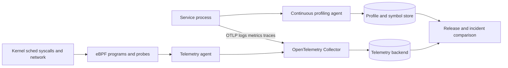

## What it is
An observability platform infers a distributed system's internal behavior from telemetry it emits, chiefly structured logs, metrics, and distributed traces. Monitoring compares signals with known thresholds, while observability supports new questions about unfamiliar states and failures; platforms such as Prometheus, Grafana, OpenTelemetry, and alert managers connect instrumentation to storage, correlation, dashboards, and notifications.

## How it works
**Structured logging** emits machine-readable events with named fields. A log backend can index those fields without parsing an arbitrary message. **Metrics** aggregate numerical measurements as counters, gauges, or histograms over time. Prometheus scrapes or receives time series, evaluates PromQL, stores samples in its time-series database, and supplies metrics to Grafana or compatible visualizers.

A **distributed trace** records a request as a tree of spans. Each span carries a trace identifier, its parent span identifier, timing, attributes, and events. **OpenTelemetry** standardizes instrumentation APIs and a vendor-neutral telemetry protocol, so a service can emit traces, metrics, and logs without coupling its application code to one backend. The OpenTelemetry Collector receives telemetry, applies memory limiting, batching, transformation, sampling, and routing rules, then exports it to storage.

**Continuous profiling** samples running processes rather than waiting for a specific request. A profiling agent can collect CPU samples, wall-clock stacks, allocation profiles, lock waits, and garbage-collection events over a time window, then aggregate stacks into flame graphs and compare them across releases. Symbol files and build identifiers are required to turn native addresses into meaningful functions. **eBPF** extends this visibility inside the kernel: a small verified program can attach to schedulers, syscalls, network paths, or other probe points and emit compact events. Tools such as BCC, bpftrace, and continuous-profiling agents can then attribute latency, packet loss, or system calls without restarting the target process.



Profiling and eBPF still have costs. Event frequency, stack walking, symbol lookup, ring-buffer loss, and kernel version affect overhead, while privileged probes can expose arguments, secrets, or process data. Apply retention and field-redaction policy just as you would for logs, and prefer purpose-built stable probe points when a portable userspace signal is sufficient.

```json
{
  "timestamp": "2026-01-15T10:15:30.125Z",
  "level": "info",
  "service": { "name": "checkout", "version": "1.4.0" },
  "event": "order.created",
  "order_id": "ord_7f23",
  "duration_ms": 84,
  "trace_id": "4bf92f3577b34da6a3ce929d0e0e4736",
  "span_id": "00f067aa0ba902b7"
}
```

```yaml
receivers:
  otlp:
    protocols:
      grpc:
        endpoint: 0.0.0.0:4317
      http:
        endpoint: 0.0.0.0:4318
processors:
  memory_limiter:
    check_interval: 1s
    limit_percentage: 80
  batch:
    timeout: 5s
exporters:
  otlp/tempo:
    endpoint: tempo:4317
    tls:
      insecure: true
  prometheusremotewrite/mimir:
    endpoint: http://mimir:9009/api/v1/push
  otlphttp/loki:
    endpoint: http://loki:3100/otlp
service:
  pipelines:
    traces:
      receivers: [otlp]
      processors: [memory_limiter, batch]
      exporters: [otlp/tempo]
    metrics:
      receivers: [otlp]
      processors: [memory_limiter, batch]
      exporters: [prometheusremotewrite/mimir]
    logs:
      receivers: [otlp]
      processors: [memory_limiter, batch]
      exporters: [otlphttp/loki]
```

A Prometheus target can expose a counter and histogram for HTTP requests. A rule engine then evaluates those series over a time window, and Alertmanager routes notifications through deduplication, grouping, inhibition, and receiver policies.

```prometheus
http_server_requests_total{service="checkout",method="POST",status="201"} 1842
http_server_requests_total{service="checkout",method="POST",status="500"} 17
http_server_request_duration_seconds_bucket{service="checkout",le="0.1"} 1430
http_server_request_duration_seconds_bucket{service="checkout",le="+Inf"} 1859
http_server_request_duration_seconds_sum{service="checkout"} 64.2
http_server_request_duration_seconds_count{service="checkout"} 1859
```

```yaml
global:
  scrape_interval: 15s
rule_files:
  - alerts.yml
scrape_configs:
  - job_name: checkout
    static_configs:
      - targets:
          - checkout:9090
```

```yaml
groups:
  - name: checkout-availability
    rules:
      - alert: CheckoutHighErrorRate
        expr: |
          (
            sum(rate(http_server_requests_total{service="checkout",status=~"5.."}[5m]))
            /
            sum(rate(http_server_requests_total{service="checkout"}[5m]))
            > 0.01
          )
          and
          (
            sum(rate(http_server_requests_total{service="checkout"}[5m])) >= 1
          )
        for: 10m
        labels:
          severity: page
        annotations:
          summary: Checkout request errors exceed 1 percent with at least one request per second
```

A **service-level objective (SLO)** defines a target for a service-level indicator (SLI), such as the proportion of valid requests that do not fail within a defined window. For example, an availability SLO can use a rolling 30-day window. The remaining tolerance is an **error budget**, which provides an explicit relationship between reliability and release risk. Multi-window, multi-burn-rate alerts can evaluate both a recent error budget burn and a longer-term condition before paging.

## Tradeoffs
- **Metric labels** — service, instance, and environment labels support useful grouping, but every unique label combination creates another time series and increases storage work.
- **Telemetry cost** — verbose logs, fine-grained metrics, and complete traces improve evidence, but collection, processing, storage, and retention require explicit limits.
- **Trace sampling** — sampling reduces volume, but decisions made without the complete trace can discard slow or failed requests needed for diagnosis.
- **Signal correlation** — shared trace identifiers connect logs and spans, but that correlation depends on propagating OpenTelemetry context through every service and process boundary.
- **Ownership** — SLOs and error budgets connect technical reliability to product decisions, but teams must define the metric, own the outcome, and maintain targets users actually rely on.
- **Alerting policy** — actionable alerts reduce noise, but thresholds need enough time and data to distinguish incidents from normal variation.

## When to use
- A request crosses services, queues, or hosts and you need evidence about where time and failure were introduced.
- Failures can produce unknown states that fixed dashboards and metric alerts do not cover.
- You need quantitative service targets and error budgets to guide release decisions.
- Multiple teams and languages need one telemetry contract through OpenTelemetry.
- You need actionable paging signals rather than a stream of raw threshold notifications.

## Alternatives
- **Host metrics and uptime checks** — simple infrastructure monitoring is inexpensive to operate, but it does not explain application behavior inside distributed requests.
- **Log search alone** — detailed events remain useful without a full metrics pipeline, but aggregate trends and request-level paths are harder to compare.
- **Commercial application performance monitoring** — a managed suite reduces backend operation and often integrates agents, but recurring usage fees and proprietary data models can constrain portability.
- **Tracing-only analysis** — Jaeger or Zipkin can reveal request paths, but separate metrics and logs remain necessary for fleet trends and event detail.

## Related
- [Deployment Strategies: Blue-Green, Canary Releases, Rolling Updates, and Shadow Deployments](03-deployment-strategies.md)
- [CI/CD Workflows, Automated Testing Pipelines, and GitOps Engines (ArgoCD, Flux)](04-cicd-gitops.md)
- [Container Orchestration: Kubernetes Architecture (Control Plane, Worker Nodes, Pods, Services, Ingress)](02-kubernetes.md)
- [Chapter 12: References](06-references.md)
