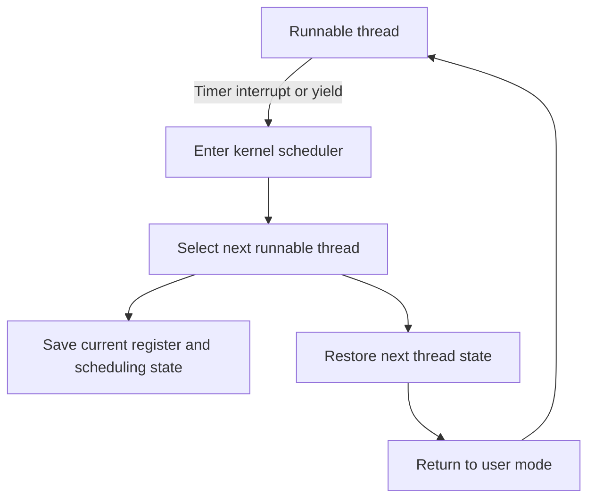

## What it is

Processes and threads are the operating system's execution contexts: a process owns an address space and protection boundary, while a thread is a schedulable stream of instructions inside that address space. They let independent work run concurrently, communicate through operating-system primitives, and share processors fairly without requiring one program per CPU.

## How it works

A process contains a virtual address space, open-file references, credentials, signal state, and one or more threads. Each thread has its own registers, program counter, stack, scheduling state, and thread-local storage. Threads in one process share the address space and file-descriptor table, so one thread can observe another thread's ordinary memory changes. That sharing is cheap to use but requires synchronization.

On Linux, `fork` creates a child process. Most physical pages are initially shared and copied only when a write occurs, a mechanism called **copy-on-write**. `fork` does not load a new program; a successful `exec` replaces the child's program image. Modern programs often use a higher-level runtime API, but the operating-system sequence remains visible in process tracing tools. A context switch saves the current thread's registers and scheduling state, restores another thread's state, and changes processor bookkeeping. It can take constant kernel-side work while still producing variable latency from cache, TLB, and CPU effects.

A **thread pool** keeps a bounded set of workers alive and moves tasks through a queue. It amortizes thread creation and bounds concurrency. The scheduler still runs each worker as a thread, and this call-oriented path shows what happens when the processor switches from one runnable thread to another:



A service can expose concurrency controls as part of its deployment contract:

```yaml
apiVersion: apps/v1
kind: Deployment
metadata:
  name: order-worker
spec:
  replicas: 2
  selector:
    matchLabels:
      app: order-worker
  template:
    metadata:
      labels:
        app: order-worker
    spec:
      containers:
        - name: worker
          image: ghcr.io/example/order-worker:2.1.0
          env:
            - name: WORKER_THREADS
              value: "8"
            - name: TASK_QUEUE_CAPACITY
              value: "256"
            - name: TASK_REJECT_POLICY
              value: caller_runs
          resources:
            requests:
              cpu: "1"
              memory: 512Mi
            limits:
              cpu: "2"
              memory: 1Gi
```

**Inter-process communication (IPC)** means one process deliberately exchanges data with another. Unix pipes and domain sockets stream ordered bytes; message queues preserve discrete messages under defined APIs; shared memory transfers large buffers but requires separate synchronization. Signals notify a process but are too limited for ordinary data transport. A process boundary is valuable for failure isolation and privilege separation, while shared memory reduces copying when processes already share a large dataset.

Threads need explicit rules for shared state. Common **concurrency bugs** include data races, deadlocks, lost wakeups, lock-order inversion, and use-after-free caused by a pointer outliving its owner. A mutex protects a critical section, a condition variable waits for a state change, and an atomic operation performs one indivisible read-modify-write. None of these primitives repairs an incorrect ownership model; the same lock can still create a cycle that deadlocks every participant.

CPU scheduling is also a policy. A preemptive scheduler can interrupt a runnable thread so another receives processor time. Time-sliced fair schedulers balance responsiveness and throughput, and Linux's normal scheduler uses virtual runtime to compare task demand. **Multilevel feedback queue (MLFQ)** scheduling gives new or interactive work short quanta and boosts tasks that wait, approximating short-job priority without permanently starving long work. Real-time policies such as fixed priority and rate monotonic scheduling optimize deadline behavior, but they can starve normal work and require bounded execution time. Linux exposes related mechanisms such as `SCHED_FIFO`, `SCHED_RR`, priorities, affinities, and cgroup controls.

A **process identifier (PID)** is the kernel-assigned number that identifies a process. The shell
artifact sets `PID` to the current Bash shell's process identifier before using it to inspect that
process's scheduling state and processor affinity:

```bash
PID=$$
ps -p "$PID" -o pid,ppid,nlwp,cls,rtprio,pri,ni,psr,stat,comm
ps -T -p "$PID" -o pid,spid,tid,cls,rtprio,pri,psr,stat,comm
taskset -pc "$PID"
cat /proc/"$PID"/status
```

## Tradeoffs

| Design choice | Gain | Cost or risk |
| --- | --- | --- |
| One process per request | Strong failure and address-space isolation | Process creation and IPC overhead |
| One thread per request | Direct concurrency with low creation cost | Unbounded threads can exhaust memory and scheduler capacity |
| Bounded thread pool | Reuses workers and makes overload visible | Incorrect queue or rejection settings can increase latency or drop work |
| Shared memory IPC | Avoids repeated payload copies | Requires explicit locking, ownership, and recovery rules |
| Mutex-based coordination | Preserves invariants with a clear critical section | Contention, priority inversion, and lock-order mistakes can stall progress |
| Lock-free atomics | Avoids some blocking and kernel sleeps | Narrow applicability, subtle memory ordering, and difficult proofs |
| MLFQ-like scheduling | Favors interactive work while protecting long tasks | Frequency estimates and boosts do not directly guarantee application latency |
| Fixed-priority real-time scheduling | Supports bounded deadline analysis | Admission and execution-time proofs are required; starvation is possible otherwise |

## When to use

- You need multiple tasks to overlap I/O with computation on the same processor.
- You need a fault or privilege boundary that ordinary thread sharing cannot provide.
- You can define queue capacity, cancellation, timeout, and overload behavior.
- Shared mutable state has an explicit ownership and synchronization design.
- Workload priorities and deadlines fit a scheduler policy you can measure.

## Alternatives

- **Single-threaded event loop** — wins for many mostly idle socket connections and avoids shared-state races, but one blocking operation can stall the loop.
- **Actor model** — wins when messages and per-actor ownership make concurrency explicit, but cross-actor coordination still requires careful protocol design.
- **Asynchronous callbacks or futures** — wins for composing I/O operations, but callbacks complicate control flow and error propagation.
- **Process-per-pod or process-per-tenant** — wins when failure isolation matters more than in-process communication efficiency, but it increases memory and orchestration overhead.

## Related

- [Virtual Memory & Kernel Traps](02-virtual-memory-kernel-traps.md)
- [High-Performance File Systems & Low-Level I/O](03-file-systems-low-level-io.md)
- [Container Internals: Docker, OCI Runtimes, Linux Namespaces, and cgroups](../02-containers-cicd/01-container-internals.md)
- [Chapter 12A: References](04-references.md)
