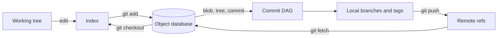

## What it is

**Distributed version control (DVCS)** is a source-history system in which every clone can create, inspect, and publish commits without a central write point, so you model history as a graph of content-addressed snapshots and move explicit references along that graph to develop, review, integrate, and release software.

## How it works

Git stores immutable **objects** and moves lightweight **refs** over them. A **directed acyclic graph (DAG)** connects commits through parent pointers; because every parent is already immutable, history cannot be changed in place, and integration creates new commits instead.



### Objects, trees, and commits

A working tree is staged in the index, and `git add` writes changed content as a **blob**. A **tree** records one entry per path, mapping names to blob, tree, or submodule object IDs. A **commit** records the root tree, zero or more parent commits, author and committer metadata, and a message. The commit ID is a content hash of that record, so identical metadata and tree content produce the same identity.

```bash
git init
printf 'status = "ok"\n' > status.txt
git add status.txt
git commit -m "Add health status"
git rev-parse HEAD
git cat-file -p HEAD^{tree}
git rev-list --parents -n 1 HEAD
```

`HEAD` normally points to a symbolic ref such as `refs/heads/main`; `main` points to a commit. Tags can point to commits or other Git objects. `git log --graph --oneline --decorate --all` makes the DAG and its ref positions visible.

```bash
git log --graph --oneline --decorate --all
git show --stat --oneline HEAD
git merge-base main feature/checkout-idempotency
```

A **merge base** is a best common ancestor reachable from both tips. Git uses the merge bases as common states for a three-way integration, which is why a fast-forward, merge commit, or rebase can produce different commit IDs from the same branch tips.

### Branching strategies

A **branch** is a movable ref, not a copy of the repository. A **trunk-based development** model integrates small changes through a stable main branch and releases from protected, tested integration points. **Feature branching** keeps a topic branch open for its planned change, usually for days rather than the life of a release. **GitFlow** adds long-lived `develop`, release, and hotfix branches, trading simpler day-to-day integration for explicit release preparation and maintenance lines.

| Strategy | Integration pattern | Gain | Cost |
| --- | --- | --- | --- |
| Trunk-based development | Small pull requests merge into a protected main branch | Short-lived refs, continuous integration, simple release line | Requires fast feedback, automated checks, and disciplined ref updates |
| Feature branching | One topic branch merges when its change is ready | Isolates unfinished work and gives reviewers a bounded diff | Integration debt and conflicts accumulate as branches diverge |
| GitFlow | Separate main, develop, release, and hotfix lines | Makes planned releases and maintenance explicit | More refs, merge ceremony, and slower cross-line integration |

Use a **merge** to preserve actual integration points. Git finds the merge base, applies the changes from both tips, and either fast-forwards when one tip already contains the other or writes a merge commit with two parents when the histories have diverged.

```bash
git fetch origin
git switch main
git merge --ff-only origin/main
git switch feature/checkout-idempotency
git merge --no-ff origin/main
git push origin HEAD
```

Use a **rebase** to replay a topic branch's unique commits on a newer base. Rebase changes commit IDs because it creates new commit objects; it does not move the original commits or send them to the remote.

```bash
git fetch origin
git switch feature/checkout-idempotency
git rebase origin/main
git push --force-with-lease origin feature/checkout-idempotency
```

Rebase private or unshared topic branches. Never rebase commits that another developer or deployment system may have already consumed. `--force-with-lease` refuses a push when the remote ref no longer has the value the local client last observed, reducing accidental overwrites compared with unconditional force pushes.

### Conflict resolution and code review

A **merge conflict** occurs when Git cannot choose a consistent result from changes on both sides of the merge base. Text conflicts appear in files with competing edits, while **rename/delete** and **modify/delete** conflicts require a human decision about whether a path's identity or content changed.

```bash
git status
git diff --name-only --diff-filter=U
git diff
git add src/checkout.go tests/checkout_test.go
git merge --continue
```

If the integration goes wrong, restore the pre-merge or pre-rebase state with `git merge --abort` or `git rebase --abort`. During an interactive rebase, `git rebase --continue` records the current resolution, `git rebase --skip` drops the current commit, and `git rebase --edit-todo` changes the remaining sequence.

A **code review workflow** turns a topic ref into an auditable integration proposal. Keep the change bounded, push its branch, open a pull or merge request, require automated checks, inspect the diff against the target branch, and merge only after approval and a current required status. Branch protection enforces this policy on the server; review comments still require human judgment.

```yaml
name: pull-request-checks
on:
  pull_request:
permissions:
  contents: read
jobs:
  verify:
    runs-on: ubuntu-latest
    steps:
      - uses: actions/checkout@v4
        with:
          fetch-depth: 0
      - run: git fsck --strict
      - run: git diff --check origin/main...HEAD
      - run: make test
      - run: make lint
      - run: git diff --stat origin/main...HEAD
      - run: git log --oneline origin/main..HEAD
```

For merge commits, require an up-to-date target branch and test the combined result before merging. For rebase workflows, rebase or merge the target branch into the topic branch, refresh the pull request, and avoid an endless approval loop by resolving feedback before requesting renewed review.

## Tradeoffs

| Decision | Gain | Cost |
| --- | --- | --- |
| Merge commit | Preserves the real branch event and two-parent topology | Adds an integration commit and can retain merge noise |
| Rebase | Produces a linear, reviewable topic history and a clean base | Rewrites local commit IDs and complicates shared-branch collaboration |
| Fast-forward only | Prevents accidental merge commits on a protected branch | Fails when a pull-request branch has genuinely diverged |
| Squash merge | Keeps main compact and makes the integrated change one commit | Discards branch-level commit boundaries and individual review timing |
| Long-lived release branch | Stabilizes a supported release while main evolves | Creates another line that must receive fixes and merge policy |

## When to use

- You need local commits, offline work, and multiple integration points without depending on one writable server.
- You need to explain how two histories combine before choosing a merge, rebase, fast-forward, or squash policy.
- You maintain a service where a protected main branch must pass review and automated checks before integration.
- You maintain versioned releases that need hotfixes without pulling unfinished work from the main development line.
- You need reproducible recovery steps for conflicts, interrupted rebases, or rejected remote updates.

## Alternatives

- **Centralized version control** — Subversion fits a centrally governed repository with fewer local-history workflows, but it adds a network dependency for most updates and gives up Git's lightweight branching and offline operation.
- **Mercurial** — keeps the distributed model and provides a coherent built-in command set, but Git has broader hosting, tooling, and CI integration.
- **Gerrit** — enforces change-list review and patch-set revisions at large scale, but its workflow is less flexible than pull requests for teams that prefer branch-based collaboration.
- **Monorepo versioning policy** — coordinates changes across repositories in one versioning domain, but requires stronger ownership and dependency management than independent repository branches.

## Related

- [Chapter 12B overview](_index.md)
- [Chapter 12B References](02-references.md)
- [CI/CD Workflows, Automated Testing Pipelines, and GitOps Engines (ArgoCD, Flux)](../02-containers-cicd/04-cicd-gitops.md)
- [Chapter 12A: Operating Systems & Kernel Mechanics](../03-operating-systems-kernel-mechanics/)
