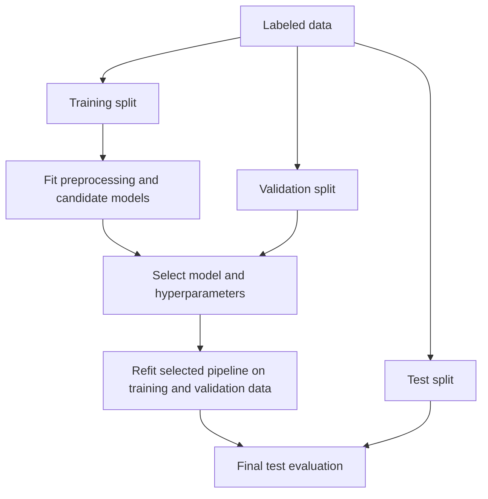

## What it is
Supervised learning is the branch of machine learning that learns a mapping from inputs to known targets using labeled examples. The model optimizes a loss against the targets during training, then applies the learned mapping to examples whose targets are not known.

## How it works
A supervised training run separates data selection, fitting, evaluation, and selection. The data split prevents information from the test set from influencing training or tuning. Scikit-learn supplies linear models, support vector machines (SVMs), k-nearest neighbors (k-NN), decision trees, and random forests. XGBoost, LightGBM, and CatBoost supply gradient-boosted tree systems with different tree construction, regularization, and categorical-data strategies. Their interfaces differ, but all support the same validation workflow.



```yaml
experiment:
  task: "binary classification"
  data:
    features: ["age", "region", "purchase_count"]
    target: "churned"
    split: {train: 0.70, validation: 0.15, test: 0.15}
    leakage_control: "fit preprocessing on the training split only"
  models:
    linear_regression:
      loss: "mean squared error"
      use_for: "continuous targets"
    logistic_regression:
      loss: "binary or multinomial cross-entropy"
      use_for: "binary or multiclass targets"
    decision_tree:
      split_criterion: "impurity reduction"
      pruning: ["cost complexity", "minimum leaf size"]
    random_forest:
      trees: "many decorrelated bootstrap trees"
      voting: "majority vote or mean probability"
    support_vector_machine:
      kernel: "linear or nonlinear"
      use_for: "small clean datasets with a useful margin"
    knn:
      neighbors: 15
      distance: "scaled Euclidean or cosine"
      use_for: "local decision boundaries"
    xgboost:
      boosting: "gradient boosted decision trees"
      objective: "logistic classification"
    lightgbm:
      boosting: "histogram-based gradient boosting"
      leaf_wise_growth: true
    catboost:
      boosting: "ordered gradient boosting"
      categorical_features: "fit target statistics without target leakage"
  evaluation:
    metrics: ["accuracy", "precision", "recall", "ROC AUC"]
    selection: "validation score"
    final_report: "test score"
```

The model family determines the hypothesis and loss. **Linear regression** predicts a continuous target with an affine function and minimizes squared error. **Logistic regression** applies a sigmoid for binary classification or softmax for multiclass classification and minimizes cross-entropy. An **SVM** maximizes the margin between classes; a linear kernel separates the original features, while kernels such as the radial basis function define nonlinear boundaries in feature space. **k-NN** stores labeled examples and predicts by aggregating their nearest neighbors, so its inductive bias is local rather than parametric.

**Decision trees** choose splits that reduce impurity, such as Gini impurity or variance. A **random forest** fits trees on bootstrap samples and random feature subsets, then averages or votes their predictions to reduce variance. **Gradient boosting** fits trees sequentially: at round `m`, a new tree learns the residual or loss-gradient signal from the current ensemble so later trees correct earlier mistakes.

XGBoost, LightGBM, and CatBoost implement different gradient-boosting strategies. XGBoost regularizes boosted trees and uses second-order loss statistics; LightGBM groups features into histogram bins and can grow leaves by their loss reduction; CatBoost uses ordered boosting and target statistics to handle categorical features without leaking target information into training statistics. Validation performance selects model families, rounds, and other hyperparameters, while the test set is used only for the final estimate. Imputation, scaling, feature selection, and categorical encodings must be fitted or defined without validation or test data; XGBoost, LightGBM, and CatBoost can handle some missing and categorical values directly, subject to their configured model and split rules.

## Complexity
Let `m` be the number of training examples, `q` the number of prediction examples, `d` the number of features, `h` the maximum tree depth, `L` the boosting-tree depth, `T` the number of forest trees, `k` the neighbor count, `s` the number of support vectors, `M` the number of candidate tree nodes, and `b` the number of histogram bins per feature. Tree-training costs depend on split search and caching strategy, so the bounds below describe representative implementations rather than every library.

| Operation | Representative time | Additional space |
| --- | --- | --- |
| Linear or logistic regression pass | O(md) | O(d) working space, excluding stored parameters |
| k-NN prediction with a spatial index | O(qd log m + qk log k) in the fixed-dimensional index case | O(k) per query for neighbor results |
| k-NN prediction by brute force | O(qmd) before aggregation | O(1) extra space per query when streamed |
| SVM prediction | O(qsd) | O(1) per example beyond the model |
| One depth-limited tree fit | O(m log m + Mdh) after sorting | O(m) for feature order and O(M) for candidate state |
| Random-forest fit | T times the cost of one tree fit | O(TM) for model and training state |
| One histogram-based boosting tree | O(md + Ldb) for histogram accumulation and split search | O(db) for histograms, plus tree and metadata state |
| Prediction | O(d) for linear models; O(sd) for an SVM; O(h) per tree or O(Th) for a forest | O(1) working space beyond the model |

## When to use
- You have labeled examples and need a model that maps the same measured features to a known target.
- The target is continuous or categorical and you need transparent linear baselines for regression or classification.
- The dataset is small and clean, so an SVM's margin model or k-NN's local decision rule is a useful candidate.
- The data is tabular, and random forests or gradient-boosted trees from XGBoost, LightGBM, or CatBoost are practical candidates.
- The decision is high impact, so you can reserve a test set and compare models on a task-specific metric.

## Alternatives
- **Generalized linear models** — provide calibrated probability baselines with a fixed functional form, but cannot represent arbitrary feature interactions.
- **Gaussian processes** — model uncertainty and smooth functions, but scale quadratically or cubically with sample count in common exact implementations.
- **Neural networks** — learn richer interactions and reusable representations at scale, but need more data, compute, tuning, and interpretability work.

## Related
- [Unsupervised Learning](02-unsupervised-learning.md)
- [Neural Networks](03-neural-networks.md)
