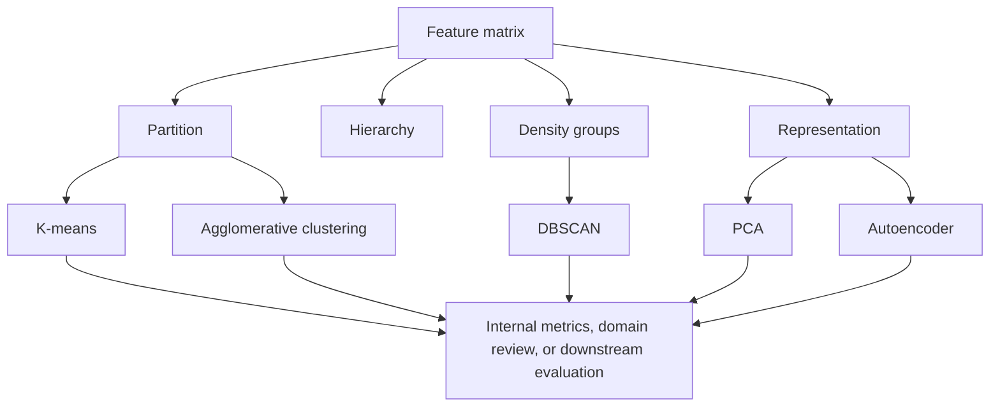

## What it is
Unsupervised learning is the branch of machine learning that discovers structure in data without target labels. It groups related examples, identifies density, or finds lower-dimensional representations that preserve useful properties of the input distribution.

## How it works
An unsupervised pipeline chooses whether the output is a partition, a hierarchy, a density model, or a transformed representation, then applies an objective appropriate to that output. The result still requires evaluation: a visually plausible cluster is not evidence of useful structure. Scikit-learn provides standard implementations of these methods, FAISS provides optimized large-scale clustering and nearest-neighbor search, and PyTorch provides tensor primitives for custom implementations. Domain labels and downstream tasks provide external validation when available.



```yaml
pipeline:
  input:
    features: "numeric feature matrix"
    preprocessing: ["impute missing values", "scale sensitive features"]
  representations:
    k_means:
      parameters: {k: 8, initialization: "k-means++", restarts: 10}
      objective: "within-cluster sum of squares"
    hierarchical:
      parameters: {linkage: "ward", criterion: "increase in within-cluster sum of squares"}
      output: "dendrogram"
    dbscan:
      parameters: {epsilon: "tunable radius", min_points: 5}
      output: "density-connected clusters and noise"
    pca:
      parameters: {components: 2, standardization: true}
      objective: "maximum retained variance"
    autoencoder:
      architecture: ["encoder", "bottleneck", "decoder"]
      objective: "reconstruction error with optional regularization"
  evaluation:
    internal: ["silhouette score", "Davies-Bouldin index"]
    external: ["adjusted Rand index", "normalized mutual information"]
    downstream: "cluster quality on a held-out task"
```

**K-means** alternates between assigning each point to its nearest centroid and replacing each centroid with the mean of its assigned points. K-means++ initialization reduces the chance of starting with distant centroids, and multiple restarts reduce sensitivity to the initial assignment. The method requires `k` and partitions the data into compact spherical regions under a squared-Euclidean objective; it does not guarantee balanced cluster sizes.

**Hierarchical clustering** produces a tree of merges or splits. Agglomerative clustering starts with one cluster per observation and merges clusters according to a **linkage** rule such as single, complete, average, or Ward linkage. Ward is a linkage criterion rather than a standalone vector-distance metric: it chooses the merge that minimizes the increase in the within-cluster sum of squared Euclidean deviations. Divisive clustering starts with one cluster and splits it using a chosen criterion. A dendrogram can be cut at different levels to obtain different cluster counts without rerunning the fit.

**Principal component analysis (PCA)** centers the data and finds orthogonal directions of maximum variance. The first principal component is the leading eigenvector of the covariance matrix, and later components have non-increasing eigenvalues. For a fixed number `q` of components, the leading `q` eigenvectors define the linear subspace that captures the greatest total variance among all `q`-dimensional linear subspaces. Using all `d` components is only a rotation, whereas using `q < d` performs dimensionality reduction. **DBSCAN** is a density-based alternative that groups points connected through epsilon neighborhoods; points with insufficient neighbors are noise unless they are density-reachable border points of a core cluster.

An **autoencoder** learns a representation by compressing an input into a latent vector and reconstructing the input from that vector. The **encoder** maps `x` to `z`, and the **decoder** maps `z` back to a reconstruction. Training minimizes reconstruction error, with bottleneck size, regularization, and decoder capacity controlling what information can pass through the latent representation. A linear autoencoder trained with squared reconstruction error can learn a PCA rotation, while nonlinear encoders and decoders can represent more complex structure.

## Complexity
Let `n` be the number of examples, `d` the input width, `k` the number of clusters, `I` the number of K-means iterations, `q` the PCA or autoencoder latent width, and `P` the number of autoencoder parameters. If a multilayer autoencoder has layer widths `a_1, a_2, ..., a_L`, layer `j` costs O(a_j a_(j+1)).

| Operation | Representative time | Additional space |
| --- | --- | --- |
| K-means iteration | O(nkd) | O(n + kd) for assignments and centroid values |
| K-means fit | O(Inkd) | O(n + kd) for assignments and centroid values, excluding the O(nd) stored input |
| Naive agglomerative hierarchy | O(n^3 d) when pairwise distances are recomputed after merges | O(n^2) if pairwise distances are cached |
| PCA with a dense covariance matrix | O(nd^2 + d^3) | O(d^2) for the covariance matrix and eigenvectors, excluding the input |
| PCA projection to `q` components | O(ndq) | O(nq) for materialized projected values or O(1) per row when streamed |
| Autoencoder forward pass | O(Σ_j a_j a_(j+1)) per example | O(Σ_j a_j) for stored activations, excluding O(P) parameters |
| Autoencoder backward pass and update | O(Σ_j a_j a_(j+1)) per example | O(Σ_j a_j + P) for activations, parameter gradients, and optimizer state |
| DBSCAN with a fixed-dimensional spatial tree | O(n log n + R) expected under bounded-dimension query assumptions, where `R` is the number of returned neighbor pairs; dense neighborhoods can reach O(n²) | O(n + R) for labels, returned neighbors, and queue state |

## When to use
- You need to segment customers or observations and a fixed number of compact spherical groups is an acceptable assumption.
- You need a hierarchy so you can inspect cluster merges and choose a level after fitting.
- You need to detect irregular clusters and separate points outside density-connected groups as noise.
- You need PCA for an optimal linear variance representation or an autoencoder for a learned nonlinear representation.
- You have no labels but can validate clusters or representations with domain review and a downstream task.

## Alternatives
- **Gaussian mixture models** — provide soft cluster probabilities and elliptical cluster shapes, but require expectation-maximization training and a component-count choice.
- **Isomap and Laplacian eigenmaps** — preserve selected nonlinear neighborhood relationships, but depend heavily on graph construction and do not define a global linear decomposition.
- **t-SNE and UMAP** — reveal local non-linear neighborhoods in visualizations, but neighborhood parameters and random initialization affect the display and they are not reconstruction models.

## Related
- [Supervised Learning](01-supervised-learning.md)
- [Neural Networks](03-neural-networks.md)
