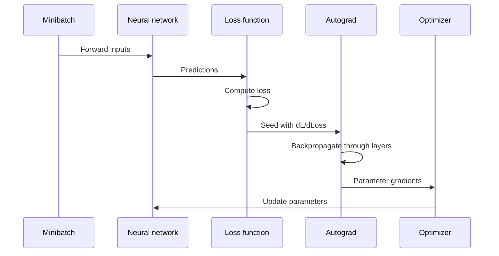

## What it is
A neural network is a parameterized function composed of connected layers that transform inputs into outputs. A multilayer perceptron (MLP) uses affine transformations and nonlinear activation functions, while training adjusts the parameters to reduce a task loss.

## How it works
A feed-forward training run repeats three operations: forward propagation computes layer outputs and the loss, backpropagation computes gradients with the chain rule, and an optimizer uses those gradients to update parameters. PyTorch autograd, TensorFlow GradientTape, and JAX transformations implement automatic differentiation; the optimizer then consumes the gradients.



```yaml
training_run:
  batch:
    size: 128
    shuffle: true
  forward_pass:
    input: "batch of feature vectors"
    hidden: ["linear", "ReLU"]
    output: ["linear", "softmax"]
  loss:
    name: "cross_entropy"
    class_count: 10
  backward_pass:
    algorithm: "chain rule through every layer"
    gradient: "loss gradient with respect to each parameter"
  optimizer:
    name: "Adam"
    learning_rate: 0.001
    regularization: ["weight_decay", "dropout"]
    early_stopping: true
  evaluation:
    split: "validation"
    metric: "accuracy"
```

For a layer, forward propagation computes `h = sigma(Wx + b)`. **Activation functions** introduce nonlinearity: ReLU keeps positive inputs and maps negative inputs to zero, sigmoid maps values to `(0, 1)`, tanh maps values to `(-1, 1)`, and softmax turns a vector of scores into a probability distribution. Hidden layers commonly use ReLU or a related function; the output activation follows the target type.

**Backpropagation** first computes the loss gradient at the output and then repeatedly applies the derivative of each operation to the incoming gradient. The framework records the forward computation and propagates one gradient at a time or in reverse-mode sweeps. The resulting gradient is paired with each parameter. **Stochastic gradient descent (SGD)** updates a parameter in the negative-gradient direction, optionally with momentum. **Adam** combines the current gradient with running first- and second-moment estimates and scales each parameter's update. Backpropagation computes gradients; it does not choose the update rule or decide when to stop.

The loss determines what the network optimizes. Mean squared error is common for regression, while cross-entropy compares predicted probabilities with class targets. Minibatching reduces memory use and adds stochasticity to gradient estimates; initialization, learning-rate schedules, and regularization such as weight decay or dropout affect optimization and generalization. A network can fit the training objective yet generalize poorly, so validation data must drive model selection and the test set must remain untouched until final evaluation.

## Complexity
Let `B` be the batch size, `P` be the number of model parameters, and `d_l` be the width of layer `l`. Stored model parameters occupy O(P) independently of the operation. For a dense MLP, the following bounds cover the main matrix operations; activation and loss costs depend on the layer widths and batch size.

| Operation | Representative time | Additional space |
| --- | --- | --- |
| Forward pass | O(B Σ_l d_l d_(l+1)) | O(B Σ_l d_l) for stored activations |
| Backward pass | O(B Σ_l d_l d_(l+1)) | O(B Σ_l d_l + P) for activations and parameter gradients |
| SGD update | O(P) | O(P) for parameter gradients, excluding the O(P) model parameters |
| Adam update | O(P) | O(P) for parameter gradients and O(P) for optimizer moment state, excluding the O(P) model parameters |
| Inference | O(Σ_l d_l d_(l+1)) per example | O(Σ_l d_l) for one example, excluding the model |

## When to use
- You have enough labeled examples for the model's capacity and can measure generalization on held-out data.
- The input contains useful structure that a model should learn rather than encode as hand-crafted features.
- You have accelerator memory and compute for minibatched matrix operations.
- The task benefits from learned representations, such as image, text, audio, or sensor modeling.
- You can tune the learning rate, initialization, regularization, and stopping criteria.

## Alternatives
- **Linear and logistic models** — train quickly and remain interpretable, but represent only the feature interactions supplied to them.
- **Decision trees and gradient-boosted trees** — are strong on many small-to-medium tabular datasets, but do not learn the same reusable dense representation.
- **Kernel methods and Gaussian processes** — provide strong nonlinear baselines and uncertainty in some settings, but scale poorly with large datasets.

## Related
- [Supervised Learning](01-supervised-learning.md)
- [Unsupervised Learning](02-unsupervised-learning.md)
- [Deep Learning Architectures](04-deep-learning-architectures.md)
- [Transformers](05-transformers.md)
