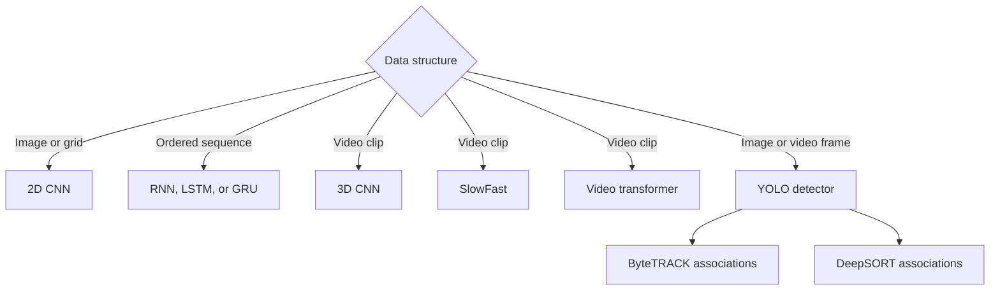

## What it is
Deep learning architectures are neural-network topologies arranged to exploit structure in a data modality. Convolutional neural networks (CNNs) encode local spatial structure, while recurrent neural networks (RNNs), long short-term memory (LSTM), and gated recurrent unit (GRU) networks encode state across a sequence. 3D CNNs, SlowFast, and video transformers model space and time; object detectors such as YOLO and trackers such as ByteTRACK or DeepSORT add localization and temporal association.

## How it works
An architecture determines which inductive bias the model carries into training. A CNN shares filters across positions, an RNN carries state from one sequence position to the next, and a video model exchanges or attends across space and time. A detector then produces object locations and classes, while a tracker associates those detections across frames. PyTorch and TensorFlow provide tensor, differentiation, and module primitives; Keras is a higher-level API that can run on a supported backend.



```yaml
architecture:
  image_model:
    input_shape: [height, width, channels]
    stages: ["convolution", "activation", "pooling or strided convolution"]
    head: "global pooling or dense output"
  sequence_model:
    input_shape: [time, features]
    recurrence: "hidden state updated at each time step"
    variants: ["RNN", "LSTM", "GRU"]
  video_model:
    inputs: [frames, height, width, channels]
    architectures:
      cnn_3d: "convolution across width, height, and time"
      slowfast: "high-frame-rate shallow path plus low-frame-rate deep path"
      video_transformer: "spatiotemporal tokens with self-attention"
  detection_and_tracking:
    detector: "YOLO predicts boxes and classes"
    trackers: ["ByteTRACK", "DeepSORT"]
  training:
    objective: "task-specific classification, reconstruction, detection, or tracking loss"
    gradients: "through layers, time, and any recurrent state"
```

A **convolutional neural network (CNN)** applies a filter across a local receptive field. Weight sharing makes a filter independent of its absolute position, and stacking layers builds higher-level features from lower-level edges and textures. Pooling or strided convolutions reduce spatial dimensions; the final head aggregates spatial information for classification or regression. Architectures such as ResNet add residual connections so a block learns a residual function around an identity path.

A **recurrent neural network (RNN)** processes `x_t` at time `t` and updates a hidden state `h_t` using the current input and previous state. During training, backpropagation through time (BPTT) applies gradients across the unrolled sequence. **Long short-term memory (LSTM)** and **gated recurrent unit (GRU)** networks add gates that regulate memory and state updates. LSTM cells separate cell state from hidden state and use forget, input, and output gates; GRU cells use update and reset gates with a simpler state. Encoder-decoder models combine an encoder with a decoder when an output sequence depends on an input sequence.

A **3D CNN** replaces a 2D kernel with a width-height-time kernel, so filters detect local motion and appearance patterns. **SlowFast** runs a shallow path at a high frame rate for motion and a deeper path at a low frame rate for appearance, then joins their features through lateral connections. **Video transformers** divide clips into spatiotemporal tokens or patches and use self-attention to exchange information across space and time; examples include TimeSformer, Video Swin, and ViViT. Their token count, positional design, and attention kernel determine the memory cost.

**YOLO** is a family of one-stage object detectors that predicts bounding boxes and class scores in one forward pass, unlike two-stage detectors that first propose regions and then classify them. **ByteTRACK** associates high- and low-confidence detections, using lower-scored boxes as evidence when a high-confidence track would otherwise be lost. **DeepSORT** combines motion estimates with an appearance feature in its data-association step, so it can preserve identities through longer occlusions when its detector and re-identification model are reliable. A tracker still depends on frame order, timestamps, detector quality, and its association rules.

## Complexity
Let `B` be the batch size, `H_out` and `W_out` the output frame height and width, `C_in` and `C_out` the input and output channels, `K` the spatial kernel side, `S_out` the number of output frames, `K_t` the temporal kernel size, `T` the sequence length, `d` the recurrent input width, and `h` the recurrent hidden width. For a video transformer, let `N` be its number of spatiotemporal tokens, `d_model` the model width, and `d_ff` the feed-forward width. The RNN bounds treat the fixed gate overhead of LSTM and GRU cells as a constant.

| Operation | Representative time | Additional space |
| --- | --- | --- |
| Dense convolution | O(B H_out W_out C_in C_out K²) | O(B H_out W_out C_out) for one output activation map |
| Average pooling | O(B H_out W_out C_in K²) for a `K × K` window | O(B H_out W_out C_in) for its output map |
| Strided convolution | O(B H_out W_out C_in C_out K²) | O(B H_out W_out C_out) for its output map |
| 3D convolution | O(B S_out H_out W_out C_in C_out K_t K²) | O(B S_out H_out W_out C_out) for one output volume |
| Video-transformer block | O(N² d_model + N d_model² + N d_model d_ff) for materialized self-attention | O(N² + N d_ff) for typical eager attention and feed-forward state |
| LSTM or GRU step | O(B(dh + h²)) | O(Bh) for the current state |
| RNN sequence training | O(TB(dh + h²)) | O(TBh) when unrolling the full sequence |
| RNN incremental inference | O(B(dh + h²)) per step | O(Bh) for the recurrent state; O(BTh) if all outputs are retained |

## When to use
- You need spatial locality and shared filters for images or grid-structured data.
- You need a recurrent state for ordered observations or incremental streaming inference.
- You need to classify or segment video and can trade local temporal bias for global spatiotemporal attention.
- You need object localization and identities across frames, so a YOLO-style detector and ByteTRACK or DeepSORT fit the pipeline.
- You can train with enough data and compute to learn many filters or recurrent parameters.
- You need a task-specific loss and held-out evaluation rather than judging the representation only by training loss.

## Alternatives
- **Transformers** — provide parallel all-token interaction and strong long-range context, but standard self-attention uses quadratic token memory.
- **State-space models** — offer recurrent-style streaming with different sequence complexity, but their quality and tooling vary by task and implementation.
- **Frame-sampled 2D CNNs** — reuse mature image backbones and reduce token or frame cost, but sampled frames can miss brief events and fine-grained motion.

## Related
- [Neural Networks](03-neural-networks.md)
- [Transformers](05-transformers.md)
