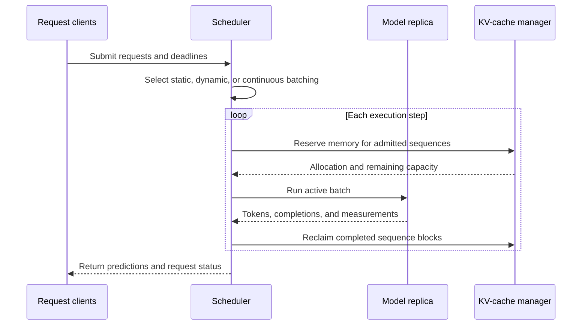

## What it is
High-performance inference is the runtime engineering of serving model predictions with an explicit balance between latency, throughput, memory, quality, and cost. It includes **batching** multiple requests for efficient accelerator execution, **parallel execution** across hardware or model partitions, and a choice between synchronous real-time APIs and asynchronous pipeline processing.

## How it works
A model server loads a versioned artifact, exposes an HTTP or gRPC interface, validates input, schedules work, runs the model, and records telemetry. Triton, TorchServe, TensorFlow Serving, and vLLM provide different combinations of model management, batching, protocol support, and accelerator scheduling. A serving deployment should expose readiness separately from liveness and should fail clearly when the requested model version or feature contract is unavailable.

**Static batching** forms a batch at a fixed size or schedule. It is easy to reason about but can wait for a full batch or leave capacity unused. **Dynamic batching** groups requests while the server is idle or below a batch limit. **Continuous batching**, common in autoregressive LLM serving, adds and removes sequences as tokens are produced so completed requests do not block a fixed batch. Batch size changes latency, throughput, and memory use; the correct choice follows the workload’s latency distribution and SLO.

**Parallel execution** can run independent requests concurrently, split a model with tensor parallelism, split a pipeline across devices, or combine approaches. Data-parallel replicas scale independent model copies; model parallelism makes one model span devices and requires communication and failure coordination. A scheduler must account for device memory, queue depth, request size, context length, and fairness. Compiled engines and kernel selection can improve utilization, but only on supported hardware and software versions.

A synchronous request path is appropriate when the caller needs the prediction before it can continue. An asynchronous pipeline accepts a job, writes inputs to durable storage, processes batches, and exposes job status and results later. Asynchronous serving absorbs traffic spikes and protects the system from per-request timeouts, but it introduces queueing, idempotency, result storage, and user-visible completion semantics.

For generative models, the **KV cache** stores attention keys and values for previously processed tokens. Reusing it avoids recomputing those tensors during decoding, while memory grows with active sequence length. Paged KV-cache storage and admission control reduce fragmentation, but the scheduler must reserve enough memory for newly admitted requests.

A scheduler couples arrivals, execution, and memory state. In continuous batching, completed sequences leave the active set and waiting sequences can enter without restarting the whole batch.



```yaml
inference_service:
  request_contract:
    protocols: [http, grpc]
    inputs: [schema, feature_version, request_id]
    outputs: [prediction, model_version, status]
  scheduling:
    modes: [static_batching, dynamic_batching, continuous_batching]
    controls: [batch_size, max_queue, deadline, fairness]
  execution:
    replicas: data_parallel_instances
    model_parallel: split_one_model_across_devices
    placement: [cpu, gpu, accelerator]
  serving_modes:
    synchronous: return_prediction_before_response
    asynchronous: persist_job_then_return_job_status
  llm_runtime:
    kv_cache: reuse_attention_state_for_decoded_tokens
    admission: reserve_memory_before_admission
  observability:
    metrics: [queue_time, time_to_first_token, per_token_latency, throughput, errors]
    logs: [model_version, request_id, batch_size, input_size]
```

## Tradeoffs

| Design choice | Gain | Cost |
| --- | --- | --- |
| Static batching | Predictable execution and simple capacity planning | Idle capacity while waiting and lower utilization for variable traffic |
| Dynamic batching | Better utilization across mixed request sizes | More scheduler state and variable latency |
| Continuous batching | Higher throughput for autoregressive generation | Complex admission, memory reservation, and fairness logic |
| Data-parallel replicas | Independent scaling and fault isolation | Duplicated model memory and load-balancing overhead |
| Tensor or pipeline parallelism | Fits a model that exceeds one device’s memory | Interconnect communication, coordinated failures, and more tuning |
| Synchronous serving | Immediate application feedback | Caller waits for queue and inference latency |
| Asynchronous serving | Durable buffering and high aggregate throughput | Job state, retries, result retrieval, and less immediate feedback |
| KV caching | Avoids repeated attention computation during decoding | Memory grows with active sequence length and must be managed explicitly |

## When to use
- A user-facing application has a latency SLO and needs predictions in the request path.
- A workload has enough concurrent requests for batching or parallel execution to improve utilization.
- Offline or deferred decisions can tolerate a job queue and retrieve results asynchronously.
- A model exceeds one device’s memory or uses autoregressive decoding with substantial context.
- Traffic is bursty and durable queueing is preferable to rejecting requests during a spike.

## Alternatives
- **Serverless or managed inference** — reduces idle infrastructure management, but cold starts, quotas, and payload limits may affect the SLO.
- **Embedded or in-process inference** — removes a network hop, but centralizes less lifecycle management and couples deployment scaling to the host application.
- **Batch-only scoring** — maximizes offline throughput, but cannot satisfy synchronous use cases.
- **Request-per-request execution without batching** — keeps latency semantics simple, but usually wastes accelerator capacity under load.

## Related
- [End-to-End ML System Design: Training, Validation, Feature Engineering, and Inference Pipelines](01-ml-system-design.md)
- [Model Optimization: Quantization (INT8/FP16), Pruning, Knowledge Distillation, and Model Compilation (TensorRT, ONNX)](03-model-optimization.md)
- [Self-Improving Machine Learning Systems: Feedback Loops, Active Learning, Online Recalibration, Continuous Drift Detection, and Auto-Tuning Pipelines](05-self-improving-machine-learning-systems.md)
- [High-Throughput LLM Serving Frameworks: vLLM, PagedAttention, KV Caching, Continuous Batching, Speculative Decoding, and Prompt Caching](../03-genai/04-llm-serving.md)
