## What it is
A self-improving machine learning system is a governed feedback loop that turns production outcomes into better data, labels, calibration, and release decisions. It improves a deployed decision policy only when fresh evidence survives validation; the model is one versioned component in the loop, not the loop itself.

## How it works
The loop begins with external data, runs a versioned decision pipeline, records the resulting action and context, and later joins the action with an observed outcome or human label. That joined event becomes evidence for the next cycle. A useful implementation separates the path that serves current traffic from the path that selects labels, detects drift, tunes candidates, recalibrates probabilities, and promotes artifacts. Separating the paths prevents late-arriving feedback from changing a production model before its data contract, evaluation, and rollback controls are satisfied.

```mermaid
flowchart LR
    A[External data] --> B[Validate and version]
    B --> C[Versioned decision model]
    C --> D[Action or recommendation]
    D --> E[Outcome and feedback events]
    E --> F[Quality evaluation and drift windows]
    F -->|uncertain or unrepresented| G[Active-learning queue]
    G --> H[Human or delayed label]
    H --> I[Versioned training set]
    F -->|material shift or quality loss| J[Auto-tuning pipeline]
    I --> J
    J --> K[Time-split evaluation and guardrails]
    K -->|approved| L[(Model and calibrator registry)]
    L --> C
```



**Active learning** spends a limited labeling budget on examples that are useful for training or evaluation. Uncertainty sampling can select low-confidence predictions, but confidence alone can overrepresent duplicates or narrow regions of the input space. A production sampler therefore combines an uncertainty signal with diversity, deduplication, and coverage of important segments. River provides online active-learning estimators, while a managed annotation queue applies privacy checks, reviewer instructions, quality review, and label-version tracking. The system records why each example was selected so a later experiment can measure whether the policy improved the model rather than merely changing the training mix.

**Continuous drift detection** compares recent production windows with a versioned reference window. Feature monitors can use distribution distances such as population stability index, Jensen-Shannon distance, Wasserstein distance, or the Kolmogorov-Smirnov statistic, and they also check missingness, range violations, category changes, and segment-level behavior. Data drift is visible before labels arrive; **concept drift** requires outcomes and can be detected through delayed error, calibration, or business metrics. A drift alert starts investigation or a controlled pipeline run, not an automatic deployment. Thresholds, minimum sample sizes, seasonal windows, and excluded segments should be recorded with the detector version so an alert remains explainable.

**Online recalibration** updates the mapping from a model score to a probability while keeping the underlying scoring artifact fixed. Platt scaling is a compact parametric option, isotonic regression can represent a more flexible monotone mapping, and temperature scaling adjusts softmax outputs for multiclass models. The calibration set must come from the current deployment population and must remain separate from model fitting when it is used as an unbiased estimate. Reliability diagrams, Brier score, and log loss test the result. A calibrator update is versioned with its base-model version, training window, method, and evaluation report. When its input contract is unchanged, it can be shadowed or rolled back independently.

**Auto-tuning pipelines** trigger bounded experiments when the evidence justifies them or when a scheduled release policy requests a refresh. A pipeline creates immutable data snapshots, tunes model hyperparameters, decision thresholds, or the calibrator, and records every trial in an experiment tracker. Time-split validation tests the candidate on data that represents later production periods; a held-out test set remains outside the search loop. A candidate must pass task metrics, calibration, subgroup or slice checks, latency, memory, and cost guardrails before it enters shadow or canary traffic. Kubeflow Pipelines can orchestrate versioned steps, MLflow can track runs and model aliases, and a release controller can promote or roll back the winning artifact.

```yaml
improvement_loop:
  evidence:
    inputs: [external_data, decisions, outcomes, human_feedback]
    join_key: [decision_id, entity_id, event_time]
    privacy: [minimize_retention, restrict_access, audit_labels]
  active_learning:
    candidates: [uncertainty, diversity, segment_coverage]
    controls: [label_budget, deduplication, reviewer_quality]
    output: versioned_training_or_evaluation_set
  drift_detection:
    reference: versioned_and_time_bounded
    windows: [current, recent_baseline]
    features: [distribution_distance, missingness, range, prediction_distribution]
    outcome_checks: [delayed_error, calibration, business_metric]
    action: [monitor, investigate, trigger_pipeline]
  online_recalibration:
    methods: [platt_scaling, isotonic_regression, temperature_scaling]
    base_model: versioned_and_fixed
    validation: [reliability_diagram, brier_score, log_loss]
    release: [shadow, canary, rollback]
  auto_tuning:
    search_space: [hyperparameters, decision_thresholds, calibrator]
    split_policy: time_based_with_protected_test_set
    guardrails: [task_quality, calibration, slices, latency, memory, cost]
    promotion: [registry, shadow, canary, champion_or_rollback]
```

The feedback loop also needs controls against self-reinforcement. Historical actions determine which outcomes exist, so a system can repeatedly optimize for the population it already serves. Keep an exploration budget when the decision policy allows it, retain protected or low-frequency segments, audit selection and approval rates, and prevent unverified user reactions from becoming ground truth. Version the policy, feature definitions, labels, detector, tuner, and registry aliases together so an improvement can be reproduced and reversed.

## Tradeoffs

| Design choice | Gain | Cost |
| --- | --- | --- |
| Active-label sampling | Uses a constrained annotation or verification budget more effectively | Adds selection logic, reviewer operations, and potential sampling bias |
| Frequent recalibration | Keeps probability mappings closer to a changing population | Can overfit short windows and requires independent rollback |
| Continuous monitoring | Detects data and operational changes before a scheduled review | Adds metric storage, statistical testing, alert handling, and segmentation work |
| Automated retraining | Shortens the path from evidence to a validated candidate | Consumes compute and can amplify feedback bias if promotion controls are weak |
| Shadow and canary promotion | Limits the traffic exposed to a candidate | Requires duplicate execution, comparable scoring, and slower rollout |
| Human approval for promotion | Adds human judgment to high-impact changes | Slows release and still requires measurable review criteria |

## When to use
- You can join decisions to delayed outcomes and can version both the events and their labels.
- Labeling, review, or experimentation is expensive enough that active selection is worthwhile.
- A deployed model’s score distribution or probability quality changes over time.
- You need an auditable trigger for retraining, recalibration, investigation, or rollback.
- Candidate models can pass time-split evaluation and controlled promotion before serving users.

## Alternatives
- **Scheduled retraining** — wins when release timing is simple and compute is predictable, but it can respond late to drift and waste runs when the model is already current.
- **Online model updates** — adapt continuously with streaming estimators, but they need stronger replay, evaluation, poisoning, and rollback controls than batch releases.
- **Rules and threshold tuning** — provide inexpensive, interpretable reactions to known changes, but they cannot learn new relationships or correct broad model errors.
- **Human review without automation** — offers judgment for sensitive decisions, but it does not scale as a complete monitoring and improvement system.

## Related
- [End-to-End ML System Design: Training, Validation, Feature Engineering, and Inference Pipelines](01-ml-system-design.md)
- [Feature Stores, Dataset Versioning (DVC), and Pipeline Orchestration (Airflow, Kubeflow)](02-feature-stores-pipelines.md)
- [Model Optimization: Quantization (INT8/FP16), Pruning, Knowledge Distillation, and Model Compilation (TensorRT, ONNX)](03-model-optimization.md)
- [High-Performance Inference: Batching, Parallel Execution, and Real-Time vs Async Pipeline Serving](04-inference-serving.md)
