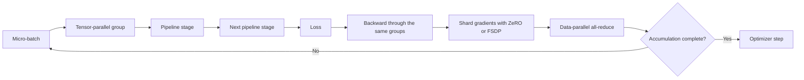

## What it is
Distributed model training partitions a training job across multiple GPUs or machines so that aggregate compute, memory, and interconnect bandwidth replace the limits of one accelerator. **Data parallelism** replicates the model and partitions examples, **tensor parallelism** partitions individual tensor operations, and **pipeline parallelism** partitions layers into sequential stages.

## How it works
A data-parallel training step synchronizes gradients so every replica applies the same effective update. With `N` workers and per-device micro-batch size `B`, one micro-step consumes `N × B` examples. Gradient accumulation combines 16 micro-steps before the optimizer step, so that optimizer step consumes an effective batch of `N × B × 16` examples. All-reduce combines gradients so each replica can update its full parameters; replication does not reduce per-device model memory.

Tensor parallelism splits matrix multiplications and collective communication groups within layers. For a linear layer whose weight does not fit or whose matrix multiplication needs more throughput than one accelerator provides, the framework partitions operands, computes partial outputs, and all-reduces or all-gathers through a process group. Megatron-LM composes this partitioning with pipeline parallelism and coordinated data parallelism for large Transformer models.

Pipeline parallelism assigns contiguous layers to stages. A conventional schedule processes several **micro-batches** so different stages can work concurrently, but stage fill and drain still leave a **pipeline bubble**. Interleaving or virtual pipeline stages can reduce that idle time at the cost of additional communication and scheduling state.

**ZeRO** reduces data-parallel memory by partitioning optimizer state in stage 1, optimizer state and gradients in stage 2, and those states plus parameters in stage 3. Parameters are gathered for computation and resharded afterward. PyTorch FSDP implements closely related explicit sharding patterns. **Activation checkpointing** instead discards selected intermediate activations and recomputes them during backward propagation, trading additional computation for activation memory.



DeepSpeed expresses the first pattern in a training configuration:

```json
{
  "train_micro_batch_size_per_gpu": 1,
  "gradient_accumulation_steps": 16,
  "bf16": {
    "enabled": true
  },
  "zero_optimization": {
    "stage": 3,
    "overlap_comm": true,
    "contiguous_gradients": true
  },
  "activation_checkpointing": {
    "partition_activations": true,
    "cpu_checkpointing": true,
    "contiguous_memory_optimization": true
  },
  "communication_data_type": "bf16"
}
```

A large training job composes these choices into three-dimensional parallelism: tensor groups divide each layer, pipeline groups divide the layer sequence, and data-parallel groups divide examples. The partition must preserve complete dependencies, place communication-heavy tensor groups on fast links, and make every checkpoint loadable on the same world-size and partition layout. Elastic training adds topology-aware checkpoint resharding or restoration so a failed job can restart with a different worker count.

The execution order of a micro-step is forward through tensor and pipeline groups, loss computation, backward through the same dependencies, gradient reduction for the data-parallel group, and an optimizer step after required parameters are materialized. Gradient accumulation performs several micro-steps before the optimizer update; it increases the effective batch size but does not increase micro-batch memory.

## Tradeoffs

| Parallelism or technique | Gain | Cost or risk |
| --- | --- | --- |
| Data parallelism | Replicates model parameters and scales batch throughput | Every rank stores replicated state unless ZeRO shards it, and gradients cross the network |
| Tensor parallelism | Fits large layers and uses accelerator matrix-multiplication throughput | Adds collectives inside the forward and backward critical paths |
| Pipeline parallelism | Partitions capacity by layer count and tolerates model-wide sharding | Introduces bubbles, stage imbalance, and activation transfer |
| ZeRO-3 / FSDP | Reduces replicated optimizer, gradient, and parameter memory | Parameter gather and resharding add communication and kernel complexity |
| Activation checkpointing | Reduces stored activation memory | Recomputation adds forward work during backward propagation |
| Gradient accumulation | Increases the effective batch on limited devices | It does not reduce per-micro-batch activation memory and delays optimizer steps |
| Elastic training | Recovers from device loss and can adjust capacity | Checkpoint resharding and topology discovery add control-plane complexity |

## When to use
- The model, optimizer state, or training activations exceed one accelerator's memory.
- The workload provides enough independent data to justify a large global batch.
- The interconnect is fast enough for the collectives in the selected partition plan.
- The job can checkpoint model, optimizer, scheduler, and data-loader state.
- The expected training time makes accelerator failures and long restart cost material.

## Alternatives
- **Single-device training** — wins for small models and experiments, but has no aggregate compute or memory beyond one device.
- **LoRA or another parameter-efficient method** — wins for adapting a frozen base model, but it does not train the full model and may underfit tasks requiring broad weight changes.
- **Activation checkpointing alone** — wins when activation memory dominates, but it cannot make model or optimizer state that exceeds device memory fit.
- **Cloud managed training** — wins when a provider's supported topology and elastic capacity fit the model, but it constrains hardware, networking, and job customization.

## Related
- [High-Throughput LLM Serving Frameworks: vLLM, PagedAttention, KV Caching, Continuous Batching, Speculative Decoding, and Prompt Caching](04-llm-serving.md)
- [Fine-Tuning & Model Alignment: Parameter-Efficient Fine-Tuning (PEFT, LoRA, QLoRA), Reinforcement Learning Alignment (RLHF, DPO)](06-fine-tuning-alignment.md)
