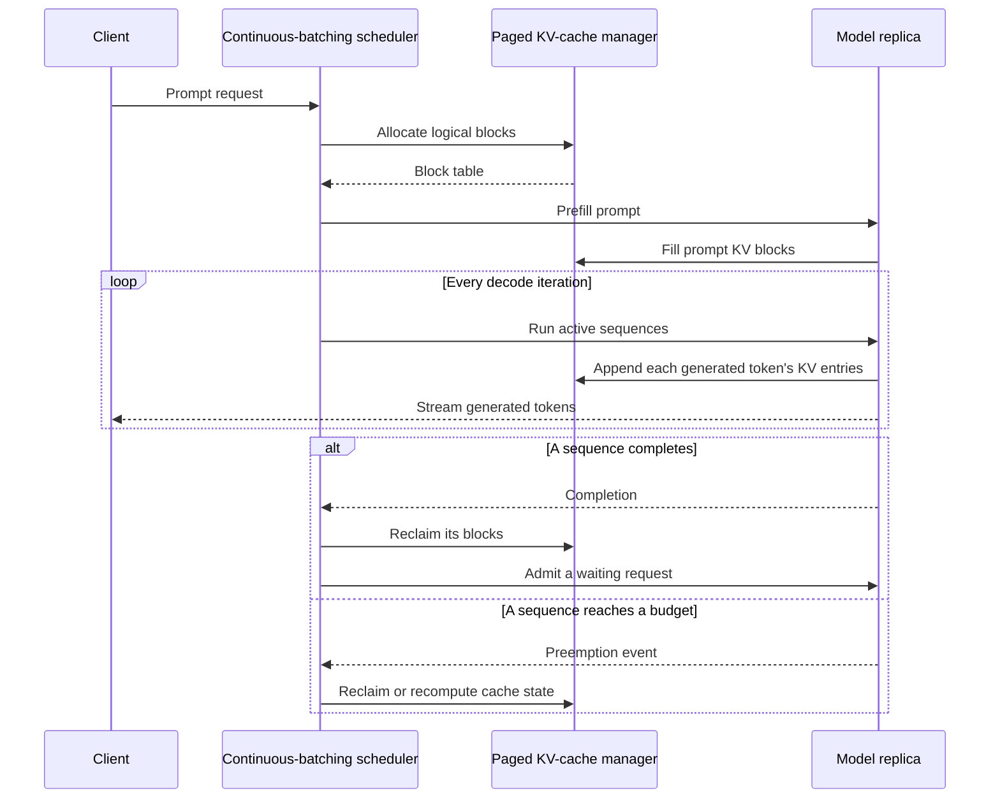

## What it is
High-throughput LLM serving is the runtime engineering that schedules autoregressive generation across accelerator memory while meeting time-to-first-token, inter-token latency, and token-throughput objectives. Frameworks such as vLLM coordinate request admission, model execution, KV-cache allocation, and output streaming instead of waiting for a static batch to finish.

## How it works
An autoregressive Transformer processes a prompt in a **prefill** phase and then produces output tokens one step at a time in a **decode** phase. Both phases execute the same model weights within a serving replica. During prefill, attention computes the KV cache for the prompt. During decode, the runtime appends one token's KV entries and reuses all prior entries instead of recomputing them. Cache size therefore grows with each active sequence and can determine how many requests fit on an accelerator.

**PagedAttention** manages KV-cache memory in fixed-size, noncontiguous blocks. Each sequence owns logical blocks, while a block table maps them to physical blocks; appending a token usually reuses a partially filled block and allocates another when it fills. This reduces memory wasted by reserving a maximum-length contiguous region for every sequence and lets the scheduler share physical memory among requests with different lengths.

A static batch runs until every member finishes. **Continuous batching**, introduced with the Orca serving design and implemented by vLLM, admits new work as completed requests leave the running batch at iteration boundaries. Chunked prefill interleaves prefill and decode work in capable schedulers so long prompts do not monopolize the device. The scheduler must account for prefill compute, decode memory, per-request token budgets, and fairness.

**Speculative decoding** uses a smaller draft model to propose several tokens and a target model to evaluate the proposal in one target step. A verification rule preserves the target model's output distribution while accepting a variable-length prefix of the draft. It can reduce sequential target steps when accepted drafts are long, but it adds draft-model work and can be slower when acceptance is low or the draft model is poorly matched.

**Prompt caching**, implemented as prefix caching in vLLM and related runtimes, hashes a model-qualified prompt prefix and reuses matching KV blocks. It avoids prefill work for repeated system instructions, few-shot examples, and conversation prefixes. Cache identity must include the model and tokenizer context, and access-aware routing must prevent one tenant from learning from or accessing another tenant's cached content.



A deployment manifest separates model placement, request policy, cache, and observation:

```yaml
service: text-generation
engine:
  framework: vLLM
  model: organization/chat-model
  tensor_parallel_size: 4
  trust_remote_code: false
  served_model_name: chat
api:
  protocol: openai_compatible_http
  stream: incremental_tokens
  request_limits:
    max_model_len: 32768
    max_num_seqs: 256
  admission:
    preempt: recompute
    fairness: per_tenant_budgets
cache:
  block_size_tokens: 16
  block_table: per_sequence
  allocation: on_demand
scheduler:
  type: chunked_prefill
  prefill_budget_tokens: 2048
  decode_batch_max_tokens: 256
optional:
  speculative_decoding:
    draft_model: organization/chat-draft-model
    speculative_tokens: 5
metrics:
  - time_to_first_token
  - inter_token_latency
  - output_tokens_per_second
  - time_to_decode_per_output_token
  - preempted_sequences
  - kv_cache_utilization
```

Operational capacity models should track the separate compute and memory bounds of prefill and decode even though both phases share the model weights. More concurrent decode work usually raises throughput but can increase queueing and inter-token latency for active requests. Larger blocks reduce per-block metadata overhead but can waste the unused tail of a short block. Quantization lowers weight and sometimes KV-cache memory, but supported kernels, output quality, and hardware determine whether it is useful.

## Tradeoffs

| Design choice | Gain | Cost or risk |
| --- | --- | --- |
| Static batching | Simple scheduling and predictable batch boundaries | Short requests wait for the longest sequence and the GPU drains at batch boundaries |
| Continuous batching | Replaces completed work without waiting for the whole batch | Queueing and preemption policies affect fairness and latency variance |
| Paged KV cache | Reduces contiguous-allocation waste and supports variable lengths | Adds block-table metadata, indirection, and preemption complexity |
| Tensor-parallel model sharding | Fits a model across multiple GPUs and shares matrix work | Fast links and collective communication are required for good latency |
| Speculative decoding | Can reduce sequential target-model steps for predictable text | Extra draft compute and low acceptance can erase the benefit |
| INT8 or INT4 quantization | Reduces memory traffic and can improve decode throughput | Output quality and kernel support vary by model, format, and accelerator |
| Prefix caching | Reuses KV entries for matching prompt prefixes | Requires cache invalidation, isolation, and access-aware reuse |

## When to use
- You serve concurrent interactive requests with measurable time-to-first-token and inter-token latency objectives.
- Variable prompt and output lengths make static, maximum-length KV reservations wasteful.
- Many short generations leave accelerator capacity unused between request batches.
- The model or KV cache needs more memory than one accelerator provides.
- You can maintain model-version, tenant-isolation, and cache-invalidation policies.

## Alternatives
- **Static batching** — wins for bounded, homogeneous offline jobs, but wastes capacity when request lengths differ.
- **Tensor parallelism** — wins when one model replica does not fit or needs more throughput, but it couples latency to interconnect bandwidth.
- **Pipeline parallelism at serving time** — wins for extremely large models, but pipeline bubbles and cross-stage transfer are less attractive for interactive generation.
- **Managed serverless inference** — wins for demand-driven scale-to-zero, but cold starts, quotas, and long-model initialization complicate strict latency SLOs.
- **Client-side model execution** — wins for private low-concurrency workloads, but hardware limits and model updates are outside the service operator's control.

## Related
- [Vector Databases & Billion-Scale Retrieval: Pinecone, Qdrant, Milvus, Similarity Metrics (Cosine, L2, Dot Product), Approximate Nearest Neighbors (HNSW, IVF-PQ), ScaNN, and DiskANN Out-of-Core Vector Search](01-vector-databases.md)
- [Retrieval-Augmented Generation (RAG): Chunking Frameworks, Hybrid Search, Dense/Sparse Embeddings, and Re-ranking](02-rag.md)
- [Distributed Model Training: Data Parallelism, Tensor Parallelism, Pipeline Parallelism (DeepSpeed, Megatron-LM)](03-distributed-training.md)
- [Fine-Tuning & Model Alignment: Parameter-Efficient Fine-Tuning (PEFT, LoRA, QLoRA), Reinforcement Learning Alignment (RLHF, DPO)](06-fine-tuning-alignment.md)
