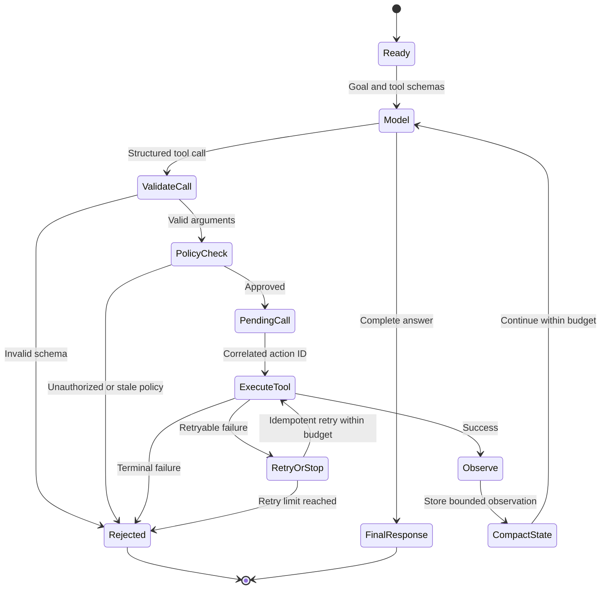

## What it is
An AI agent is a controlled runtime that lets a language model choose actions, invoke tools, inspect observations, and continue until it reaches a stopping condition. The model supplies semantic choices, while the application runtime enforces schemas, permissions, state, budgets, and termination.

## How it works
A tool-calling loop starts when the runtime sends the model a goal, conversation state, and a list of tool definitions. The model returns either a final message or a structured tool call. The runtime validates the call, checks authorization and budgets, records a pending call, executes it outside the model, correlates the result, and starts another turn. Maximum-step, token, and wall-clock limits stop an unstable loop. An idempotency policy separately protects retries from duplicate side effects; it does not prevent the loop from continuing.

Tool definitions need precise types and side-effect semantics. Read-only calls can often be retried, whereas payments, messages, and writes need idempotency keys or explicit confirmation. Keep credentials in the runtime or tool service; send the model only the data and authorization decision it needs.

A JSON Schema for a bounded lookup tool can be:

```json
{
  "name": "search_orders",
  "description": "Find orders belonging to the authenticated customer",
  "input_schema": {
    "type": "object",
    "additionalProperties": false,
    "properties": {
      "status": {
        "type": "string",
        "enum": ["open", "shipped", "canceled"]
      },
      "limit": {
        "type": "integer",
        "minimum": 1,
        "maximum": 50
      }
    },
    "required": ["limit"]
  }
}
```

**Short-term memory** is the state needed for the current task, such as recent messages, intermediate tool results, the current plan, and unfinished actions. The context window is finite, so the runtime must compact old observations without discarding commitments, identifiers, or unresolved errors. **Long-term memory** stores selected durable facts, preferences, or episodes outside the model context, commonly in a relational store, object storage, or vector database. Retrieval selects candidate memories, but the application still needs validity, provenance, retention, and tenant-isolation rules.

**ReAct** interleaves reasoning and action steps: the model proposes an action, an environment returns an observation, and the model uses that observation to choose the next step. In a production agent, store an auditable action and observation trace; do not require hidden chain-of-thought to control execution. Planning-first frameworks can produce a task graph before execution, while reflection frameworks can revise a plan after a failed result.

Multi-agent orchestration assigns roles such as planner, researcher, coder, and verifier. A supervisor agent can delegate and aggregate results, while a blackboard or workflow engine lets workers write typed artifacts to shared state. Coordination adds token cost, message latency, duplicate work, and partial-failure paths. Define ownership, handoff schemas, concurrency limits, and a final integrating role before adding more agents.

The runtime expresses the loop as a bounded state machine so that model output never bypasses validation, policy checks, side-effect controls, or termination rules.



```yaml
agent:
  goal_source: authenticated_request
  context_policy:
    retain: [goal, plan, tool_identifiers, pending_call_status, action_id, arguments, retry_state, unresolved_errors]
    compact: completed_observations
    max_tokens: 24000
  loop:
    next_action: model_or_policy
    validate_tool_schema: true
    authorize: runtime
    execute: isolated_tool_service
    record_pending_call:
      fields: [action_id, arguments, retry_state, status]
      initial_status: pending
      transitions: [pending_to_completed, pending_to_failed]
      correlate_result_by: action_id
    record_observation: true
    stop_when: [goal_complete, max_steps, max_tool_calls, max_tokens, wall_clock_deadline, terminal_tool_failure]
  budgets:
    max_steps: 12
    max_tokens: 32000
    max_tool_calls: 20
    wall_clock_seconds: 90
  side_effects:
    default: require_confirmation
    idempotency_key: request_id_and_action_id
  memory:
    short_term: task_state
    long_term:
      store: durable_application_database
      write: approved_facts_only
      retrieve: tenant_and_policy_filtered
  observability:
    trace: [request_id, step, model, tool, policy_decision, duration, result_class]
```

Safety boundaries belong outside the model. Validate every argument, authorize against the current user, isolate code execution, cap outputs, redact secrets, and require approval for consequential actions. An agent should fail closed when tool state is stale, a policy decision is missing, or the result cannot be matched to a pending call.

## Tradeoffs

| Design choice | Gain | Cost or risk |
| --- | --- | --- |
| Single agent with tools | One planner and context reduce handoff overhead | The same context and model must cover every capability |
| Planner-worker multi-agent system | Specialists can use narrower tools and prompts | Delegation, duplicate work, and result integration add latency and failure modes |
| ReAct action-observation loop | Adapts the next action from tool results | Errors compound across steps and traces grow quickly |
| Explicit plan-first execution | Makes dependencies and progress inspectable | Early plans can become stale when observations change the task |
| Short-term context memory | Preserves immediate details and unresolved state | Large tool histories consume the context window |
| Long-term retrieved memory | Carries approved knowledge across sessions | Stale or unauthorized memories can influence future actions |
| Model-selected tool calls | Flexible composition without hard-coding each branch | Argument and authorization errors become runtime attack surfaces |
| Deterministic workflow | Repeatable, testable, and constrained execution | Less able to handle novel inputs or choose an unplanned tool |

## When to use
- The task requires multiple observations and actions that cannot fit one model call.
- Tools expose controlled APIs or sandboxes that a runtime can authenticate and monitor.
- Success and failure are measurable enough to define stopping conditions.
- Human approval is available for consequential side effects.
- You can operate retries, budgets, traces, and memory retention as production concerns.

## Alternatives
- **Single-call LLM** — wins for one-shot transformation or generation, but it cannot use tools or iterate on observations.
- **Deterministic workflow or DAG** — wins when steps, policy, and side effects are known, but it handles novel cases through explicit branches.
- **Human-in-the-loop workflow** — wins for high-consequence decisions, but it adds staffing and response latency.
- **Retrieval without generation** — wins when the system can return relevant records directly, but it does not synthesize a grounded answer.
- **One multi-agent system for every task** — wins for work that genuinely needs independent specialist roles, but it is slower and harder to reason about than a single agent for simple tasks.

## Related
- [Vector Databases & Billion-Scale Retrieval: Pinecone, Qdrant, Milvus, Similarity Metrics (Cosine, L2, Dot Product), Approximate Nearest Neighbors (HNSW, IVF-PQ), ScaNN, and DiskANN Out-of-Core Vector Search](01-vector-databases.md)
- [Retrieval-Augmented Generation (RAG): Chunking Frameworks, Hybrid Search, Dense/Sparse Embeddings, and Re-ranking](02-rag.md)
- [Fine-Tuning & Model Alignment: Parameter-Efficient Fine-Tuning (PEFT, LoRA, QLoRA), Reinforcement Learning Alignment (RLHF, DPO)](06-fine-tuning-alignment.md)
