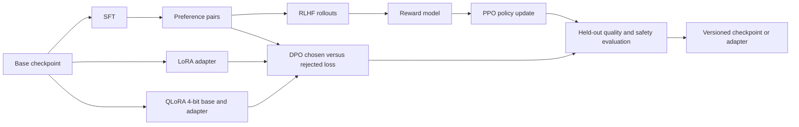

## What it is

Fine-tuning continues training on task-specific examples so a pretrained model changes its behavior, while **alignment** trains a model to prefer responses that satisfy human or policy judgments. Parameter-efficient fine-tuning updates a small adapter instead of the full model; reinforcement learning from human feedback and Direct Preference Optimization change policy parameters from reward or preference signals.

## How it works

**Supervised fine-tuning (SFT)** tokenizes prompt-response pairs, computes a loss against the next response token, and updates model parameters through backpropagation. It teaches the model the target format, domain behavior, and demonstrations, but it does not reliably rank two plausible responses when no single response token reveals which answer a person would prefer.

**Parameter-efficient fine-tuning (PEFT)** freezes most or all base-model parameters and trains a smaller task-specific component. LoRA replaces a full weight update for a selected matrix `W` with a low-rank update: `W + scaling × B × A`. For input width `d_in`, output width `d_out`, and rank `r`, the adapter contains `r × d_in + r × d_out` trainable parameters. The original matrix remains frozen, so the checkpoint is small and the base weights are not overwritten. Typical target modules are the attention and MLP projection matrices named by the model implementation; selecting the wrong module names can produce an adapter that trains successfully but barely changes the intended behavior.

QLoRA keeps the base model in a 4-bit NormalFloat representation, dequantizes blocks as required by compute kernels, and trains adapters at a higher precision. It combines bitsandbytes-style base-weight quantization, the PEFT adapter, gradient checkpointing, and paged optimizer state. It lowers base-weight memory during training, but it does not remove the need to run the base model or store training activations. A 4-bit training recipe is also not automatically the best 4-bit deployment format for every runtime.

**RLHF** commonly starts from an SFT checkpoint. Annotators rank candidate responses, a reward model learns a scalar preference score, and a policy generates rollouts that an optimizer such as Proximal Policy Optimization updates. A KL-divergence term keeps the policy near a reference model, and clipping limits how far an update moves the policy from sampled behavior. The pipeline can improve helpfulness and harmlessness, but reward-model errors, annotator disagreement, reward hacking, and online rollout cost can all affect the result.

**DPO** instead trains directly on preference pairs. It increases the policy's relative log-probability of a chosen response over a rejected response while regularizing against a reference policy. It removes the separate online RL loop, but the reference scores, dataset quality, beta setting, and base-policy behavior still determine what the model learns. With PEFT, an implementation can sometimes use the frozen base as the reference by disabling the trainable adapter, avoiding a second trainable policy.



A reproducible QLoRA run can record the model, data, quantization, adapter, and release gates in one manifest:

```yaml
run:
  base_model: organization/base-model
  method: qlora
  dataset:
    train: sft/train.jsonl
    validation: sft/validation.jsonl
    columns:
      prompt: instruction
      completion: response
  quantization:
    load_in_4bit: true
    bnb_4bit_quant_type: nf4
    bnb_4bit_compute_dtype: bfloat16
    bnb_4bit_use_double_quant: true
  adapter:
    peft_type: LORA
    r: 16
    lora_alpha: 32
    lora_dropout: 0.05
    bias: none
    task_type: CAUSAL_LM
    target_modules:
      - q_proj
      - k_proj
      - v_proj
      - o_proj
      - gate_proj
      - up_proj
      - down_proj
  training:
    per_device_train_batch_size: 1
    gradient_accumulation_steps: 16
    learning_rate: 0.0002
    max_seq_length: 4096
    gradient_checkpointing: true
    optim: paged_adamw_8bit
  release:
    merge_adapter: false
    evaluate:
      - held_out_task_quality
      - safety_policy_suite
      - regression_prompts
    publish:
      - base_model_digest
      - dataset_digest
      - adapter_digest
      - quantization_config
      - evaluation_report
```

The rank, target modules, sequence length, and learning rate are starting choices, not universal constants. Increase adapter capacity only when evaluation shows an underfitting pattern, and compare it with the additional training and serving cost.

## Complexity

Let `P` be total base-model parameters and `d_in` and `d_out` the dimensions of a targeted matrix.

| Method | Updated parameters | Parameter or execution cost |
| --- | --- | --- |
| Full SFT | `Θ(P)` | Stores model-sized gradients; optimizer state depends on the optimizer, and the full model runs in both training directions |
| LoRA | `Θ(Σ r × (d_in + d_out))` over target matrices | Stores a small adapter, but the frozen base still runs and adapters add low-rank multiplications |
| QLoRA | Same adapter count as LoRA | Stores the 4-bit base plus adapter, activations, dequantization workspace, and optimizer state; quality depends on quantization and supported kernels |
| DPO | LoRA adapter or `Θ(P)` for full tuning | Scores chosen and rejected sequences and computes a reference-policy comparison; implementation determines whether a separate reference model is resident |
| RLHF | Policy updates plus reward and reference models | Adds response generation, reward inference, policy scoring, and rollout storage beyond ordinary SFT |

LoRA reduces trainable parameter, gradient, and optimizer memory, not the asymptotic leading compute of running a dense base model. QLoRA's main saving is base-weight representation during training. Neither method guarantees a smaller or faster deployed model unless the adapter is merged, the base is also quantized for serving, and the resulting kernels are benchmarked.

## When to use

- Demonstrations teach a stable task format, domain behavior, or tool policy.
- You need a task-specific model without storing a full optimizer copy for every variant.
- A base model is already strong enough that a small adapter can supply the missing behavior.
- You have preference pairs or a reward signal whose quality you can evaluate.
- You can maintain dataset versions, adapters, safety tests, and rollback artifacts independently.

## Alternatives

- **Prompting and structured context** — wins for rapidly testable behavior, but consumes context and cannot reliably encode every persistent rule.
- **Retrieval-augmented generation** — wins for changing factual knowledge, but does not by itself teach a stable response style or preference policy.
- **Continued pretraining** — wins for broad language or domain adaptation, but costs more compute and can shift unrelated capabilities.
- **Full fine-tuning** — wins when broad weight changes are required, but uses more memory, storage, and operational controls.
- **Distillation** — wins when a smaller model can imitate a validated teacher, but it depends on the teacher's behavior and does not replace preference evaluation.

## Related
- [Distributed Model Training: Data Parallelism, Tensor Parallelism, Pipeline Parallelism (DeepSpeed, Megatron-LM)](03-distributed-training.md)
- [High-Throughput LLM Serving Frameworks: vLLM, PagedAttention, KV Caching, Continuous Batching, Speculative Decoding, and Prompt Caching](04-llm-serving.md)
- [AI Agent Systems: Tool-Calling Mechanics, Long/Short-Term Memory Stores, Reasoning Frameworks (ReAct), and Multi-Agent Orchestration](05-ai-agents.md)
