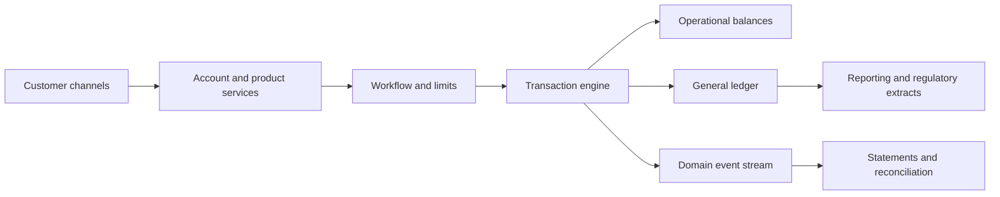

## What it is

A **core banking system** is the authoritative operational platform that maintains customer accounts, movements of money, and the related accounting records. It is the bank's system of record: channels request actions, but the core decides whether a product, balance, limit, and journal entry are valid.

## How it works

A core links three views of the same business event. A **customer account** describes who owns the relationship and its conditions. An **operational account** tracks deposits, loans, cards, and pending transactions. A **general ledger** summarizes those movements into assets, liabilities, income, and expenses.

A deposit request enters through a channel, is checked against account status and available funds, receives an internal transaction identifier, and posts to the ledger. The core updates account balances and produces accounting entries. It also emits events for statements, reconciliation, and downstream reporting.



Core platforms differ in deployment and product model:

| Vendor | Common model | Distinguishing concern |
| --- | --- | --- |
| Temenos | Large institutions with packaged banking products | Broad product coverage and configurable workflows |
| Mambu | Cloud-native deployments with composable APIs | Faster integration and cloud operating models |
| Thought Machine | Cloud-native, composable core with a ledger foundation | Configurable products and event-centric architecture |

A deployment boundary might look like this:

```yaml
core:
  products: [current_account, savings_account, card, loan]
  posting_day: {timezone: UTC, close: "23:55"}
  availability:
    default: immediate
    checks: rule_driven
  ledger:
    base_currency: USD
    posting_batch_size: 5000
  integrations:
    inbound: [cards, payments, identity]
    outbound: [statements, data_warehouse, regulatory_reporting]
  controls:
    maker_checker: required
    immutable_posting_log: true
    segregation_of_duties: true
```

The ledger and operational balance are related but not interchangeable. A ledger may contain compound journal entries across many accounts; an operational balance may be a cached, frequently queried subtotal. Every cached value must be reconstructible from posting records, and every posting must preserve enough evidence to explain who requested it, who approved it, which rules ran, and which accounts changed.

## Tradeoffs

- **Monolithic core** — provides integrated posting and mature controls, but releases, upgrades, and scaling can be tightly coupled.
- **Composable core** — lets teams deploy capabilities independently, but requires deliberate consistency, integration, and operating discipline.
- **Real-time synchronous posting** — gives immediate balances, but increases coupling to downstream services.
- **Asynchronous posting** — isolates the core and supports batching, but introduces pending states and projection lag.

## When to use

- You need deposits, withdrawals, payments, fees, or loans to have one authoritative posting path.
- You must report account activity consistently with the general ledger.
- Product rules, approvals, and limits need enforceable state transitions.
- Regulators or auditors require traceable postings and segregation of duties.
- Multiple channels and products must share account behavior.

## Alternatives

- **Commercial payment processing platforms** — simplify card and acquiring operations, but are not a complete general-ledger core.
- **Ledger-first internal platforms** — provide strong accounting control, but require the bank to build product, workflow, and integration depth around them.
- **Hosted core banking** — reduces infrastructure ownership, but creates vendor, migration, and jurisdictional constraints.

## Related
- [Double-Entry Bookkeeping: Ledger Design, Journal Entries, Chart of Accounts, Multi-Currency Ledgers](02-double-entry-bookkeeping.md)
- [Payment Processing Architecture: Authorization/Capture/Settlement Flow, Payment Orchestration, Idempotency Keys & Idempotent Request Handling](04-payment-processing-architecture.md)
- [Ledger Consistency: Event-Sourced Ledgers, Immutable Audit Trails, Double-Spend Prevention, Eventual Consistency in Distributed Ledgers](06-ledger-consistency.md)
