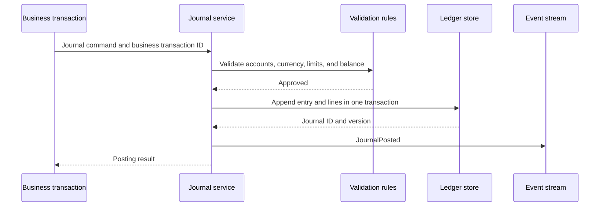

## What it is

**Double-entry bookkeeping** records each transaction as equal debits and credits in a **general ledger**. The debit and credit sides explain where value came from and where it went, making the books easier to balance, reconcile, and audit.

## How it works

A **chart of accounts** classifies postings into stable categories such as customer deposits, correspondent bank accounts, loan assets, interest income, and payment fees. A **journal entry** groups balanced lines that post together under one transaction identifier and business date. The system rejects an entry unless its debits equal its credits in the entry's functional currency.

For a customer deposit of USD 100 funded by a correspondent bank, customer deposit liability increases on the credit side while the bank's asset increases on the debit side. A compact ledger model can look like this:

```sql
CREATE TABLE journal_entry (
    journal_id uuid PRIMARY KEY,
    business_date date NOT NULL,
    description text NOT NULL,
    posting_status text NOT NULL,
    created_at timestamptz NOT NULL
);

CREATE TABLE journal_line (
    journal_id uuid NOT NULL REFERENCES journal_entry(journal_id),
    line_number smallint NOT NULL,
    ledger_account_id uuid NOT NULL,
    debit_minor bigint NOT NULL DEFAULT 0,
    credit_minor bigint NOT NULL DEFAULT 0,
    currency char(3) NOT NULL,
    PRIMARY KEY (journal_id, line_number),
    CHECK (debit_minor >= 0 AND credit_minor >= 0),
    CHECK (NOT (debit_minor > 0 AND credit_minor > 0))
);
```

Money should be stored as integer minor units when the chosen currency permits it. Floating-point values can introduce rounding differences that make a balanced journal appear unbalanced.



A **multi-currency ledger** must distinguish transaction currency, ledger currency, and the functional currency used for financial reporting. Foreign-currency postings may exchange into a reporting currency using a documented rate and effective date. Exchange gains and losses become separate accounts rather than silently changing the original amount.

```yaml
journal_policy:
  functional_currency: USD
  require_zero_net_by_currency: true
  require_equal_debits_and_credits: true
  allowed_rounding: half_even
  foreign_currency:
    rate_type: closing
    preserve_original_amount: true
    posting_accounts: [fx_currency_gain, fx_currency_loss]
  reversal:
    method: new_reversing_entry
    preserve_original: true
```

Corrections should create compensating entries with references to the original journal. Editing posted rows destroys auditability, while deleting a failed journal without a reason can hide an operational incident.

## Tradeoffs

- **Current-value accounting** — reflects expected collections and losses, but introduces estimates and complex adjustments.
- **Historical-value accounting** — keeps original measurements and reversals clear, but can report profits differently from tax or regulatory measures.
- **One currency per entry** — simplifies balancing, but requires paired journals for some conversions.
- **Multi-currency entry** — keeps translation visible, but makes validation, rounding, and reporting more demanding.

## When to use

- You need a traceable basis for financial statements and regulatory reporting.
- Customer, money-transfer, or payment movements must be explainable by account.
- Multiple currencies and exchange rates affect the books.
- Audit evidence must connect a source transaction to every affected account.
- Reconciliations must prove that subledgers and the general ledger agree.

## Alternatives

- **Single-entry expense records** — fit simple personal or exploratory bookkeeping, but do not provide the same control and balance model.
- **Event-sourced accounting** — preserves all changes and projections, but requires robust event schemas, replay, and correction procedures.
- **Daybooks without a general ledger** — simplify high-volume capture, but still need aggregation into a controlled financial chart of accounts.

## Related
- [Core Banking Systems: Account Structures, General Ledger, Core Banking Vendors (Temenos, Mambu, Thought Machine)](01-core-banking-systems.md)
- [Reconciliation Systems: Statement Matching, Break Detection, Automated Clearing, Ledger-to-Bank Reconciliation](05-reconciliation-systems.md)
- [Ledger Consistency: Event-Sourced Ledgers, Immutable Audit Trails, Double-Spend Prevention, Eventual Consistency in Distributed Ledgers](06-ledger-consistency.md)
