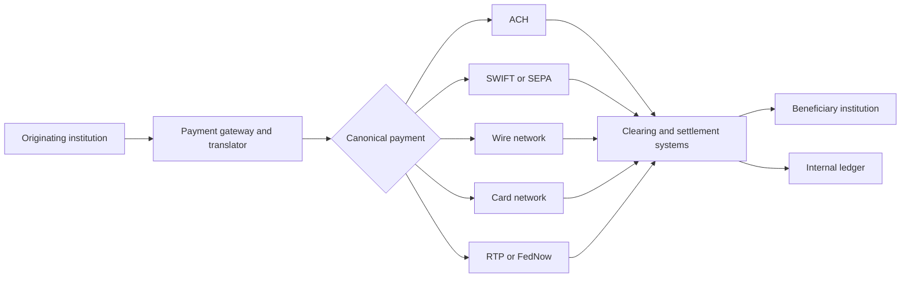

## What it is

A **payment rail** is a network and operating model that moves payment instructions and settles obligations between financial institutions. ACH, SWIFT messaging, SEPA payment schemes, card networks, wires, RTP, and FedNow differ in speed, reach, settlement model, and message format.

## How it works

Banks connect directly or through a gateway, sponsor, or service provider. A payment platform validates instructions, selects a rail, tracks acknowledgments and exceptions, and posts the resulting ledger entries. It should preserve the institution's canonical payment model instead of exposing each network's wire format to the entire business.



| Rail or message | Core model | Useful distinction |
| --- | --- | --- |
| ACH | Batch or scheduled debit and credit processing | Defined clearing windows and return handling |
| SEPA | European payment schemes with a structured ISO 20022 family | High-volume account-to-account payments |
| SWIFT | Financial messaging network, including MT and ISO 20022 messages | Carries instructions and reports, not settlement itself |
| Wire | Bank-to-bank transfer through a designated network | Direct instruction, higher cost, separate rails |
| Visa and Mastercard | Card authorization, clearing, and settlement networks | Uses ISO 8583 and related network messages |
| RTP and FedNow | Real-time account-to-account payment services | Immediate or near-immediate status and confirmation |

**ISO 20022** is a structured financial-message standard, not a settlement rail. Banks map canonical payment instructions to messages such as `pacs.008`, customer credit transfers, and `pacs.002`, status reports. The mapping layer must preserve the end-to-end trace from the internal payment ID to every external reference.

A practical route policy can separate business intent from network configuration:

```yaml
payment_route:
  rails:
    ach:
      purpose: us_ach
      message: iso_20022_pacs_008
      cutoff: America/New_York/16:30
    sepa:
      purpose: eu_sepa
      message: iso_20022_pacs_008
      settlement_currency: EUR
    swift:
      purpose: correspondent_transfer
      message: iso_20022_pacs_008
    rtp:
      purpose: domestic_realtime
      message: iso_20022_pacs_008
    fednow:
      purpose: us_instant
      message: iso_20022_pacs_008
  selection:
    customer_eligibility: true
    beneficiary_scheme: true
    amount_limits: true
    cutoff: true
  observability:
    correlation_fields: [payment_id, end_to_end_id, network_reference]
```

A rail adapter should translate fields, enforce scheme rules, manage acknowledgments, and normalize network responses. Business services should not infer settlement merely from a synchronous HTTP success; finality differs by rail.

## Tradeoffs

- **Single rail per payment type** — simplifies operations, but limits reach and customer choice.
- **Smart rail routing** — improves cost, speed, and resilience, but adds compliance, cut-off, and routing complexity.
- **Native ISO 20022 interfaces** — reduce mapping work, but limit flexibility for organizations with many legacy systems.
- **Hub-and-spoke access** — accelerates market entry, but adds provider dependency and an extra operational boundary.

## When to use

- You need to send or receive payments across more than one institution or region.
- Business requirements include speed, finality, availability, or reach.
- Legacy formats must be translated to a stable internal payment model.
- Regulators require message traceability and structured reporting.
- A customer should choose a rail or the platform should choose one by policy.

## Alternatives

- **Direct bank connectivity** — maximizes control and may reduce per-payment gateway costs, but requires connectivity, certificates, and maintenance for every institution.
- **Aggregated payment service providers** — simplify one integration, but constrain available rails and reporting detail.
- **Closed-loop wallet or stored-value networks** — fit platform ecosystems, but are not substitutes for general account-to-account settlement.

## Related
- [Payment Processing Architecture: Authorization/Capture/Settlement Flow, Payment Orchestration, Idempotency Keys & Idempotent Request Handling](04-payment-processing-architecture.md)
- [Reconciliation Systems: Statement Matching, Break Detection, Automated Clearing, Ledger-to-Bank Reconciliation](05-reconciliation-systems.md)
- [Ledger Consistency: Event-Sourced Ledgers, Immutable Audit Trails, Double-Spend Prevention, Eventual Consistency in Distributed Ledgers](06-ledger-consistency.md)
