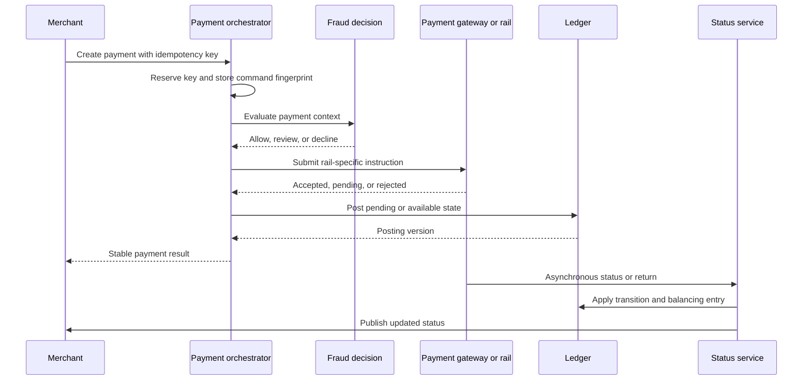

## What it is

A **payment processing architecture** coordinates payment requests, external gateways, ledgers, fraud decisions, and status updates. **Payment orchestration** routes each operation through the required policies and integrations, while an **idempotency key** lets the system recognize a repeated request safely.

## How it works

Card payments commonly move through three distinct stages. **Authorization** reserves funds and asks whether the issuer expects the purchase to proceed. **Capture** converts an approved authorization into a charge, either at checkout or later. **Settlement** is the network and issuer process that transfers the net obligation and posts final financial records.

Other rails compress or rename these stages. A real-time account-to-account payment can receive immediate final status, while an ACH instruction is commonly accepted before later settlement or return. The orchestration model should therefore express durable business state rather than hard-code card steps for every rail.



The orchestrator persists the payment ID, current state, rail references, amount, and version. It records every attempted transition rather than overwriting history. A timeout is not proof of failure because the remote rail may have accepted the instruction; uncertain states require status lookup or reconciliation.

An idempotency contract can be explicit:

```http
POST /v1/payments HTTP/1.1
Idempotency-Key: 01J2R7K9Q4M8V6W3N5T0X1Y2Z3
Idempotency-Version: 1
Content-Type: application/json

{
  "merchant_id": "mrc_8f12",
  "amount": {"minor": 4999, "currency": "USD"},
  "payment_method_token": "pm_tok_01",
  "rail_preference": ["card", "ach"]
}
```

The key is scoped to the authenticated merchant, operation, and API version. The service stores a hash of the canonical request with the result. A repeat with the same key and same request returns the original result; a repeat with the same key but a different request returns a conflict. Store the key and initial outcome atomically with any local state transition, and retain it long enough to cover client and partner retry windows.

## Tradeoffs

- **Synchronous orchestration** — returns a decision quickly, but couples availability to several dependencies.
- **Asynchronous state machine** — isolates dependencies and records progress, but requires polling, notifications, and delayed-state handling.
- **Shared idempotency store** — prevents cross-service duplicate effects, but introduces a durable consistency boundary.
- **Service-local keys** — scales simply, but a retry across workflows can repeat a side effect before a global identifier is known.

## When to use

- A payment can pass through several internal and external systems.
- Networks, processors, or ledgers can return ambiguous or delayed results.
- Clients and partners retry timeouts.
- Business rules select or fall back between rails.
- Every state change needs an auditable cause and correlation ID.

## Alternatives

- **Gateway-managed processing** — reduces internal orchestration work, but places routing, reporting, and state ownership outside the bank.
- **A single synchronous ledger call** — is simple for closed-loop payments, but does not model authorization, capture, settlement, and returns by itself.
- **Event-driven payment workflows** — improve resilience and auditability, but require explicit state-machine and compensation design.

## Related
- [Payment Rails & Messaging Standards: ACH, SWIFT/SEPA, Wire Transfers, Card Networks (Visa/Mastercard), Real-Time Payments (RTP, FedNow), and ISO 20022 Protocol Integration](03-payment-rails-messaging-standards.md)
- [Reconciliation Systems: Statement Matching, Break Detection, Automated Clearing, Ledger-to-Bank Reconciliation](05-reconciliation-systems.md)
- [Fraud Detection: Rule Engines, Velocity Checks, Device Fingerprinting, ML-Based Anomaly Scoring](07-fraud-detection.md)
- [Card Tokenization: PAN Tokenization (Network Tokens - Visa/MC Token Service), EMV Tokenization, Format-Preserving Encryption, Token Vaults, Device-Bound Tokens (Apple Pay/Google Pay), Detokenization Flow & PCI Scope Reduction](08-card-tokenization.md)
