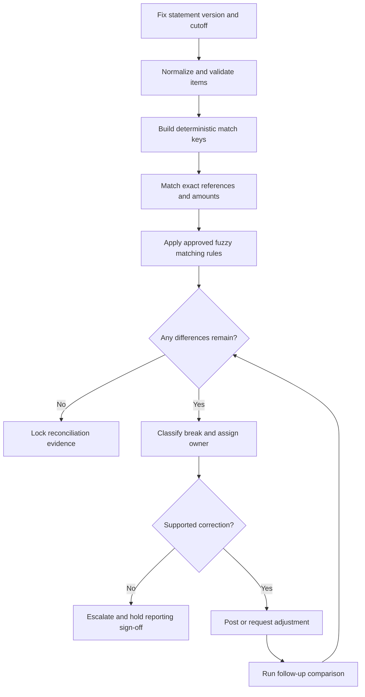

## What it is

A **reconciliation system** compares independent records, matches equivalent items, and explains every difference. It acts as a control that internal subledgers, payment partners, and external bank statements reflect the same settled financial activity.

## How it works

A reconciliation run fixes a statement, currency, and cutoff so the same inputs produce a repeatable result. It normalizes identifiers, amounts, dates, and directions; generates candidate matches; and applies a documented matching strategy. Items that match are cleared; remaining **breaks** move to investigation with an owner and reason code.



Matching should move from strongest evidence to weaker evidence. An exact provider reference and amount is stronger than matching by amount, date, and customer name alone. A one-to-many match requires an approved allocation, while a many-to-one match can combine fee components and must still reconcile to the total.

A practical clearing job can make controls explicit:

```yaml
reconciliation_run:
  statement: bank_statement_2026-09-24
  statement_version: 3
  ledger_currency: USD
  cutoff: 2026-09-24T23:59:59Z
  sources:
    - type: bank_statement
      object: s3://finance/bank/2026-09-24.csv
    - type: payment_subledger
      table: settled_payments
    - type: general_ledger
      accounts: [correspondent_cash, settlement_clearing]
  match_order:
    - [provider_reference, amount, currency]
    - [network_trace_id, amount, currency]
    - [bank_serial, amount]
  tolerances:
    amount: 0
    days: 0
  unmatched:
    minimum_amount_minor: 1
    severity:
      aging_days_0_1: high
      aging_days_2_7: critical
  controls:
    lock_statement_after_signoff: true
    require_evidence_for_writeoff: true
```

**Automated clearing** should only automate a match when the evidence and thresholds are approved. **Ledger-to-bank reconciliation** compares the cash account in the general ledger with bank balances and statement evidence; it is not complete merely because the payment subledger matches internal settlement records.

Each result should retain the input version, algorithm version, candidate evidence, decision, timestamps, and any human override. Reprocessing the same locked version should produce the same result, while a corrected statement requires a new version and a full rerun.

## Tradeoffs

- **Exact matching** — is precise and auditable, but leaves legitimate formatting and timing differences unresolved.
- **Rule-based fuzzy matching** — resolves more breaks automatically, but can create false matches and requires tight controls.
- **Machine-learned matching** — handles broader patterns, but needs explainability, labeled examples, and constrained financial actions.
- **Manual review** — handles unusual cases, but is slow and should not be the default path for high volumes.

## When to use

- A subledger must be proven against a bank or network statement.
- Payment settlement produces timing, fee, return, or FX differences.
- Finance must demonstrate that cash, clearing, and general-ledger balances agree.
- Regulators or auditors need evidence of complete and timely reconciliation.
- Break volume requires measurable ownership and aging.

## Alternatives

- **Spreadsheet reconciliation** — is quick for small volumes, but lacks durable lineage, concurrency control, and complete audit evidence.
- **ERP reconciliation modules** — integrate enterprise accounting, but may be too coarse for high-volume payment exceptions.
- **Ledger-native balance comparison** — catches missing totals, but cannot explain item-level mismatches by itself.

## Related
- [Double-Entry Bookkeeping: Ledger Design, Journal Entries, Chart of Accounts, Multi-Currency Ledgers](02-double-entry-bookkeeping.md)
- [Payment Rails & Messaging Standards: ACH, SWIFT/SEPA, Wire Transfers, Card Networks (Visa/Mastercard), Real-Time Payments (RTP, FedNow), and ISO 20022 Protocol Integration](03-payment-rails-messaging-standards.md)
- [Payment Processing Architecture: Authorization/Capture/Settlement Flow, Payment Orchestration, Idempotency Keys & Idempotent Request Handling](04-payment-processing-architecture.md)
- [Ledger Consistency: Event-Sourced Ledgers, Immutable Audit Trails, Double-Spend Prevention, Eventual Consistency in Distributed Ledgers](06-ledger-consistency.md)
