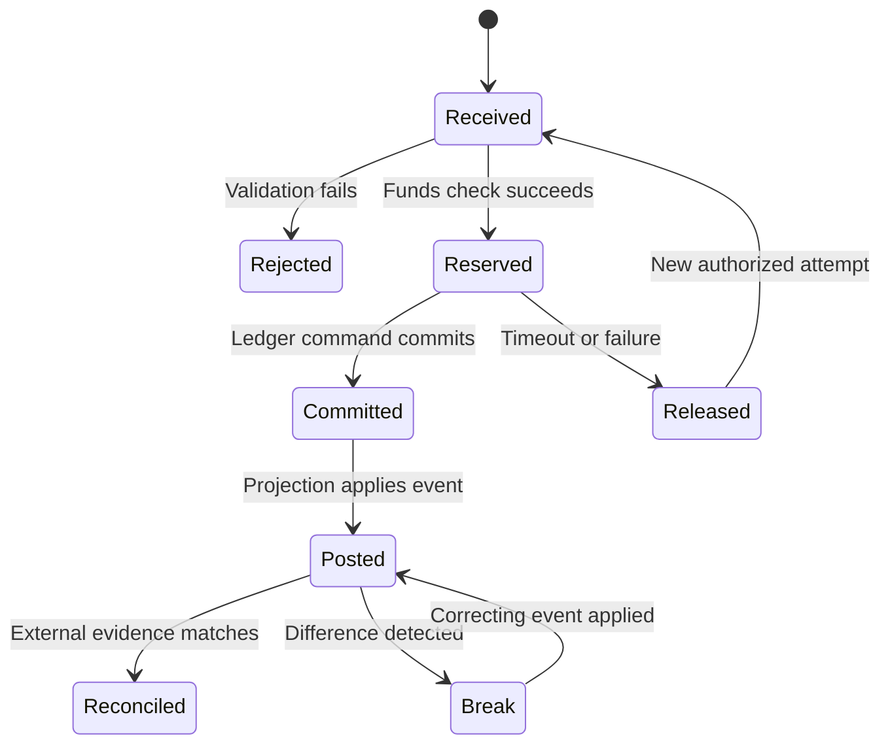

## What it is

**Ledger consistency** is the set of rules that keeps balances, postings, and audit evidence trustworthy under retries, concurrency, failure, and replication. An **event-sourced ledger** stores authoritative changes as an ordered event log and derives balances into read models; an **immutable audit trail** preserves who did what without silently rewriting history.

## How it works

An append-only event stream records accepted domain facts. A projector consumes those events to build account balances, statements, risk features, and reporting tables. Corrections are new compensating events, and a projection can be rebuilt by replaying the stream.



The event store is the durable boundary, but consistency depends on what the command handler atomically protects. A database transaction can lock an account row, check available funds, append a posting event, and advance the stream version. This prevents two concurrent requests from spending the same reserved balance within that account aggregate.

```sql
BEGIN;

SELECT account_id, available_minor
FROM account_balance
WHERE account_id = $1
FOR UPDATE;

INSERT INTO posting_event (
    event_id,
    account_id,
    business_type,
    amount_minor,
    currency,
    causation_id,
    stream_version,
    payload
) VALUES ($2, $1, 'card_authorization', $3, $4, $5, 1, $6);

UPDATE account_balance
SET available_minor = available_minor - $3,
    stream_version = stream_version + 1
WHERE account_id = $1;

COMMIT;
```

A unique constraint on the business operation identifier prevents duplicate effects. Version checks prevent an older writer from overwriting a newer state. Authorization of the event itself still belongs in the command path and must not trust client-supplied account ownership.

```json
{
  "event_id": "01J2S4C8M7N6P5Q2R9T0V1W3X4",
  "stream_id": "account_01J1A",
  "stream_version": 128,
  "business_operation_id": "capture_01J2S3",
  "event_type": "ledger.posting.appended",
  "effective_at": "2026-09-24T14:18:31Z",
  "amount": {"minor": 4999, "currency": "USD"},
  "references": {
    "authorization_id": "auth_01J2R9",
    "payment_id": "pay_01J2R7"
  },
  "schema_version": 1
}
```

Replication can introduce **eventual consistency**: a replica or projection may lag behind the authoritative stream. Read paths should report the observed version or watermark. A transfer that must not be spent twice belongs in a serialized aggregate or requires a ledger-wide coordination protocol; independent asynchronous replicas alone cannot guarantee that condition.

## Tradeoffs

- **Event sourcing** — gives complete history and rebuildable views, but requires schema evolution, replay, and correction tooling.
- **Mutable relational balances** — gives simple transactional reads, but weakens historical reconstruction unless changes are also recorded.
- **Per-account serialization** — makes spend decisions clear, but can create hot accounts and requires deadlock and contention handling.
- **Global serialization** — gives one total order, but limits throughput and availability.

## When to use

- Auditors need a replayable history of every accepted and corrected financial action.
- Retries or concurrent requests could otherwise create duplicate or conflicting postings.
- Multiple projections need different views of the same facts.
- Operations span regions or asynchronous services.
- Business users need to explain a balance from its underlying events.

## Alternatives

- **Relational double-entry with audit tables** — is conventional and efficient, but does not automatically make every table event-sourced.
- **External consensus ledgers** — distribute validation across participants, but add protocol, privacy, and operational complexity.
- **Strict synchronous replicas** — reduce stale reads, but trade availability and cross-region latency.

## Related
- [Double-Entry Bookkeeping: Ledger Design, Journal Entries, Chart of Accounts, Multi-Currency Ledgers](02-double-entry-bookkeeping.md)
- [Reconciliation Systems: Statement Matching, Break Detection, Automated Clearing, Ledger-to-Bank Reconciliation](05-reconciliation-systems.md)
- [Payment Processing Architecture: Authorization/Capture/Settlement Flow, Payment Orchestration, Idempotency Keys & Idempotent Request Handling](04-payment-processing-architecture.md)
- [Fraud Detection: Rule Engines, Velocity Checks, Device Fingerprinting, ML-Based Anomaly Scoring](07-fraud-detection.md)
