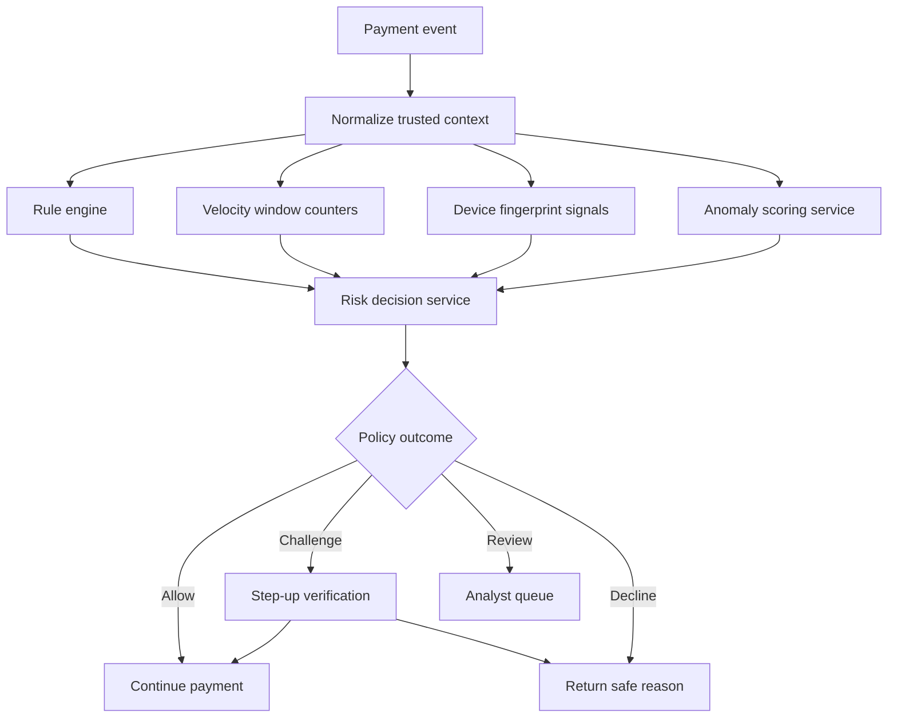

## What it is

**Fraud detection** evaluates whether a payment or account action is abnormal or violates an explicit control. It combines rules, recent activity, device context, and statistical or machine-learned scores to allow, challenge, review, or decline an event.

## How it works

A decision pipeline receives trusted identity, account, payment, device, and network context. A **rule engine** evaluates deterministic policy. **Velocity checks** count events in a recent window, such as several attempts from one card across different accounts. **Device fingerprinting** creates a risk signal from browser, device, and network characteristics, subject to privacy and policy controls. An **ML-based anomaly scorer** estimates risk from learned patterns and contributes evidence rather than bypassing required controls.



Rules and model scores should be versioned independently. A decision record preserves the exact inputs, feature snapshot, rule version, model version, outcome, and reason codes without retaining unnecessary raw personal data.

```yaml
fraud_policy:
  decision_version: 2026-09-24.1
  rules:
    - id: impossible-travel
      when: "account_country != device_country and transaction_country != account_country"
      outcome: review
    - id: trusted-device-override
      when: "payment_amount_minor <= 10000 and device_trust >= 0.95"
      outcome: allow
      restrictions: [no_cross_border]
  velocity_checks:
    - scope: [card_fingerprint]
      window: 10m
      maximum: 3
      action: step_up
    - scope: [account_id, device_fingerprint]
      window: 24h
      maximum: 2
      action: review
  model:
    name: payment_risk_v18
    block_threshold: 0.92
    step_up_threshold: 0.65
  fallback:
    service_unavailable: conservative_local_rules
  privacy:
    retention_days: 30
    require_purpose: true
```

Velocity counters need efficient updates. A sorted event store or time-window counter can answer a count, while a streaming aggregator can maintain recent values per account, token, device, or network. The key must prevent a customer from bypassing a limit by changing an untrusted identifier.

Fraud models also face **model drift** as customer behavior, attacks, and devices change. Teams monitor false positives, false negatives, approval rate, loss, review volume, and segment performance. They retrain and challenge models without rewriting historical decisions.

## Tradeoffs

- **Rules only** — explainable and easy to change, but create maintenance burden and struggle with novel patterns.
- **Model only** — can detect complex patterns, but may be opaque, biased, and hard to operate safely.
- **Rules plus models** — combines control and flexibility, but requires careful policy ordering and governance.
- **Static thresholds** — are predictable, but do not adapt to changing activity.

## When to use

- Payments expose accounts to credential theft, account takeover, or payment fraud.
- You can define enforceable controls and collect trustworthy event context.
- Reviewers need consistent reason codes and evidence.
- False positives and losses must be balanced for the product.
- Model or rule changes require rollback and outcome monitoring.

## Alternatives

- **Strong customer authentication** — reduces risk through possession or knowledge checks, but does not replace monitoring and can add customer friction.
- **Manual review for every unusual event** — gives human judgment, but does not scale and risks inconsistent decisions.
- **Network intelligence feeds** — provide shared signals, but can be incomplete, delayed, or privacy-sensitive.

## Related
- [Payment Processing Architecture: Authorization/Capture/Settlement Flow, Payment Orchestration, Idempotency Keys & Idempotent Request Handling](04-payment-processing-architecture.md)
- [Ledger Consistency: Event-Sourced Ledgers, Immutable Audit Trails, Double-Spend Prevention, Eventual Consistency in Distributed Ledgers](06-ledger-consistency.md)
- [Card Tokenization: PAN Tokenization (Network Tokens - Visa/MC Token Service), EMV Tokenization, Format-Preserving Encryption, Token Vaults, Device-Bound Tokens (Apple Pay/Google Pay), Detokenization Flow & PCI Scope Reduction](08-card-tokenization.md)
