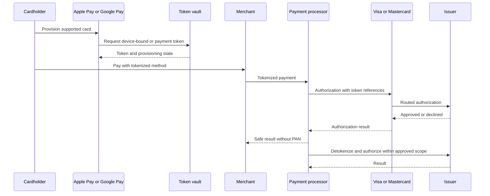

## What it is

**Card tokenization** replaces a primary account number, or **PAN**, with an identifier called a token that has no value to an unauthorized merchant. A protected **token vault** maps tokens to card data, while controlled **detokenization** retrieves the PAN only for an authorized payment or approved operational use.

## How it works

A merchant sends a payment token instead of storing the card number. The token request binds the token to a merchant, cardholder, device or wallet context, and allowed use according to the issuing or network service. At authorization, the acquirer and issuer resolve the token to the card account without exposing the PAN to the merchant.



There are several related mechanisms:

| Mechanism | Behavior | Main distinction |
| --- | --- | --- |
| Payment tokenization | Replaces PAN with a PAN-like or opaque token | Must be reversible only through a controlled issuer service |
| Network tokens | Visa and Mastercard provision tokens for issuer and payment ecosystems | Lifetime and device provisioning are controlled by network and issuer policy |
| EMV tokenization | Uses standardized token state and cryptogram-based flows | The cryptogram and device context bind the request to its provisioning |
| **Format-preserving encryption (FPE)** | Encrypts a PAN while preserving a chosen digit format | Creates a deterministic surrogate; it is not a substitute for a token vault |
| Device-bound tokens | Bind a payment credential to supported device or wallet state | Reduces exportability and supports issuer lifecycle controls |

FPE uses a keyed, reversible algorithm such as an approved FF1 construction. Because deterministic encryption can reveal equality and requires careful key and format handling, production card designs generally use dedicated tokenization rather than exposing an FPE value as a universal payment token.

A token request policy might be:

```yaml
token_service:
  networks: [visa, mastercard]
  token_ttl_days: 90
  provisioning:
    channels: [ios, android, browser]
    device_binding: required
  merchant_bindings:
    merchant_id: mrc_8f12
    allowed_purpose: [recurring, card_on_file]
  detokenization:
    callers: [payment_authorization, dispute_operations]
    require_active_token: true
    log_access: true
    prohibit_unstructured_export: true
  vault:
    hsm_backed_keys: true
    separated_pan_and_metadata: true
    immutable_access_audit: true
```

Detokenization is privileged. The caller must present a valid payment or dispute operation, the token must be active for the intended merchant and environment, and access must be logged. Front-end applications should never call an unrestricted detokenization endpoint to reveal a PAN.

Tokenization can reduce the systems that store, process, or transmit account data and therefore reduce **PCI DSS scope**. It does not make a merchant automatically compliant: merchant systems still handle sensitive authentication data and payment flows, and scope must be validated from the actual architecture and current PCI requirements.

## Tradeoffs

- **Opaque tokens** — avoid accidental format dependence, but require token-aware legacy integrations.
- **PAN-like tokens** — fit existing field widths, but can encourage unsafe assumptions and accidental persistence.
- **Format-preserving encryption** — limits format changes, but preserves structure and requires a secure deterministic key design.
- **Tokenization** — removes raw card data from merchant systems, but adds token lifecycle, provisioning, and recovery complexity.

## When to use

- Merchants and systems should not store or process raw PANs.
- A card processor or network supports token provisioning and authorization.
- Recurring payments need a durable credential with lifecycle controls.
- You are designing systems under the PCI DSS standard.
- A wallet expects device-bound provisioning and network cryptograms.

## Alternatives

- **Virtual card numbers** — limit exposure for one merchant or use case, but require issuance and may not support every checkout.
- **Point-to-point encrypted payment credentials** — reduce merchant exposure, but depend on wallet, processor, and device support.
- **Secure card capture without tokenization** — can meet a workflow need, but keeps sensitive account data in more systems and requires broader controls.

## Related
- [Payment Processing Architecture: Authorization/Capture/Settlement Flow, Payment Orchestration, Idempotency Keys & Idempotent Request Handling](04-payment-processing-architecture.md)
- [Fraud Detection: Rule Engines, Velocity Checks, Device Fingerprinting, ML-Based Anomaly Scoring](07-fraud-detection.md)
- [Core Banking Systems: Account Structures, General Ledger, Core Banking Vendors (Temenos, Mambu, Thought Machine)](01-core-banking-systems.md)
- [Chapter 16 References](09-references.md)
