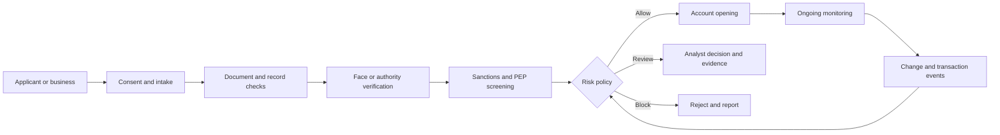

## What it is
A KYC/KYB pipeline establishes that a person or organization is who it claims to be, checks the claim against authoritative records, and continuously monitors the relationship for changed risk. The mental model is a staged assurance workflow: collect evidence, verify identity, screen prohibited parties, decide under policy, and preserve an auditable record.

## How it works
An onboarding flow separates identity data from verification evidence. The applicant supplies attributes, the system obtains a document or business record, and a decision service combines those inputs with jurisdiction, product, and risk policy. A person flow commonly uses a government identity document, facial comparison, and liveness; a business flow uses incorporation records, beneficial ownership, control evidence, and a representative's authority.

The execution order is:

1. **Collect** the minimum data needed for the declared product and jurisdiction.
2. **Validate** syntax and provenance for names, dates, identifiers, addresses, and registration numbers.
3. **Authenticate** the document or business record with a trusted issuer, chip, database, or manual review.
4. **Screen** the person, business, representatives, and related parties against sanctions and PEP data.
5. **Decide** using a documented policy, with human review for ambiguity, escalation, or high-risk outcomes.
6. **Monitor** material changes such as ownership, directors, address, sanctions status, and account behavior.

Document checks combine machine-readable-zone parsing, visual inspection, chip validation when the document supports it, and issuer-specific checks. A successful OCR result proves only that characters were read; it does not prove that the document belongs to the applicant or remains in force. A KYB flow also needs a chain from the legal entity to the person who controls the application and to the beneficial owners required by the applicable rule.



A production decision record should be structured rather than reconstructed from logs:

```json
{
  "case_id": "kyc-2026-004812",
  "subject_type": "individual",
  "jurisdiction": "GB",
  "evidence": {
    "document_type": "passport",
    "document_check": "passed",
    "liveness": "passed",
    "issuer_source": "document_reader"
  },
  "screening": {
    "sanctions": "clear",
    "pep": "possible_match",
    "lists": ["OFAC-SDN", "UN-1267"]
  },
  "risk": {
    "score": 72,
    "factors": ["pep_match", "country_exposure", "ownership_complexity"]
  },
  "decision": {
    "outcome": "manual_review",
    "policy_version": "gb-onboarding-2026-02",
    "reviewer": "analyst-184"
  },
  "retention": {
    "delete_after": "2033-02-12",
    "purpose": "legal_obligation"
  }
}
```

Screening is not only an exact-name query. Names vary by script, transliteration, order, punctuation, and historical alias. Matching therefore combines identifiers, date of birth, nationality, address, registration number, and fuzzy name similarity. A match is a prioritization signal, not proof of identity or guilt; a no-match result is not proof of absence if list freshness or identity coverage is inadequate.

Ongoing monitoring should be risk-based. Low-risk accounts may receive periodic list refreshes and material-change checks; higher-risk relationships need stronger identity refresh, transaction monitoring, and review SLAs. A decision should record why evidence was sufficient, which policy applied, and what event changed the risk.

## Tradeoffs
- **Vendor-hosted verification** — reaches production document, liveness, and screening coverage quickly, but adds vendor dependency, data-transfer exposure, and limited control over retention.
- **Build-or-buy document checks** — improves integration and local data control, but requires model evaluation, document templates, key rotation, and operations for issuer changes.
- **Low-friction onboarding** — improves conversion, but weak evidence creates fraud and regulatory exposure.
- **Manual review fallback** — handles ambiguous documents and edge cases, but increases cost, queue time, and operational inconsistency.
- **Persistent biometric storage** — can simplify matching across services, but creates a high-value target and raises privacy, retention, and breach-impact concerns.
- **Risk-based monitoring** — spends analyst capacity where exposure is greatest, but requires defensible thresholds, calibration, and data-quality ownership.

## When to use
- You onboard individuals or businesses before granting access to regulated products or sensitive data.
- You must document the evidence, policy version, reviewer, and outcome for each decision.
- Your jurisdiction requires sanctions, PEP, beneficial-ownership, or periodic refresh checks.
- You can provide an appeal or remediation path for false matches and rejected applicants.
- You have a retention schedule and deletion process for identity evidence and verification logs.

## Alternatives
- **Manual identity review** — works for low volume or unusual cases, but scales poorly and needs trained reviewers and consistent evidence standards.
- **Government digital identity integration** — can provide high-assurance attributes where available, but depends on jurisdiction, citizen access, and policy compatibility.
- **Risk-based simplified onboarding** — reduces friction for trusted low-risk cases, but requires reliable prior identity, usage limits, and strong monitoring.
- **Third-party identity platform** — reduces implementation effort, but contractual retention, audit, model, and regional availability controls need review.

## Related
- [17.2 AML Systems: Transaction Monitoring, Suspicious Activity Reports (SARs), Rule-Based vs ML Detection](02-aml-systems.md)
- [17.6 AML Deep Dive: Transaction Graph Analysis, Entity Resolution, Sanctions List Matching (OFAC/UN), Risk Scoring Models, Case Management Workflows, Regulatory Filing (SAR/CTR)](06-aml-deep-dive.md)
- [17.7 Face & Identity Verification: Face Detection vs Recognition, Liveness Detection (Active/Passive, Anti-Spoofing/Deepfake Detection), 1:1 Face Matching vs 1:N Search, Document Authenticity (MRZ/NFC Chip Reading, Hologram Detection), Biometric Template Storage & Privacy](07-face-identity-verification.md)
- [Chapter 17 References](08-references.md)
