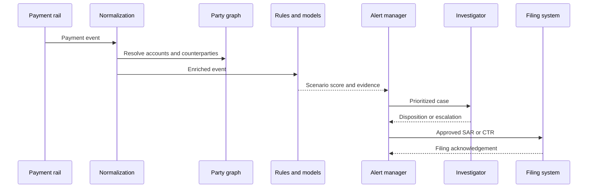

## What it is
An anti-money-laundering system detects and investigates activity that may indicate money laundering, terrorist financing, or another reportable risk. It combines customer due diligence, payment intelligence, rules, models, case management, and regulatory reporting into a repeatable decision process.

## How it works
An AML platform maintains a party's identity and risk profile, receives normalized transactions, enriches them with account and counterparty context, evaluates detection scenarios, and routes alerts to an investigator. A **rule-based scenario** expresses a known pattern such as rapid movement through newly opened accounts. A **model-based detector** scores a feature representation or sequence to prioritize less obvious patterns. Human decisions determine whether a case is escalated, closed, or reported.

The normal path is:

1. Onboard a customer and classify customer, geography, product, and delivery channel.
2. Normalize payments, preserve original message and beneficiary details, and associate accounts and counterparties.
3. Run rules, models, sanctions screening, and behavior analytics against the event and party graph.
4. Deduplicate alerts and enrich them with prior cases, KYC risk, and related parties.
5. Assign an investigator with evidence, explainable reasons, and service-level deadlines.
6. Record disposition, escalation, suspicious activity report decisions, and supervisory feedback.
7. Tune thresholds with validated outcomes without destroying the original evidence.

Rules are precise and auditable but can miss novel behavior and become expensive to maintain. Models can rank broad populations but introduce data drift, unexplainable decisions, and feedback loops. Production systems commonly combine them: rules handle regulatory or product-specific obligations, while models prioritize volume and surface anomalous patterns. A model should not autonomously file a report; a qualified analyst or approved policy process makes and records that decision.



A detection configuration must keep the scenario, data contract, and review policy versioned:

```yaml
aml_scenario:
  id: rapid_pass_through_new_accounts
  version: 4
  subject: customer
  window: 24h
  thresholds:
    minimum_transactions: 6
    minimum_ratio: 0.85
    exclude_scheduled_payments: true
  features:
    - inbound_amount
    - outbound_amount
    - account_age_hours
    - counterparty_risk
  response:
    minimum_score: 0.78
    dedupe_key: [customer_id, pattern_id, window_start]
    case_priority: high
  evidence:
    retain_payment_ids: true
    retain_rule_inputs: true
  review:
    queue: aml_l2
    sla_hours: 24
```

Alert volume alone is not a useful success metric. Track precision, false-positive rate, time to disposition, escalation quality, missed-evidence rate, and whether filed cases contain complete narratives. A model monitoring program needs label quality, drift checks, threshold review, and a rollback path. Do not retrain directly on investigator dispositions without reviewing selection bias and inconsistent labeling.

A SAR is a regulatory filing or submission produced under the applicable jurisdiction's rules, not an internal alert. The system must preserve the reporting entity, subject, suspicious pattern, supporting evidence, decision maker, submission timestamp, and acknowledgement. A CTR usually records threshold-based transaction reporting and is not a substitute for SAR analysis. Requirements differ by jurisdiction; a platform must make jurisdiction, report type, and legal deadlines explicit.

## Tradeoffs
- **Deterministic rules** — produce explainable and reproducible matches, but miss behavior outside authored patterns and require maintenance as typologies change.
- **Machine-learning ranking** — can prioritize complex or previously unknown behavior, but needs labels, drift monitoring, explainability, and a safe fallback.
- **High-recall screening** — reduces missed alerts, but increases analyst workload, duplicate cases, and operational cost.
- **Case-management integration** — preserves evidence and decisions, but requires consistent data models across investigations and reporting.
- **Real-time interruption** — can stop an in-flight transaction when policy requires it, but can create false positives and customer-impacting outages.
- **Post-transaction monitoring** — is easier to operate and supports investigation, but cannot guarantee that funds can be frozen before disposition.

## When to use
- You provide accounts, payments, custody, trading, or other services exposed to money-laundering risk.
- Your obligations require sanctions screening, customer due diligence, suspicious activity reporting, or transaction reporting.
- You can assign qualified investigators and maintain evidence with a defensible retention policy.
- You need to explain why an alert fired, who decided its disposition, and which data version was used.
- You can measure false positives, missed patterns, drift, and model performance over time.

## Alternatives
- **Manual review** — provides context for unusual cases, but does not scale to a complete population or provide consistent timing.
- **Rules-only monitoring** — is easier to explain and audit, but leaves coverage dependent on the scenarios an organization can author.
- **Managed transaction monitoring** — accelerates deployment, but can constrain data ownership, tuning, portability, and audit access.
- **Graph analytics** — reveals relationships and multi-hop patterns, but requires entity resolution, graph quality, and controls against incorrect links.

## Related
- [17.1 KYC/KYB Pipelines: Identity Verification, Document/Liveness Checks, Sanctions & PEP Screening, Ongoing Monitoring](01-kyc-kyb-pipelines.md)
- [17.6 AML Deep Dive: Transaction Graph Analysis, Entity Resolution, Sanctions List Matching (OFAC/UN), Risk Scoring Models, Case Management Workflows, Regulatory Filing (SAR/CTR)](06-aml-deep-dive.md)
- [17.5 Identity Federation: SSO, SAML, Cross-Border Identity Interoperability](05-identity-federation.md)
- [Chapter 17 References](08-references.md)
