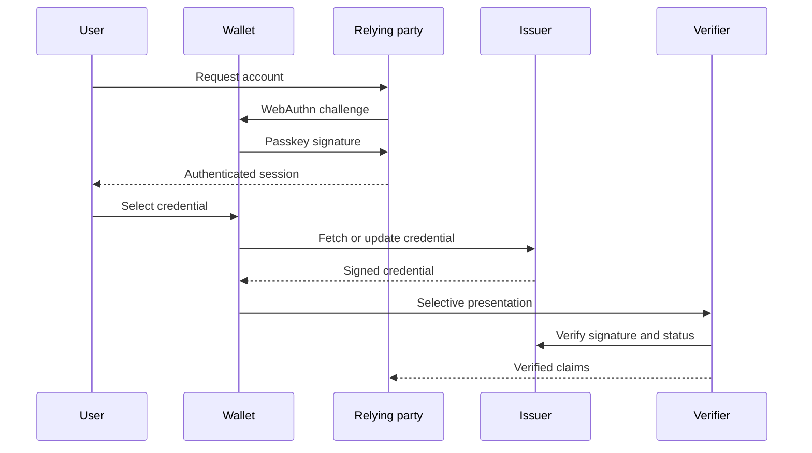

## What it is
Digital identity standards let a subject prove an attribute or authenticate to a relying party without exposing every underlying credential. OAuth 2.0 delegates authorization, OpenID Connect (OIDC) adds identity claims, FIDO2 passkeys use public-key cryptography for phishing-resistant authentication, and Verifiable Credentials (VCs) allow an issuer, holder, and verifier to exchange signed claims.

## How it works
OAuth 2.0 separates the client from the authorization server. The client redirects the user-agent to the authorization server, receives an authorization code over a protected back channel, and exchanges it for tokens at the token endpoint. OIDC adds an ID token, a userinfo endpoint, discovery metadata, and nonce or PKCE protections. An ID token is for the client to understand the authentication event; it is not a general-purpose user-data API.

```http
GET /.well-known/openid-configuration HTTP/1.1
Host: identity.example.com

GET /authorize?response_type=code&client_id=web-app&redirect_uri=https%3A%2F%2Fapp.example.com%2Fcallback&scope=openid%20profile&code_challenge=challenge&code_challenge_method=S256&nonce=request-nonce HTTP/1.1
Host: identity.example.com

POST /token HTTP/1.1
Content-Type: application/x-www-form-urlencoded

grant_type=authorization_code&client_id=web-app&code=authorization-code&redirect_uri=https%3A%2F%2Fapp.example.com%2Fcallback&code_verifier=verifier
```

FIDO2 separates registration and authentication. During registration, the authenticator creates a key pair, keeps the private key protected by the authenticator, and sends the public key and signed challenge to the relying party. During authentication, the relying party creates a challenge; the authenticator signs it after user verification. A **passkey** is a discoverable FIDO2 credential usually managed by a platform or synced wallet. The signature proves control of the key, not that the human is present; user verification and the authenticator's attestation policy help establish that assurance.

A **Verifiable Credential** is a portable signed claim. An issuer signs a credential, a holder stores it in a wallet, and a verifier checks its signature, schema, status, and holder binding. A wallet is a client-side boundary: it should not silently accept an issuer, disclose all claims to every verifier, or execute an unbounded presentation request. **Self-sovereign identity (SSI)** describes a model in which the subject controls credential storage and presentation, usually with selective disclosure and user-mediated consent. It does not remove the need for governance, revocation, recovery, or legal evidence.



Do not treat a token, a DID, or a biometric match as interchangeable identity evidence. A protocol can prove possession, possession of a key, or control of a wallet; the business still needs assurance level, issuer trust, consent, fraud controls, and an accountable recovery path.

## Tradeoffs
- **OAuth 2.0 and OIDC** — centralize identity and provide mature application integration, but the authorization server and client registration become security-critical dependencies.
- **SAML** — works well for enterprise federation and XML ecosystems, but its profile complexity and assertion processing create a larger implementation surface.
- **Passkeys** — resist phishing and eliminate reusable server secrets, but recovery, device migration, and ecosystem support require a plan.
- **Long-lived bearer tokens** — simplify integration, but make theft equivalent to account access until revocation.
- **Short-lived tokens with rotation** — reduce replay exposure, but require refresh-token protection, revocation, and careful client behavior.
- **Verifiable Credentials** — make claims portable and selectively disclosable, but depend on issuer trust, wallet behavior, key recovery, and revocation status design.

## When to use
- You need standards-based single sign-on or delegated API access across several applications.
- Your threat model includes phishing, credential stuffing, or token theft.
- You need user-held claims that can be presented selectively across organizations.
- You can define issuer, verifier, wallet, and key-holder responsibilities.
- You need auditable authentication and authorization decisions without storing a user's private signing key.

## Alternatives
- **Passwords with MFA** — remains broadly compatible, but shared secrets, SMS, and recovery flows can be phished or socially engineered.
- **API keys and mTLS** — suits service-to-service identity, but a compromised secret still requires careful rotation and does not represent a user consent flow.
- **SAML federation** — wins for established enterprise identity providers and XML-based applications, but is less compact than a modern authorization-code flow.
- **Centralized database identity** — gives an organization complete control, but creates a large breach target and couples every service to one account database.

## Related
- [17.4 Decentralized Identifiers (DIDs): DID Methods, DID Documents, Resolution, Wallet-Based Identity](04-decentralized-identifiers-dids.md)
- [17.5 Identity Federation: SSO, SAML, Cross-Border Identity Interoperability](05-identity-federation.md)
- [17.1 KYC/KYB Pipelines: Identity Verification, Document/Liveness Checks, Sanctions & PEP Screening, Ongoing Monitoring](01-kyc-kyb-pipelines.md)
- [Chapter 17 References](08-references.md)
