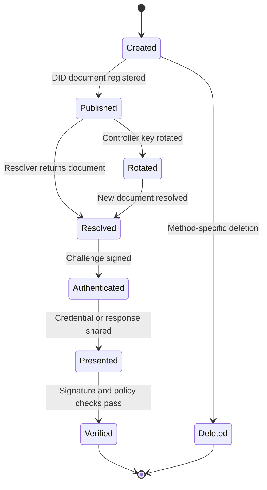

## What it is
A **decentralized identifier (DID)** is a globally unique identifier whose subject controls a DID document describing how to authenticate and update it. A **DID method** defines the syntax, creation, resolution, update, deletion, and security rules for a particular kind of DID.

## How it works
A DID is a URI that embeds a method name and method-specific identifier, such as `did:example:alice`. Resolution turns that URI into a DID document, normally represented as JSON-LD, whose verification methods, service endpoints, and metadata are controlled by the subject. A wallet stores private keys or delegates them to an external signer, creates presentations, and chooses which claims to disclose.

The lifecycle is:

1. The subject creates a key pair through a DID method and registers a DID document.
2. A relying party resolves the DID through its method-specific resolver or universal resolver.
3. The party validates the resolution result, method, controller, and document version.
4. The holder authenticates with a challenge bound to the DID, audience, nonce, and domain.
5. The holder presents a credential or authentication response to the verifier.
6. Rotation, recovery, or revocation updates the controller relationship without changing unrelated identifiers.

DID methods make different tradeoffs. A key-based method can be self-custodial and fast, but key loss and recovery require care. A blockchain or distributed-ledger method can provide public discoverability and key-history proofs, but its transaction cost, finality, governance, and privacy properties become operational dependencies. A hosted method can simplify recovery, but the host is part of the trust boundary.



A DID document is a security-sensitive metadata object, not a public profile invitation. Validate its JSON-LD context and representation according to the selected method and profile, reject unsupported methods, and bind signatures to the exact requested audience. Universal resolution may return multiple representations or hints, not a guarantee that a DID is genuine.

```json
{
  "@context": [
    "https://www.w3.org/ns/did/v1",
    "https://www.w3.org/ns/security/data/v2"
  ],
  "id": "did:example:alice",
  "controller": ["did:example:alice"],
  "verificationMethod": [{
    "id": "did:example:alice#key-1",
    "type": "JsonWebKey2020",
    "controller": "did:example:alice",
    "publicKeyJwk": {
      "kty": "EC",
      "crv": "P-256",
      "x": "public-x-coordinate",
      "y": "public-y-coordinate"
    }
  }],
  "authentication": ["did:example:alice#key-1"],
  "assertionMethod": ["did:example:alice#key-1"]
}
```

Wallet security requires secure display of issuer, claims, audience, and requested proof type; explicit consent; protection against malicious QR codes and deep links; and a recovery plan that does not silently trust a support employee. A wallet should not become a universal correlation point. Selective disclosure, pairwise DIDs, unlinkable presentation, and scoped keys can reduce correlation, but each method and verifier must support the required privacy model.

## Tradeoffs
- **User-controlled keys** — remove a central account database and improve portability, but make backup, recovery, rotation, and lost-device handling the user's problem.
- **Ledger-backed resolution** — offers transparent method history and global availability, but can expose metadata, impose consensus latency, and tie availability to a network.
- **Hosted wallets or DIDs** — simplify support and key recovery, but introduce a provider as a high-value trust and availability dependency.
- **Universal resolver** — offers one lookup interface across methods, but still requires method-specific validation and can hide resolution differences.
- **Selective disclosure** — reduces data sharing, but requires compatible credential formats, verifier support, and careful binding metadata.

## When to use
- You need identifiers that can survive a single application's account migration.
- The subject must control credential presentation without giving one verifier a complete profile.
- Multiple issuers and verifiers need a shared identifier and verification workflow.
- You can support key rotation, recovery, revocation, and DID method upgrades.
- Your privacy requirements can be expressed in the method, wallet, and presentation profile you select.

## Alternatives
- **OIDC subject identifier** — wins for a centralized application ecosystem, but the provider remains the account authority and portability is limited.
- **SAML NameID** — works for enterprise federation, but is designed around an identity provider relationship rather than self-controlled public-key identity.
- **Conventional account UUID** — is simple and fast, but depends on the owning system and does not itself specify key control or resolution.
- **Blockchain address** — provides a compact public identifier, but does not by itself provide a complete identity model, privacy policy, or credential semantics.

## Related
- [17.3 Digital Identity Standards & Authentication: OAuth2/OIDC, Passkeys (FIDO2/WebAuthn), Verifiable Credentials (VCs), Self-Sovereign Identity (SSI)](03-digital-identity-standards-authentication.md)
- [17.5 Identity Federation: SSO, SAML, Cross-Border Identity Interoperability](05-identity-federation.md)
- [17.1 KYC/KYB Pipelines: Identity Verification, Document/Liveness Checks, Sanctions & PEP Screening, Ongoing Monitoring](01-kyc-kyb-pipelines.md)
- [Chapter 17 References](08-references.md)
