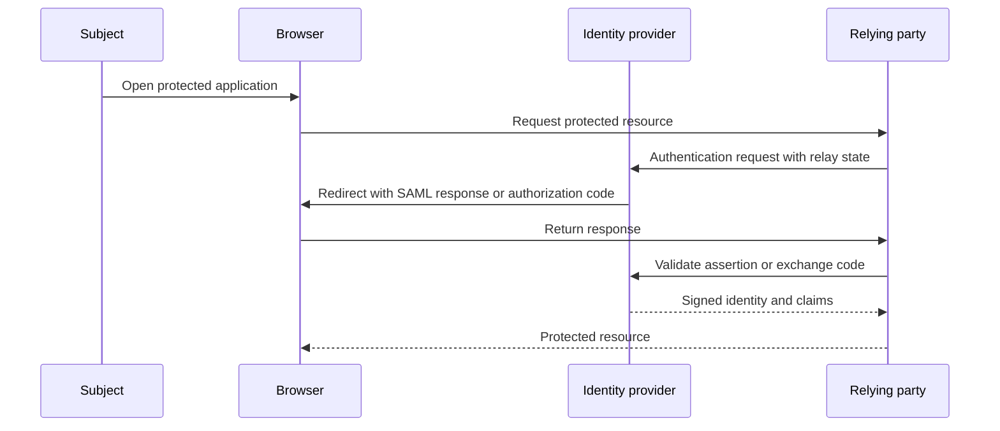

## What it is
Identity federation lets an identity provider authenticate a subject for several relying parties while keeping each application's authorization context explicit. **Single sign-on (SSO)** is the user experience of authenticating once and accessing multiple participating services; the security mechanism still requires token, assertion, session, and policy validation at every service.

## How it works
A relying party sends an authentication request to an identity provider. The provider establishes or reuses an authenticated session, applies step-up or risk checks when required, and returns a signed assertion. In SAML 2.0, the response commonly contains an XML assertion consumed through a browser redirect or POST binding. In OIDC, the client receives an ID token after an authorization-code exchange and can request scoped claims from a UserInfo endpoint.

Federation separates authentication from authorization. A successful login says that the provider asserted an identity under a specified protocol; the relying party still decides whether that subject may access the resource. Keep the issuer, audience, recipient, client, tenant, nonce, time window, session context, and authorization policy in the validation contract. Never accept a token merely because its signature verifies.



SAML metadata defines service-provider endpoints, identity-provider endpoints, certificates, and supported bindings. It is a trust configuration, so signing and rollover procedures matter. A minimal assertion must be bound to the intended service, have a narrow validity interval, use an approved signature algorithm, and reject replayable message IDs.

```xml
<EntityDescriptor entityID="https://idp.example.com">
  <IDPSSODescriptor protocolSupportEnumeration="urn:oasis:names:tc:SAML:2.0:protocol">
    <KeyDescriptor use="signing">
      <KeyInfo>
        <X509Data>
          <X509Certificate>BASE64_CERTIFICATE</X509Certificate>
        </X509Data>
      </KeyInfo>
    </KeyDescriptor>
    <SingleSignOnService Binding="urn:oasis:names:tc:SAML:2.0:bindings:HTTP-Redirect" Location="https://idp.example.com/sso"/>
  </IDPSSODescriptor>
</EntityDescriptor>
```

Cross-border identity interoperability is constrained by more than syntax. Jurisdictions differ on acceptable evidence, consent, data residency, transfer mechanisms, localization, age assurance, and regulatory authorization. A relying party should map a stable internal subject and explicit claim contract rather than assume that a foreign name, national identifier, or postal address has one universal meaning. Keep translation, transliteration, clock skew, and locale data visible to auditors.

SSO reduces repeated authentication but can increase blast radius. Protect the provider with phishing-resistant MFA, enforce per-client redirect URI registration, prevent open redirects, isolate relying parties, and revoke sessions when risk changes. A federation service should monitor unusual client usage, assertion failures, metadata changes, and cross-tenant data access.

## Tradeoffs
- **Centralized SSO** — simplifies user experience and central policy, but creates a high-value dependency and a broad compromise domain.
- **SAML 2.0** — mature in enterprise XML ecosystems, but assertion profiles, signature wrapping defenses, and metadata operations require specialist care.
- **OIDC/OAuth 2.0** — compact and native to modern APIs, but token audience and client configuration must prevent token substitution.
- **Federated identifiers** — let a subject use one account across services, but can create cross-service correlation and make deletion semantics complex.
- **Cross-border federation** — extends access to foreign ecosystems, but requires explicit legal, privacy, residency, and assurance mappings.
- **Local accounts alongside federation** — provides fallback continuity, but creates account-linking, recovery, and duplicate-identity risks.

## When to use
- Several applications need a shared sign-in experience and centralized authentication policy.
- You can operate or rely on an identity provider with strong tenant isolation and recovery controls.
- Each relying party can validate issuer, audience, signature, time, and authorization independently.
- You need explicit cross-border claim mappings and a lawful basis for data transfer.
- You can monitor federation metadata, client registration, token use, and account-linking events.

## Alternatives
- **Independent local accounts** — isolate applications and simplify federation, but create duplicated account recovery and weak cross-service consistency.
- **API gateway authentication** — centralizes traffic policy, but does not replace a user identity, authorization model, or strong authentication ceremony.
- **Passkeys with a local account** — reduces password phishing, but does not provide cross-application SSO or centralized lifecycle management.
- **A single hosted consumer identity** — offers broad interoperability, but gives one provider substantial control over availability, policy, and data processing.

## Related
- [17.3 Digital Identity Standards & Authentication: OAuth2/OIDC, Passkeys (FIDO2/WebAuthn), Verifiable Credentials (VCs), Self-Sovereign Identity (SSI)](03-digital-identity-standards-authentication.md)
- [17.4 Decentralized Identifiers (DIDs): DID Methods, DID Documents, Resolution, Wallet-Based Identity](04-decentralized-identifiers-dids.md)
- [17.1 KYC/KYB Pipelines: Identity Verification, Document/Liveness Checks, Sanctions & PEP Screening, Ongoing Monitoring](01-kyc-kyb-pipelines.md)
- [Chapter 17 References](08-references.md)
