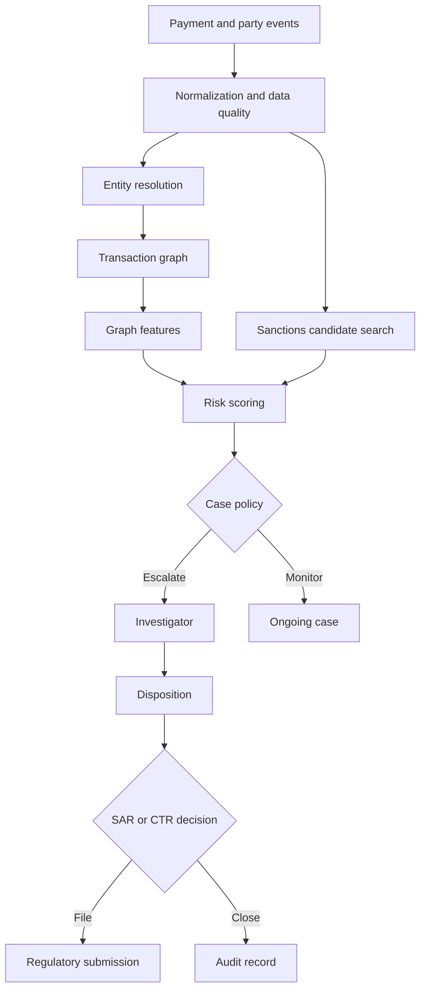

## What it is
An AML deep-dive system turns incomplete and noisy evidence into a defendable view of relationships, risk, and reporting obligations. Transaction graphs, entity resolution, sanctions matching, risk models, case workflows, and SAR/CTR filing are separate controls that must agree on identity and evidence.

## How it works
A payment event contains a sender, beneficiary, account, amount, time, and rail. The system resolves these references into canonical parties, adds ownership and control relationships, and updates a graph of accounts, people, businesses, devices, addresses, and counterparties. Graph features can expose layering, rapid pass-through, fan-in/fan-out, and links to high-risk parties that a single transaction misses.

**Entity resolution** maps names and identifiers to a canonical party without incorrectly merging people or businesses. Exact identifiers are stronger than names, but identifiers can be missing, stolen, mistyped, or recycled. A practical matcher uses deterministic rules for known identifiers, normalized fields for fast blocking, and probabilistic or model-based ranking only after the candidate set is constrained. Keep merge and unmerge operations reversible and preserve the source evidence.

Sanctions matching is a versioned search against authoritative list data. OFAC and UN lists have different identifiers, update cycles, legal interpretations, and matching challenges. Normalize names conservatively, search aliases and transliterations, and rank candidates using identifiers and context. An analyst should review the list version and source record before blocking, releasing, or reporting a match.



Risk scores combine customer risk, geography, product, channel, transaction behavior, graph exposure, screening results, and case outcomes. A score is a prioritization aid, not proof of suspicious activity. Keep model version, feature snapshot, calibration, threshold, reason codes, and overrides in the case record so a reviewer can reproduce the result.

A case workflow should make evidence and decisions explicit:

```yaml
case:
  case_id: aml-2026-001932
  jurisdiction: US
  subject_id: party-8821
  scenario:
    id: graph_fan_in_fan_out
    version: 7
    score: 0.91
  evidence:
    payment_ids: [pay-1831, pay-1837, pay-1850]
    graph_snapshot: graph-2026-02-14T08:00:00Z
    sanctions_list_versions:
      OFAC-SDN: "2026-02-14"
      UN-1267: "2026-02-13"
  disposition: escalate
  investigator: investigator-42
  regulatory_review:
    sar: required
    ctr: not_applicable
    deadline: 2026-02-21
  audit:
    model_version: aml-risk-3.2
    reason_codes: [rapid_fan_in, high_risk_counterparty]
```

A SAR must present suspicious activity and supporting facts in the format required by the jurisdiction. A CTR generally captures a reportable transaction threshold and is distinct from a suspicious-pattern narrative. Never let an alert automatically become a filing without policy review, quality checks, and accountable approval. Conversely, do not suppress a case because a graph or model score is low if a deterministic sanctions or reporting rule applies.

Privacy and security controls should cover the graph as carefully as the payment ledger. Limit analyst access by role and jurisdiction, encrypt sensitive links, log exports, monitor bulk entity resolution, and prevent speculative production access. Minimize graph attributes that are not needed for a stated purpose. Graph merges can spread an error across every downstream feature and case, so preserve provenance and support reversal.

## Tradeoffs
- **Graph analysis** — reveals multi-party and multi-hop relationships, but can amplify entity-resolution mistakes and require careful graph retention controls.
- **Probabilistic entity resolution** — improves recall across messy records, but creates false merges that can taint sanctions, risk, and reporting results.
- **Deterministic sanctions rules** — are explainable and auditable, but miss spelling, transliteration, and identity variations.
- **Model-based risk scores** — improve prioritization across large populations, but require calibration, drift monitoring, reason codes, and human review.
- **Centralized case management** — creates a defensible evidence trail, but stores highly sensitive investigations and broadens insider-access risk.
- **Fully automated filing** — reduces handling time, but is unsafe when narrative quality, legal judgment, deadlines, and false positives are material.

## When to use
- You need to identify suspicious patterns across accounts, parties, and time rather than one transaction.
- Your list data and screening process must be versioned and reproducible.
- Investigators need graph context, evidence, reason codes, and a controlled disposition workflow.
- You must produce jurisdiction-specific SAR or CTR records with accountable approval.
- You can govern sensitive graph data, model risk, and analyst access.

## Alternatives
- **Transaction rules without a graph** — are simpler and easier to explain, but miss relationships that span several accounts or counterparties.
- **Exact identifier matching** — minimizes false merges, but fails when identifiers are absent, stale, or inconsistent across providers.
- **A standalone sanctions screening service** — improves list coverage and operations, but still requires identity resolution, context, and case handling.
- **Manual investigation with spreadsheets** — offers flexibility for a small queue, but does not provide consistent entity resolution, auditability, or scalable deadline control.

## Related
- [17.2 AML Systems: Transaction Monitoring, Suspicious Activity Reports (SARs), Rule-Based vs ML Detection](02-aml-systems.md)
- [17.1 KYC/KYB Pipelines: Identity Verification, Document/Liveness Checks, Sanctions & PEP Screening, Ongoing Monitoring](01-kyc-kyb-pipelines.md)
- [17.4 Decentralized Identifiers (DIDs): DID Methods, DID Documents, Resolution, Wallet-Based Identity](04-decentralized-identifiers-dids.md)
- [Chapter 17 References](08-references.md)
