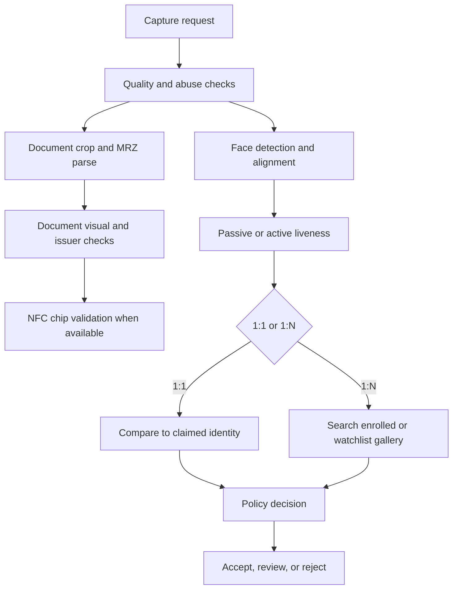

## What it is
Face and identity verification is a set of decisions that links a live subject to a document or account without treating a face image as a password. **Face detection** locates faces, **face recognition** compares a face representation, and **identity verification** establishes whether the live subject matches the claimed identity under a defined assurance policy.

## How it works
A typical flow captures or receives a document image and a live camera or trusted device signal, extracts a document's machine-readable zone (MRZ), validates visual and chip features, and compares the live subject with the document portrait or stored enrollment. **Liveness detection** checks that the input is an actual live presentation rather than a printed photograph, screen replay, mask, or generated video. Passive liveness uses only observable behavior or capture properties; active liveness asks the subject to perform an action such as turning the head or blinking.

Face matching has two distinct search modes. **1:1 verification** compares a live face with one claimed identity, which is the usual account-opening or step-up flow. **1:N search** searches a gallery to find candidate identities, which is useful for watchlist or duplicate detection but increases false-match exposure, privacy impact, and operational cost. A match score is a model output, not proof of identity; calibrate thresholds by demographic group, device, capture quality, and population.



Document authenticity checks use several signals. MRZ parsing checks encoded structure and checksums, while visual checks compare fonts, layout, portraits, and security features against issuer templates. NFC chip reading, often called ePassport or ICAO 9303 reading, validates signed data and passive-authentication evidence when the chip and access key are present. Hologram detection is one signal, not a universal guarantee; counterfeit resistance depends on the document type, issuance process, and inspection quality.

A verification policy should record the exact artifact, model, and threshold used:

```yaml
verification:
  policy_version: face-document-2026-02
  capture:
    require_user_consent: true
    min_face_pixels: 320
    reject_excessive_blur: true
  document:
    mrz_checksum: required
    visual_template: issuer_registry_v4
    nfc: when_supported
  liveness:
    mode: active
    challenge_set: [turn_left, turn_right, blink]
    presentation_attack: reject
  matching:
    mode: one_to_one
    threshold: 0.82
    demographic_calibration: required
  storage:
    raw_images: discard_after_verification
    templates: encrypted
    retention: risk_based
  audit:
    retain_evidence_hash: true
    retain_decision_reasons: true
```

Biometric templates are sensitive even when they are not raw photographs. A template can still enable linkage or inference, and a compromised biometric cannot be rotated as easily as a password. Prefer a protected, revocable representation over raw media when the use case permits, encrypt templates with managed keys, isolate template stores from ordinary application databases, limit exports, and retain only what a documented purpose requires. Do not use a face match as the only factor for a high-risk transaction; combine it with a possession factor and an independent authorization decision.

Accuracy testing must include genuine and impostor samples, camera and lighting conditions, demographic slices, document types, and presentation attacks. Measure 1:1 false match and false non-match rates separately from 1:N candidate-generation performance. A threshold chosen only on balanced test data may be unsafe for a large gallery or a particular population.

## Tradeoffs
- **1:1 verification** — narrows the search to a claimed identity and reduces false-match exposure, but depends on correct claim binding and enrollment quality.
- **1:N search** — can detect duplicate or watchlist membership, but raises gallery scale, latency, bias, and unauthorized-identification risk.
- **Passive liveness** — reduces user friction, but can be harder to distinguish from high-quality replay and is sensitive to capture conditions.
- **Active liveness** — challenges a live subject more directly, but adds friction, accessibility concerns, and failure modes for users with disabilities.
- **Raw image retention** — makes review and debugging easier, but increases breach impact and privacy obligations.
- **Template-based matching** — reduces storage and can support cancellable designs, but is still sensitive data and may be irreversible or vulnerable to template attacks.

## When to use
- You need to verify that a live person controls a claimed document or account.
- You can collect informed consent and provide a non-biometric or manual alternative where required.
- You need to test capture quality, demographic performance, and presentation attacks before deployment.
- You can protect biometric templates and raw media with separate keys, access controls, retention, and audit.
- Your policy distinguishes 1:1 verification from 1:N identification and defines human review.

## Alternatives
- **Document and knowledge-based verification** — can work without a biometric template, but is weaker against synthetic documents and account takeover.
- **Device-bound passkeys** — resist phishing and do not require a face database, but do not by themselves verify a legal identity or document authenticity.
- **Human document review** — can interpret unusual cases, but is slower, less consistent, and exposes reviewers to more personal data.
- **Remote online notarization** — can add witnessed identity and consent, but depends on the jurisdiction, credential, workflow, and trust framework.

## Related
- [17.1 KYC/KYB Pipelines: Identity Verification, Document/Liveness Checks, Sanctions & PEP Screening, Ongoing Monitoring](01-kyc-kyb-pipelines.md)
- [17.3 Digital Identity Standards & Authentication: OAuth2/OIDC, Passkeys (FIDO2/WebAuthn), Verifiable Credentials (VCs), Self-Sovereign Identity (SSI)](03-digital-identity-standards-authentication.md)
- [17.6 AML Deep Dive: Transaction Graph Analysis, Entity Resolution, Sanctions List Matching (OFAC/UN), Risk Scoring Models, Case Management Workflows, Regulatory Filing (SAR/CTR)](06-aml-deep-dive.md)
- [Chapter 17 References](08-references.md)
