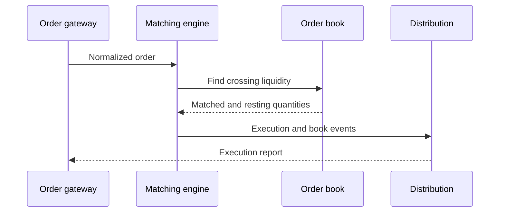

## What it is

An exchange architecture is the stateful, event-driven system that accepts orders, maintains an order book, determines executions, and publishes market events. Its central invariant is that every accepted event has one deterministic outcome that all participants can reconstruct.

## How it works

An order enters through a gateway that authenticates the participant, validates the message, assigns a sequence identity, and forwards a normalized event to the matching engine. The engine stores resting bids and asks by price, then applies a venue-specific matching rule. A **price-time priority** rule matches the best price first and, within that price, the oldest accepted order first.

A typical continuous-market match searches the opposite side for a crossing price. A sell at or below the best bid can consume one or more bids. Each execution creates trade, order-update, and book-update events. The engine updates quantity, removes exhausted orders, and emits a sequence of events that represents the resulting book. Later components distribute those events, apply risk controls, and retain an audit log.



A venue's book representation is part of its contract. Price-time priority favors simple, visible queue semantics, while pro-rata, auctions, and synthetic orders can change the allocation rule without changing the external event model. A robust engine defines tie-breaking, rounding, self-trade prevention, quantity aggregation, and cancellation behavior precisely.

A configuration artifact can make the operational contract explicit:

```yaml
exchange:
  instrument: BTC-USD
  matching_mode: continuous
  priority: price_time
  sequence_mode: per_instrument
  self_trade_prevention: cancel_oldest
  quantity_step: 0.00001
  tick_size: 0.01
```

The engine must not infer these rules from UI defaults. It must persist or reproduce the instrument definition, accepted input, resulting events, and recovery position. Otherwise two healthy replicas can produce different books after a restart.

## Tradeoffs

| Design choice | Gain | Cost or risk |
| --- | --- | --- |
| Centralized single writer | Strong ordering and simple reasoning | A hot engine can become a bottleneck or failure domain |
| Price-time priority | Clear FIFO behavior at a price | Large resting orders can move a queue without improving price |
| Partition by instrument | Parallel matching and fault isolation | Cross-instrument orders need an ordering policy |
| In-memory book plus durable log | Low read latency and replayable history | Memory sizing, snapshots, and recovery are operational risks |
| Publish every book change | Reconstructable state and simpler consumers | More bandwidth and stricter sequence handling |
| Publish deltas with periodic snapshots | Lower steady-state bandwidth | A consumer needs gap detection and snapshot recovery |

## When to use

- You need a shared market whose accepted order and execution events are auditable.
- You can define exact rules for price priority, time priority, rounding, and self-trade prevention.
- You need a book that can be reconstructed from an ordered event log.
- You can measure and accept the latency of a centralized matching path.
- You need failover behavior that does not silently change the book.

## Alternatives

- **Fully decentralized order books** — remove a central operator, but introduce consensus, replication, and ordering costs.
- **Continuous liquidity pools** — provide composability and shared state, but do not express ordinary resting queue priority in the same way.
- **Periodic batch auctions** — reduce continuous matching complexity, but delay execution until a collection event.
- **Venue-specific hybrid engines** — add auctions or priority rules, but require more protocol and operational analysis.

## Related

- [18.2 Order Types & Execution: Market/Limit/Stop Orders, Smart Order Routing](02-order-types-execution.md)
- [18.3 Market Data Systems: Ticker Plants, Data Broadcast/Fan-Out, Multicast Feeds, FIX Protocol](03-market-data-systems.md)
- [18.5 Risk Controls: Pre-Trade Risk Checks, Position Limits, Circuit Breakers, Margin/Collateral Engines](05-risk-controls.md)
- [Chapter 18 References](10-references.md)
