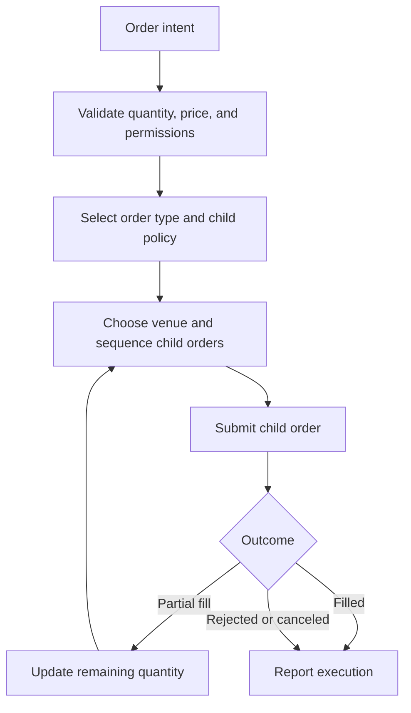

## What it is

An order type defines the condition under which an order becomes active, and an execution algorithm decides how and where that order is submitted. Together they turn trading intent into a sequence of venue requests without hiding the consequences of liquidity, latency, and adverse selection.

## How it works

A market order prioritizes execution over a specified limit and can consume multiple levels until filled, canceled, or rejected. A limit order is eligible only while its price condition holds; a resting limit order may receive partial fills. A stop order becomes eligible after a trigger condition, but a triggered stop is not a guarantee of the trigger price. Stops need trigger evaluation rules, gaps handling, and an explicit relationship to the resulting order.

A router receives an order intent, filters venues by permissions, price, displayed or expected liquidity, latency, and operational health, then submits child orders. It must decide whether to route actively, passively, or not at all. An IOC or FOK child order controls how long partial quantity may remain exposed. The router tracks acknowledgments, cancels, fills, and venue status without assuming that an acknowledgment is a fill.



A normalized router decision can be represented as data rather than hidden branching:

```json
{
  "instrument": "BTC-USD",
  "side": "buy",
  "quantity": 12.5,
  "policy": "route_by_liquidity",
  "max_child_quantity": 4.0,
  "max_participation_rate": 0.08,
  "limit_price": 42000.00,
  "cancel_after_ms": 750,
  "venues": ["primary", "secondary"]
}
```

A router is not automatically safer than a direct order. It can chase stale liquidity, select correlated venues, or amplify temporary price impact. A production router needs independent limits for notional, price improvement, reject rate, latency, and cancel-replace churn.

## Tradeoffs

| Design choice | Gain | Cost or risk |
| --- | --- | --- |
| Market order | Fast entry and high fill priority | Pays through levels and has uncertain slippage |
| Limit order | Price bound and passive participation | May not fill and requires queue management |
| Stop order | Defines a conditional trigger | Gap risk can fill far from the trigger price |
| Smart routing | Accesses fragmented liquidity | Adds routing logic, venue dependencies, and model risk |
| IOC or FOK child orders | Limits exposure during re-factoring | Can reject when only partial liquidity exists |
| Cancel-replace loop | Reacts to changing book state | Excessive churn can worsen impact and hit rate limits |

## When to use

- You need to express an entry, exit, or hedge intent with a defined price or trigger condition.
- Liquidity is fragmented across venues with different fees, latency, and permissions.
- You can measure fill probability, effective spread, implementation shortfall, and reject rates.
- Your strategy can tolerate trigger gaps and partial fills.
- You can define maximum child size, participation, and cancel age.

## Alternatives

- **Direct venue submission** — minimizes routing decisions, but exposes the application to one venue's liquidity and behavior.
- **Algorithmic execution** — schedules participation over time, but can be slow when the objective is immediate execution.
- **RFQ or auction submission** — can improve price discovery for larger blocks, but exposes intent and requires counterparty availability.
- **Market-making or passive execution** — earns spread or fees, but carries inventory and adverse-selection risk.

## Related

- [18.1 Exchange Architecture: Order Books, Matching Engines, Price-Time Priority](01-exchange-architecture.md)
- [18.3 Market Data Systems: Ticker Plants, Data Broadcast/Fan-Out, Multicast Feeds, FIX Protocol](03-market-data-systems.md)
- [18.4 Low-Latency Engineering & High-Frequency Trading: Kernel Bypass, Co-Location, Hardware Timestamping, LMAX Disruptor Pattern, and FPGA Accelerator Offloading](04-low-latency-hft.md)
- [18.8 Exchange System Design: Multi-Asset Exchange Architecture, Sequencer/Matching Engine Determinism, Order Book Replication, Market Maker Incentives, Cross-Exchange Arbitrage Infra](08-exchange-system-design.md)
