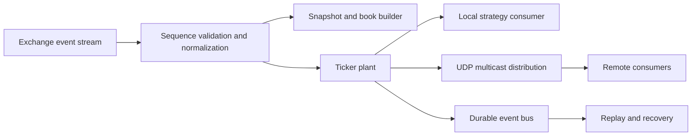

## What it is

Market data systems distribute the exchange's authoritative event stream to consumers with different freshness, bandwidth, and recovery needs. A ticker plant is the low-latency normalization and publication path; broadcast and fan-out distribute the resulting messages; multicast and FIX are delivery or protocol choices, not interchangeable guarantees.

## How it works

A market-data handler receives sequenced updates from the exchange, validates sequence numbers, normalizes fields, and updates an in-memory top-of-book or depth view. The ticker plant publishes updates to local consumers first. Downstream distribution may use UDP multicast for a one-to-many feed, a message bus for durable replay, or a specialized binary protocol for bandwidth-sensitive consumers.

A consumer must distinguish an update from a snapshot. If sequence numbers skip, the consumer requests a snapshot or resynchronizes rather than applying a gap blindly. A feed can be fast while the decision built from it is stale, so timestamps, receive times, and processing times should be retained separately.



FIX is a session-oriented message standard commonly used for order routing and execution reports. It has message types, tags, checksums, sequence numbers, and recovery semantics. A market-data session can use FIX, but high-rate consumers often use a more compact binary feed because FIX framing and text encoding add bandwidth and parsing overhead. The protocol choice does not remove the need for sequence and timestamp validation.

```text
8=FIX.4.4|9=138|35=W|34=1842|49=CLIENT|56=VENUE|52=20260101-12:00:00.123456|115=3|48=BTC-USD|22=8|31=42000.00|32=4.0|14=42001.00|11=ORDER-17|21=3|6=42000.00|39=2|150=F|151=4.0
```

The line is a tagged FIX-like artifact for inspecting fields, not a complete session. A production parser must not infer missing tags, reset sequence numbers without the prescribed recovery process, or treat a quote update as an executable guarantee.

## Tradeoffs

| Design choice | Gain | Cost or risk |
| --- | --- | --- |
| UDP multicast | Low per-consumer fan-out cost | Loss, reordering, and receiver tuning require controls |
| Durable message bus | Replay and recovery are straightforward | Adds latency and operational storage |
| Binary market-data protocol | High message density and fast parsing | More implementation effort and less interoperability |
| FIX session | Broad counterparty interoperability | Text parsing and session recovery add overhead |
| Snapshot plus deltas | Efficient steady-state updates | Consumers need versioned snapshots and gap handling |
| One feed per consumer type | Tailored bandwidth and latency | More contracts and more cross-feed consistency work |

## When to use

- You need a fast view of an authoritative exchange event stream.
- Consumers have different latency, replay, and bandwidth requirements.
- You can version snapshots and detect sequence gaps.
- You can measure feed staleness separately from strategy decision time.
- You need an interoperable order or execution protocol.

## Alternatives

- **Polling a REST snapshot** — simple and recoverable, but too slow and expensive for active market making.
- **A single normalized internal bus** — easy to govern, but can hide the latency differences between local and remote consumers.
- **Kafka-style durable streams** — excellent replay and consumer isolation, but usually not the lowest-latency direct feed.
- **Vendor-specific binary feeds** — efficient and feature-rich, but create portability and versioning work.

## Related

- [18.1 Exchange Architecture: Order Books, Matching Engines, Price-Time Priority](01-exchange-architecture.md)
- [18.2 Order Types & Execution: Market/Limit/Stop Orders, Smart Order Routing](02-order-types-execution.md)
- [18.8 Exchange System Design: Multi-Asset Exchange Architecture, Sequencer/Matching Engine Determinism, Order Book Replication, Market Maker Incentives, Cross-Exchange Arbitrage Infra](08-exchange-system-design.md)
- [Chapter 18 References](10-references.md)
