## What it is

Low-latency trading is the disciplined reduction of uncertain time between a market event, a decision, and an order reaching a venue. High-frequency trading (HFT) applies this discipline to strategies whose edge depends on short-lived pricing or queue information, with latency as a measurable input rather than a proxy for speed.

## How it works

The path begins with a feed handler that receives packets, validates checksums and sequences, and publishes normalized events. A strategy consumes the event, updates state, and emits an order intent. An execution gateway serializes and transmits the order. Every stage can add queueing, copies, interrupts, allocation, and network uncertainty, so end-to-end timestamp measurements matter more than one function's execution time.

Kernel bypass uses a user-space network stack or a device-specific path to avoid unnecessary kernel transitions. Co-location places a strategy and its feed/order gateways near the exchange's network path. Hardware timestamping records packet arrival or transmission near the NIC. The LMAX Disruptor pattern uses a ring buffer designed for ordered, low-allocation event handoff between threads. An FPGA can offload a stable filtering or parsing stage when the workload is data-parallel and its update cycle is constrained.

```mermaid
gantt
    title Event-to-order timing
    dateFormat X
    axisFormat %s ms
    section Feed
    Packet arrives : a1, 0, 10ms
    Normalized event : a2, after a1, 10ms
    section Strategy
    Decision : a3, after a2, 15ms
    section Execution
    Serialize : a4, after a3, 10ms
    Transmit : a5, after a4, 10ms
    Exchange response : a6, after a5, 20ms
```



A deployment contract should expose the measurement points rather than claim an average latency:

```yaml
latency_profile:
  feed: consolidated_nbbo
  order_gateway: colocated_primary
  cpu_isolation: dedicated
  queue: disruptor_ring
  timestamp_source: ptp_hardware
  offload: fpga_filter
  risk_gateway: mandatory_local
  rejection_policy: fail_closed
```

A fast path is not automatically a correct path. Bypassing the kernel can reduce scheduling noise but complicates packet loss, congestion, and protocol upgrades. Co-location creates shared physical failure domains. FPGAs improve bounded processing but introduce difficult-to-change bitstreams. Hardware timestamps need clock synchronization and calibration; timestamps without uncertainty are not evidence of a stable ordering.

## Tradeoffs

| Design choice | Gain | Cost or risk |
| --- | --- | --- |
| Kernel bypass | Fewer kernel transitions and lower jitter | Specialized networking and reduced debuggability |
| Exchange co-location | Shorter and more predictable network path | Higher facility cost and correlated infrastructure risk |
| Hardware timestamping | Measurement near the wire | Requires clock discipline and timestamp interpretation |
| Lock-free ring buffer | Low-allocation ordered handoff | Correctness depends on memory ordering and backpressure rules |
| FPGA offload | Bounded, parallel filtering or parsing | Bitstream complexity, validation, and slower feature iteration |
| Redundant gateways | Failure tolerance and venue reachability | More state to reconcile and more failure modes |

## When to use

- The strategy's holding period makes event-to-order latency material to expected value.
- You can measure latency distributions, timestamp uncertainty, packet loss, and queue depth.
- The trading logic can tolerate a venue disconnect or a stale book.
- Risk controls remain local and fail closed when the fast path is unavailable.
- Offload can be justified by a stable workload and tested against a software reference.

## Alternatives

- **Optimized user-space application** — preserves flexible tooling, but kernel scheduling and allocation remain in the path.
- **Regional deployment with smart routing** — reduces some network distance, but adds routing state and cross-region uncertainty.
- **Exchange-provided co-location APIs** — reduces integration work, but limits control over hardware and venue connectivity.
- **Software-only signal processing** — easiest to update and observe, but can miss strict tail-latency targets.

## Related

- [18.2 Order Types & Execution: Market/Limit/Stop Orders, Smart Order Routing](02-order-types-execution.md)
- [18.3 Market Data Systems: Ticker Plants, Data Broadcast/Fan-Out, Multicast Feeds, FIX Protocol](03-market-data-systems.md)
- [18.5 Risk Controls: Pre-Trade Risk Checks, Position Limits, Circuit Breakers, Margin/Collateral Engines](05-risk-controls.md)
- [Chapter 18 References](10-references.md)
