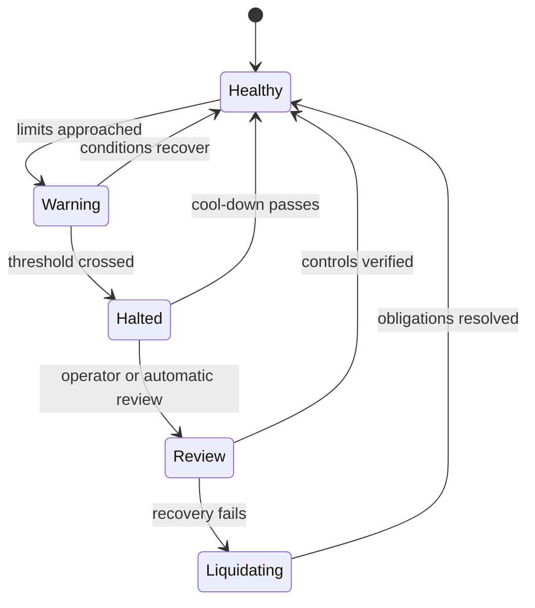

## What it is

Risk controls are automated limits and state transitions that keep an exchange, clearing member, or trading strategy inside acceptable liquidity, credit, position, and operational bounds. They are separate from the strategy's expected return because a valid signal can still be too large, too fast, or too poorly collateralized.

## How it works

A pre-trade check runs before an order reaches the matching engine or before it is released to a venue. It authenticates the account, checks permissions, validates price and quantity, estimates notional exposure, verifies available margin or collateral, and applies price bands, fat-finger bounds, and participation limits. The check can reject, reduce, hold for review, or require a stronger authentication factor.

Post-trade controls reconcile fills, update positions and margin, detect abnormal order flow, and trigger actions such as cancellation, a trading halt, a margin call, or forced liquidation. A **circuit breaker** is a stateful throttle or halt that activates on measured stress, then permits controlled recovery only after a defined condition. A **margin/collateral engine** values positions, applies haircuts, funds settlement obligations, and distinguishes available collateral from encumbered collateral.



The control result should be explicit in a machine-readable contract:

```json
{
  "account": "acct-42",
  "instrument": "ETH-USD",
  "side": "buy",
  "quantity": 1200,
  "limit_price": 3150.00,
  "checks": {
    "permission": "pass",
    "price_band": "pass",
    "position_limit": "pass",
    "available_collateral": "pass"
  },
  "decision": "accept",
  "reason": "within pre-trade limits"
}
```

A risk engine must use the same price and position state as the execution path. Otherwise a check can pass against a stale mark and a later fill creates an uncovered obligation. Failures should be observable, idempotent where possible, and conservative: unknown state should not become permission to trade.

## Tradeoffs

| Design choice | Gain | Cost or risk |
| --- | --- | --- |
| Synchronous pre-trade checks | Blocks unsafe orders before matching | Adds latency to every order |
| Asynchronous limits | Higher throughput | Allows a small exposure window and needs reconciliation |
| Static position caps | Simple and explainable | Can reject valid hedges or permit concentrated intraday churn |
| Dynamic margin | Responds to volatility and liquidity | More model inputs and more operational cases |
| Automatic circuit breaker | Limits cascading behavior | Can halt during recovery and create execution risk |
| Manual review | Adds human judgment | Slow and vulnerable to inconsistent decisions |

## When to use

- Orders can move a position or create obligations larger than available collateral.
- You need a defense against fat-finger inputs, runaway loops, and venue outages.
- Volatility or liquidity changes should alter limits or halts.
- A trader needs an auditable reason for every accept, reject, or forced reduction.
- Recovery from a halt must be explicit and observable.

## Alternatives

- **Broker-side controls** — centralize customer protection, but can be less specific to a strategy's internal state.
- **Venue-native controls** — reduce propagation delay, but do not cover a firm's aggregate exposure across venues.
- **Post-trade-only limits** — simplify the hot path, but permit temporary breaches and larger operational loss.
- **Static collateral buffers** — reduce model dependence, but tie up capital and can be too conservative.

## Related

- [18.1 Exchange Architecture: Order Books, Matching Engines, Price-Time Priority](01-exchange-architecture.md)
- [18.4 Low-Latency Engineering & High-Frequency Trading: Kernel Bypass, Co-Location, Hardware Timestamping, LMAX Disruptor Pattern, and FPGA Accelerator Offloading](04-low-latency-hft.md)
- [18.6 Clearing & Settlement: Central Counterparties (CCPs), T+1/T+0 Settlement, DvP](06-clearing-settlement.md)
- [18.8 Exchange System Design: Multi-Asset Exchange Architecture, Sequencer/Matching Engine Determinism, Order Book Replication, Market Maker Incentives, Cross-Exchange Arbitrage Infra](08-exchange-system-design.md)
