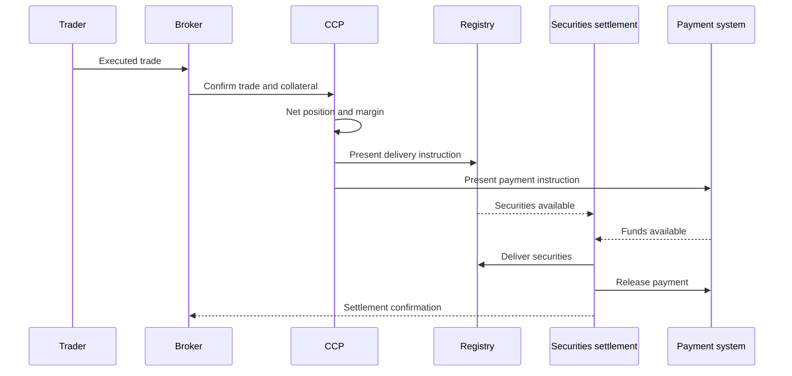

## What it is

Clearing and settlement is the process that turns executed trades into enforceable obligations, collateral requirements, and final delivery. A **central counterparty (CCP)** becomes the buyer to every seller and seller to every buyer, reducing bilateral counterparty exposure but concentrating the need for margin, default management, and recovery rules.

## How it works

After execution, trade details are confirmed and assigned to a clearing member. The CCP calculates variation margin, initial margin, and any additional obligations. Positions are marked, collateral is valued, and a netting set is updated. Settlement then follows the market's cycle: **T+1** generally means one business day after trade date, while **T+0** attempts same-day completion. The exact deadlines and holiday rules are jurisdiction and asset specific.

Cash settlement accounts for payment; securities settlement accounts for delivery. **DvP**, delivery versus payment, links them so payment and delivery occur against one another under defined settlement conditions. A settlement system must handle fails, cancellations, corporate actions, freezes, and replacement trades without silently creating a free balance.



A settlement ledger can distinguish state, ownership, and cash rather than updating a single balance without provenance:

```sql
CREATE TABLE settlement_instruction (
    instruction_id TEXT PRIMARY KEY,
    trade_id TEXT NOT NULL,
    settlement_date TEXT NOT NULL,
    asset_id TEXT NOT NULL,
    quantity TEXT NOT NULL,
    cash_amount TEXT NOT NULL,
    status TEXT NOT NULL
);
```

The table is an artifact for a settlement service, not a complete CCP design. A production system needs immutable trade references, idempotency keys, netting-set versioning, collateral eligibility rules, and a recovery path for partial completion. A T+0 label does not eliminate fails; it changes when the system must detect and resolve them.

## Tradeoffs

| Design choice | Gain | Cost or risk |
| --- | --- | --- |
| CCP novation | Reduces bilateral counterparty exposure | Centralizes default and liquidity risk |
| Bilateral settlement | Preserves direct counterparty obligations | Requires more credit and collateral management across pairs |
| T+0 | Reduces settlement lag and counterparty exposure | Requires intraday funding, liquidity, and operational readiness |
| T+1 | More time for funding and reconciliation | Leaves more time for market and credit exposure |
| Netting | Reduces obligations and collateral transfers | Can conceal gross risk and complicates legal portability |
| DvP | Links cash and asset delivery | Requires synchronized eligible settlement arrangements |

## When to use

- You need to define who owes what after a trade and when finality occurs.
- Counterparty credit can change between execution and settlement.
- Assets and cash have different settlement calendars or delivery constraints.
- Collateral must be eligible, valued, and available for a default scenario.
- Replacement, fail handling, and audit evidence are part of the service contract.

## Alternatives

- **Direct bilateral settlement** — avoids CCP novation, but spreads credit and collateral management.
- **Rolling without central clearing** — can be useful for some bilateral markets, but requires strong counterparty selection and limits.
- **DVP model 1** — separates payment and securities legs at the start of the cycle.
- **DVP model 2** — links payment and securities delivery atomically, but has stricter operational requirements.

## Related

- [18.5 Risk Controls: Pre-Trade Risk Checks, Position Limits, Circuit Breakers, Margin/Collateral Engines](05-risk-controls.md)
- [18.7 Auction Mechanisms & Price Matching: Continuous Double Auction, Batch/Call Auctions, Uniform vs Discriminatory Pricing, Opening/Closing Auctions, Dutch/English/Vickrey Auctions](07-auction-mechanisms-price-matching.md)
- [18.8 Exchange System Design: Multi-Asset Exchange Architecture, Sequencer/Matching Engine Determinism, Order Book Replication, Market Maker Incentives, Cross-Exchange Arbitrage Infra](08-exchange-system-design.md)
- [Chapter 18 References](10-references.md)
