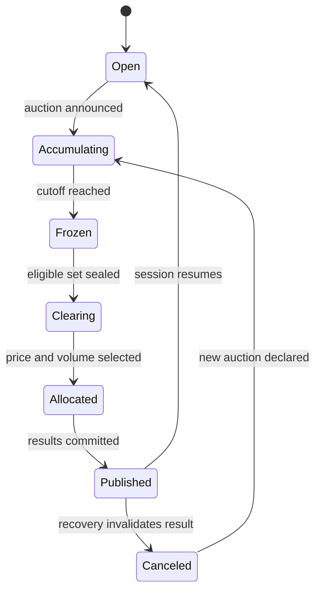

## What it is

An auction mechanism collects eligible demand and supply, then applies a price-clearing and allocation rule. Unlike a continuous double auction, where trades can happen immediately whenever a bid crosses an ask, a batch auction delays execution until a collection point so the market can use the full order set for price discovery.

## How it works

A continuous double auction maintains resting bids and asks. A batch or call auction freezes eligible orders at a cutoff, accumulates demand and supply, and finds a clearing rule. Under **uniform pricing**, all winning trades use the same clearing price. Under **discriminatory pricing**, each trade can use a different price based on its counterpart and the submitted order. The choice changes incentives, information handling, and how a participant reasons about fill probability.

An opening auction establishes an initial or reopening reference price, while a closing auction concentrates liquidity near a benchmark. The exchange must define the cutoff, eligible order types, tie-breaking, price increments, cancellation policy, and treatment of imbalance orders. A clearing result must be reproducible from the complete eligible order set.



Auction protocols are not interchangeable. A **Dutch auction** reveals a descending price until a participant stops it or an accepted amount is reached. An **English auction** has a visible current price and ends when no participant raises the bid, usually with a reserve or time rule. A **Vickrey auction** makes the highest bidder pay the second-highest bid under specified assumptions, so truthful bidding requires understanding eligibility, verification, and anti-collusion controls.

```text
eligible_bid: 101.20, quantity: 800
eligible_ask: 101.10, quantity: 1200
cutoff_sequence: 884201
allocation_rule: pro_rata_at_uniform_price
tie_break: earliest_sequence
```

The text is a compact inspection of an auction input, not a complete protocol. A clearing engine should retain the cutoff sequence, rule version, all eligible orders, rounding decisions, and allocation events. If those inputs differ between replicas, deterministic tie-breaking and reproducibility are lost.

## Tradeoffs

| Design choice | Gain | Cost or risk |
| --- | --- | --- |
| Continuous double auction | Immediate execution and continuous discovery | Queue position and latency affect outcomes |
| Batch auction | Uses the full eligible order set for clearing | Execution waits for a cutoff and exposes pending intent |
| Uniform pricing | One public clearing price and simpler interpretation | Can change equilibrium incentives between buyers and sellers |
| Discriminatory pricing | May preserve submission-time value for some participants | More complex pricing and information concerns |
| Dutch auction | Fast clearing when a downward price path is visible | Price discovery and stopping behavior can be strategic |
| Vickrey auction | Encourages truthful bids under assumptions | Verification, ties, collusion, and payment design are delicate |

## When to use

- You need a benchmark or reference price at a defined collection point.
- A full order set should influence price discovery before execution.
- You can define eligibility, tie-breaking, allocation, and cancellation before the cutoff.
- A uniform price is more useful than individual trade prices for the market objective.
- The result can be replayed from immutable inputs.

## Alternatives

- **Continuous double auction** — wins when immediate execution and persistent liquidity are primary.
- **Periodic call market** — wins when a scheduled collection point simplifies price discovery.
- **Random close or close-by-order** — changes submission incentives and can reduce predictable end-of-session runs.
- **Multi-price auction** — preserves more submission-time information, but increases complexity for participants.

## Related

- [18.1 Exchange Architecture: Order Books, Matching Engines, Price-Time Priority](01-exchange-architecture.md)
- [18.5 Risk Controls: Pre-Trade Risk Checks, Position Limits, Circuit Breakers, Margin/Collateral Engines](05-risk-controls.md)
- [18.6 Clearing & Settlement: Central Counterparties (CCPs), T+1/T+0 Settlement, DvP](06-clearing-settlement.md)
- [18.9 On-Chain Exchange Mechanics: AMM Bonding Curves vs Order-Book DEXs, MEV, Batch Auctions (CoWSwap-style), Slippage/Price Impact Models](09-on-chain-exchange-mechanics.md)
