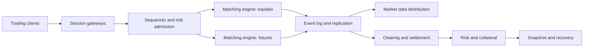

## What it is

A multi-asset exchange is a shared infrastructure that serves different products while preserving product-specific rules, permissions, risk, and settlement. Its design must make the ordering, state, and recovery contract explicit because a single shared engine can otherwise create both efficiency and cross-market failure risk.

## How it works

The ingress layer authenticates sessions and normalizes orders. A sequencer or partitioner establishes an order of events for each product or market. Matching engines process the ordered stream, while market-data publishers fan out resulting events to subscribers. Risk, margin, and clearing services consume the same execution events or an independently verifiable stream. Product rules define tick size, lot size, trading hours, self-trade prevention, auction behavior, and settlement type.

A **sequencer** is a logical authority that orders accepted events. Determinism means replicas given the same initial state and ordered inputs produce the same state and event stream. Floating-point arithmetic, map iteration order, wall-clock decisions, and nondeterministic tie-breaking must not silently enter the consensus-relevant path. Versioned rules and explicit sequences are part of the exchange contract.



Replication should distinguish a hot standby from a recovered copy. A full book snapshot plus an ordered event suffix is a practical recovery model, but the snapshot and suffix must share a version boundary. A replication lag is not a correctness failure by itself, yet a strategy must know whether its book is current, delayed, or disconnected before it acts.

```yaml
exchange_platform:
  products:
    - id: ACME
      engine: equities
      sequence_domain: acme
      matching: price_time
      settlement: t_plus_1
    - id: ACME-PERP
      engine: futures
      sequence_domain: acme_perp
      matching: price_time
      settlement: perpetual_margin
  replication:
    mode: hot_standby
    book_snapshot: periodic
    event_suffix: ordered
  arbitrage:
    normalized_symbols: true
    stale_quarantine_ms: 250
```

Market-maker incentives can improve displayed liquidity through rebates, fee tiers, or obligations, but they can also encourage spoofing-like behavior. Rules should distinguish genuine quoting from wash trading, cancellations, and self-crossing. Cross-exchange arbitrage infrastructure normalizes symbols, timestamps, fees, and settlement constraints, then acts only when a spread exceeds fees, latency, and transfer risk. A deterministic price difference is not an executable profit.

## Tradeoffs

| Design choice | Gain | Cost or risk |
| --- | --- | --- |
| One shared sequencer | Simple global ordering | A busy product can delay others and create a hot spot |
| Per-product sequencers | Higher parallelism and isolation | Cross-product orders need an explicit atomicity rule |
| Single matching engine per product | Simple state and recovery | A product fault can still affect shared infrastructure |
| Hot standby replication | Fast failover target | Requires continuous state transfer and handoff semantics |
| Full book snapshots | Straightforward cold recovery | Snapshot cost and version boundaries need care |
| Maker rebates and quotas | Encourage displayed liquidity | Can create gaming incentives and adverse selection |

## When to use

- Several products share gateways, data distribution, risk, or settlement services.
- Product rules differ in tick size, hours, margin, or matching behavior.
- Failover must preserve or explicitly reconcile the book and sequence boundary.
- Market makers need transparent incentives and monitoring.
- Cross-venue strategies need normalized symbols, fees, clocks, and staleness rules.

## Alternatives

- **Independent venue stacks per asset** — isolate products, but duplicate engineering and cross-asset risk management.
- **Fully decentralized sequencer committee** — reduce one operator's control, but add consensus and finality costs.
- **Asynchronous replication with periodic checkpoints** — simplify steady-state operation, but make failover recovery less immediate.
- **Centralized matching with external risk gateway** — isolate pre-trade policy, but add a network and ordering boundary.

## Related

- [18.1 Exchange Architecture: Order Books, Matching Engines, Price-Time Priority](01-exchange-architecture.md)
- [18.2 Order Types & Execution: Market/Limit/Stop Orders, Smart Order Routing](02-order-types-execution.md)
- [18.5 Risk Controls: Pre-Trade Risk Checks, Position Limits, Circuit Breakers, Margin/Collateral Engines](05-risk-controls.md)
- [18.6 Clearing & Settlement: Central Counterparties (CCPs), T+1/T+0 Settlement, DvP](06-clearing-settlement.md)
