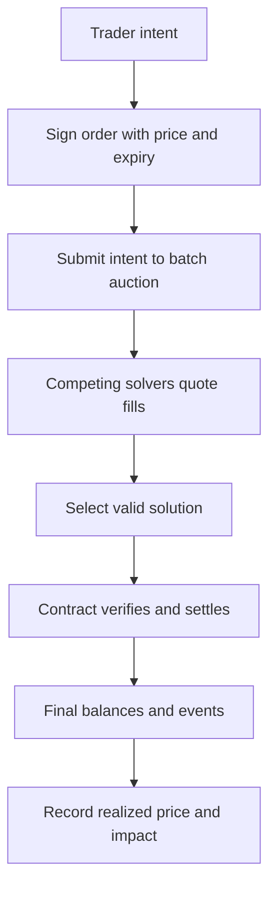

## What it is

On-chain exchanges place the order-matching, pricing, authorization, and settlement rules in a shared execution environment. An automated market maker (AMM) prices swaps from reserves or a bonding curve, while an order-book decentralized exchange (DEX) submits orders and matches them on-chain or through a controlled sequencer. A batch auction groups compatible intents and settles them together.

## How it works

An AMM holds two or more reserves and applies a pricing function. A constant-product pool, for example, changes the execution price as one asset is exchanged for the other. An order-book DEX stores bids and asks and can preserve explicit price-time or protocol-specific priority. Both models can be implemented with smart contracts, but the execution path is exposed to transaction ordering, validator or sequencer influence, and state-transition failures.

A CoWSwap-style batch auction lets solvers find better fills for signed intents and settles a compatible set through a settlement contract. The protocol's guarantee depends on the signed order format, solver competition, auction deadline, cancellation rules, and settlement contract. A solver is not trusted merely because it returns a quote; settlement must verify signatures, amounts, tokens, and expiry.



A swap intent should include a minimum output and a deadline. A model that reports only the quoted spot price misses fees, price impact, gas, priority fees, and the probability that a transaction is reordered. A constant-product execution estimate assumes the displayed reserves are available and the trade is not front-run; a quote is therefore a scenario, not a guarantee.

```typescript
type SwapIntent = {
  tokenIn: string;
  tokenOut: string;
  amountIn: bigint;
  minAmountOut: bigint;
  deadline: bigint;
  nonce: bigint;
};
```

MEV includes transaction reordering, sandwich attacks, and other ways searchers or privileged actors extract value from pending execution. Private transaction submission, batch auctions, intent encryption, and slippage bounds can reduce exposure, but no mechanism removes smart-contract, liquidity, oracle, or sequencer risk. A successful transaction is not necessarily a fair execution.

## Tradeoffs

| Design choice | Gain | Cost or risk |
| --- | --- | --- |
| AMM bonding curve | Deterministic pricing and shared liquidity | Price impact rises with trade size and fees affect execution |
| Order-book DEX | Explicit bids, asks, and queue rules | More state, lower liquidity efficiency, and ordering exposure |
| Public mempool execution | Open participation and composability | Reordering and front-running can disadvantage traders |
| Private order flow | Reduces public leakage | Requires trusted or policy-governed builders or sequencers |
| Batch auction | Groups intents and can improve price discovery | Delays settlement and depends on solver quality and liveness |
| On-chain settlement | Public, verifiable finality | Gas, block time, and contract complexity affect execution |

## When to use

- You need transparent settlement rules that can be inspected by participants.
- Liquidity is shared across many traders rather than held by named market makers.
- Users can tolerate public transaction ordering or use a private batch path.
- The contract has an established audit, pause, upgrade, and incident process.
- The quoted amount includes fees, impact, and a minimum-output deadline.

## Alternatives

- **Centralized exchange with custody** — provides support and familiar execution, but introduces operator and withdrawal risk.
- **Off-chain order book with on-chain settlement** — improves privacy and speed, but introduces operator custody and sequencer trust.
- **Intent-based solver auctions** — can search multiple liquidity sources, but depend on solver incentives and settlement liveness.
- **Batch auction without AMM** — separates price discovery from constant-product pricing, but requires a clear batch commitment rule.

## Related

- [18.2 Order Types & Execution: Market/Limit/Stop Orders, Smart Order Routing](02-order-types-execution.md)
- [18.5 Risk Controls: Pre-Trade Risk Checks, Position Limits, Circuit Breakers, Margin/Collateral Engines](05-risk-controls.md)
- [18.7 Auction Mechanisms & Price Matching: Continuous Double Auction, Batch/Call Auctions, Uniform vs Discriminatory Pricing, Opening/Closing Auctions, Dutch/English/Vickrey Auctions](07-auction-mechanisms-price-matching.md)
- [Chapter 18 References](10-references.md)
