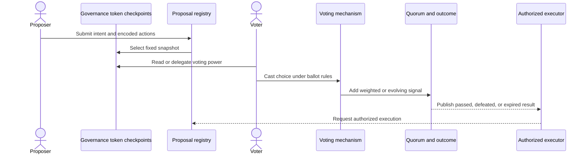

## What it is

A **decentralized autonomous organization (DAO)** is an organization whose membership, decision rules, voting power, and authority to act are encoded in contracts and publicly auditable records. DAO architecture separates who may propose, whose preferences count, how a proposal passes, and which contract receives authority to execute the result.

## How it works

A **governance token** or membership credential expresses voting power, but the token contract is only the source of weight. A **snapshot** fixes each participant's power at a stated timepoint, preventing purchases or withdrawals during a vote from changing an already active ballot. **Quorum** is the minimum participation required for a result to count; **delegation** lets a holder authorize a delegate to cast its voting power.

A common flow separates eligibility, signaling, and execution:



The snapshot protects a ballot from late token trading, but it does not stop an attacker from acquiring power before the snapshot. Voting delay, proposal threshold, delegation disclosure, and a cancel window address different attack windows; no one parameter removes them all.

The three principal mechanisms differ in what they measure:

| Mechanism | Weight function | Passage model | Main strength | Main failure mode |
| --- | --- | --- | --- | --- |
| Token-weighted | Usually one vote per token unit at the snapshot | Discrete ballot with quorum and choice thresholds | Simple, auditable, and compatible with transferable governance tokens | Concentrated holdings dominate, and delegated power can be captured |
| Quadratic | A participant's additional votes cost the square of their count; credits can be split across choices | Discrete or streaming ballot under a per-member budget | Expresses preference intensity and reduces the marginal value of extra tokens on one issue | Splitting an address into many wallets defeats the fairness assumption |
| Conviction | Support grows with time and may depend on locked stake, decay, and requested resources | Continuous proposals pass when accumulated support crosses a dynamic threshold | Supports asynchronous prioritization and limited-rate treasury allocation | Parameter sensitivity, concentrated delegates, and poor explanations can make outcomes hard to predict |

A **quadratic voting** rule assigns each participant a fixed voice-credit budget. Spending `v` votes on an option costs `v²` credits, so preferences can be spread across several choices. The fairness claim depends on enforcing a meaningful per-person budget. On a public chain, one address can own many addresses; a token-balance curve or square-root strategy limits whale influence but does not provide Sybil resistance.

**Conviction voting** treats support as a time-varying signal rather than a single vote. A participant places conviction behind a proposal, and the aggregate grows while remaining support decays. A proposal passes when its signal exceeds a threshold, often based partly on the share of treasury it requests. 1Hive's implementation demonstrates the allocation model, while Moonbeam's OpenGov uses a different conviction system based on locked voting multipliers. They are not interchangeable implementations of one standard.

A deployment should publish a decision record that the token, Governor, interfaces, tests, and monitoring services can verify:

```yaml
governance:
  chain_id: 1
  governance_asset: "0x1111111111111111111111111111111111111111"
  clock: block_number
  voting_unit: token
  snapshot:
    offset_blocks: 7200
  ballot:
    mechanism: token_weighted
    choices: [against, for, abstain]
    quorum_basis: total_supply_at_snapshot
    quorum_percent: 4
  proposal:
    threshold_percent: 1
    voting_period_blocks: 50400
  delegation:
    enabled: true
    disclose_effective_delegates: true
  execution:
    delay_seconds: 172800
    cancel_window_required: true
  security:
    emergency_executor: none
    minimum_voting_delay: 1
```

Security review must treat governance as a security boundary. A voting delay changes the acquisition window rather than guaranteeing fair influence. Snapshot lookup can fail after a token upgrade unless the token preserves historical checkpoints. Token supply can concentrate through lending, staking wrappers, or purchase immediately before a vote. Emergency roles can restore response time but can also bypass ordinary governance, so their authority, delay, scope, and expiration must be explicit.

## Tradeoffs

| Decision | Gain | Cost |
| --- | --- | --- |
| One token, one vote | Simple verification and liquid governance | Wealth concentration directly becomes governance power |
| Quadratic voting | Expressive preferences and lower marginal whale influence | Requires stronger identity assumptions and more complex accounting |
| Conviction voting | Encourages sustained, asynchronous attention | Outcomes depend on time, decay, thresholds, and delegate behavior |
| Longer voting delay | Reduces last-moment acquisition and gives delegates time to react | Slower decisions and more proposal staleness |
| Lower quorum | Allows a smaller active group to decide | Makes capture and nonparticipation more consequential |
| Emergency authority | Fast response to active incidents | Creates a privileged path that can bypass member consent |

## When to use

- You need transferable economic alignment and can tolerate openly concentrated voting power.
- You need preference intensity across several choices and can enforce a credible per-person budget.
- You need continuous prioritization for treasury requests and accept a signal-based passage rule.
- You need a simple proposal threshold and quorum that contracts can enforce deterministically.

## Alternatives

- **One-member, one-vote off-chain voting** — fits an identified membership and participation process, but needs a credible membership registry and off-chain result verification.
- **Optimistic governance** — treats silence as approval for bounded, routine changes, but requires veto rights and a slower path for consequential proposals.
- **Council or multisig decision-making** — fits small expert groups, but concentrates authority and gives members fewer direct voting rights.
- **Delegated liquid democracy** — lets specialists cast member power, but introduces delegate competition, capture, and accountability requirements.

## Related

- [Chapter 19 overview](_index.md)
- [19.2 Treasury Management & Multi-Sig Custody](02-treasury-multi-sig.md)
- [19.3 On-Chain Proposal/Execution Pipelines (Governor Contracts, Timelocks)](03-proposal-execution-pipelines.md)
- [Chapter 19 References](05-references.md)
