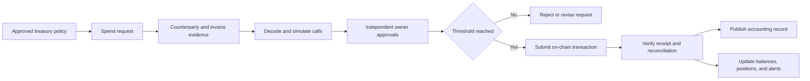

## What it is

DAO treasury management is the policy and control system that decides which assets the organization holds, who may initiate transactions, how many approvals are required, which contracts and chains are trusted, and what evidence proves an authorized payment occurred. A **multi-signature account** enforces a threshold of owner approvals on-chain, so one compromised key does not receive unilateral custody.

## How it works

A Safe smart account stores a set of owner addresses and a **threshold**. Owners sign a canonical transaction containing the chain ID, Safe address, nonce, destination, value, calldata, gas settings, and operation type. The contract accepts execution when valid signatures reach the threshold. Safe owners can also be smart accounts, but a shared signer wallet or module can recreate the single-key failure the threshold was meant to remove.

Treasury data moves through several controls rather than directly from a vote to a transfer:



A practical custody record separates signer administration from spending authority. The following is a review artifact, not a substitute for reading the deployed Safe configuration:

```yaml
custody:
  network: ethereum
  chain_id: 1
  account_type: safe
  account_address: "0x2222222222222222222222222222222222222222"
  threshold: 4
  owners: 7
  signing:
    hardware_required: true
    one_identity_per_owner: true
    signer_operators_independent: true
    backup_share_policy: documented
  transaction_policy:
    native_or_token_transfer: 4
    unlisted_contract_call: 6
    owner_or_module_change: 5
    wrapped_native_operation: 5
  allowed_environments:
    production: false
    allowlist_enforced_by_contract: true
  operations:
    two_person_receipt_review: true
    require_invoice_or_mandate: true
    simulate_before_approval: true
    daily_balance_alerts: true
    monthly_reconciliation: true
    incident_runbook: "treasury-incident-v1"
```

Use transaction batching only when the grouped calls are intentionally atomic. A batch that contains a payment and a later configuration change should not let the payment succeed while the intended security change fails. Conversely, separating unrelated calls prevents one failure from blocking the entire operational queue.

Smart-contract allowlists are useful controls, but they depend on what can be delegated. ERC-20 allowances let an approved spender move tokens up to a remaining limit. DeFi positions can be controlled by a router, vault, position manager, or governance plugin. An allowlist that covers only token addresses does not constrain the function selectors those contracts accept. Review approvals, permit signatures, permit2 or equivalent nonce systems, module permissions, guards, fallback handlers, and upgradeable dependencies separately.

Signer diversity must survive organizational changes. People from one employer, wallet seed backup, device supply chain, or communication channel are not independent controls. Rotate owners and thresholds through an approved transaction, test recovery, and maintain at least the approved threshold of responsive signers. Removing a compromised owner is easier when each signer reviews the owner set before signing and when monitoring alerts on `OwnerAdded`, `OwnerRemoved`, and threshold changes.

Treasury operations also inherit legal and financial constraints. Multisig approval proves that owners authorized a transaction; it does not prove that the recipient exists, that an invoice is accurate, that a transfer satisfies tax rules, or that a wrapped position is covered by the organization's mandate. Sanctions, accounting, custody, and reporting obligations apply to the relevant legal entity regardless of contract code.

## Tradeoffs

| Decision | Gain | Cost |
| --- | --- | --- |
| Higher multisig threshold | Fewer approvals are required to lose control | Slower operations and greater availability risk |
| Lower multisig threshold | Easier quorum during an incident | One additional compromised owner can authorize spending |
| Contract allowlist | Rejects calls to many untrusted targets | Cannot necessarily restrict methods, tokens, or amounts on trusted contracts |
| Small routine batches | Limits blast radius and simplifies reconciliation | More transactions, gas, and partial-execution states |
| Diverse organization-owned signers | More resilient membership across staff changes | More training, succession, and compensation overhead |
| Dedicated hardware signers | Keeps private keys offline during approval | Lost devices and hardware supply-chain risk still require recovery planning |

## When to use

- You need more than one person or institution to authorize treasury movement.
- You hold valuable assets or can cause irreversible DeFi contract changes.
- You can recruit enough independent, trained signers to meet the chosen threshold.
- You need a documented allowlist, incident process, reconciliation, and key-rotation schedule.
- You are willing to keep sensitive transaction data off public proposal systems and public chat.

## Alternatives

- **Governor-controlled timelock** — fits member-authorized spending and adds a reaction delay, but couples treasury access to the governance system's correctness.
- **Gnosis Safe multisig** — provides mature threshold custody and modules, but every module and owner configuration expands the trusted computing base.
- **Qualified custody or institutional MPC** — can add policy, recovery, and organizational controls, but introduces a provider and jurisdiction dependency.
- **Role-restricted spending policies** — can automate bounded payments, but a misconfigured module or upgrade key can still become an unrestricted executor.
- **Fully on-chain streaming or vesting vaults** — automate ongoing commitments, but parameter changes and implementation upgrades still need accountable governance.

## Related

- [Chapter 19 overview](_index.md)
- [19.1 DAO Architecture: Governance Tokens, Voting Mechanisms (Token-Weighted, Quadratic, Conviction Voting)](01-dao-architecture.md)
- [19.3 On-Chain Proposal/Execution Pipelines (Governor Contracts, Timelocks)](03-proposal-execution-pipelines.md)
- [19.4 DAO Tooling: Snapshot, Aragon, and Legal Wrapper Considerations](04-dao-tooling.md)
