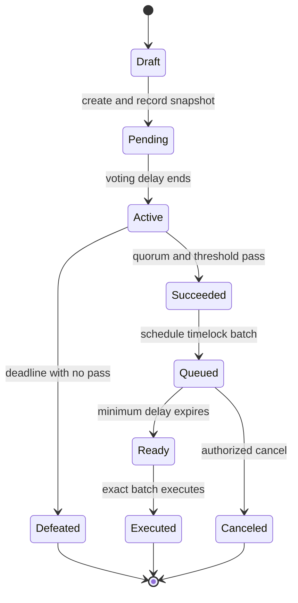

## What it is

An on-chain proposal pipeline is the state machine that turns a proposed action into authorized contract execution. A **Governor** contract records proposals, voting power, choices, quorum, and outcomes; a **timelock** holds the organization’s execution authority until a successful proposal has waited long enough to become executable.

## How it works

In a Compound-style Governor Bravo pipeline, the proposer supplies parallel arrays of target addresses, native-currency values, and encoded function calls plus a description. A proposal ID is derived from the exact actions and description hash. At creation, the Governor fixes the voting snapshot, start time, and duration recorded for that proposal.

OpenZeppelin's `Governor` composes voting-power, counting, quorum, settings, and timelock modules. The `GovernorVotes` extension reads checkpointed weight from an ERC-20 or ERC-721 voting token. `GovernorCountingSimple` records against, for, and abstain choices, while `GovernorCountingFractional` lets a delegate consume its remaining weight across those choices. These modules define accounting; they do not by themselves constrain who may execute the selected calldata.

When a TimelockController executes the proposal, the **timelock**, not the Governor, must own the assets and permissions changed by the calls. A successful vote moves the operation from timelock `Unset` to `Pending`; after the minimum delay it becomes `Ready`; execution moves it to `Done`. Batch operations are atomic and identified by a hash over all execution fields and their salt.



The manifest below records the values reviewers must compare across the proposal UI, encoding tool, Governor, TimelockController, and executed transaction. `proposal_id`, `timelock_operation_id`, and calldata hashes must be recomputed from the deployed contract versions rather than copied from a message.

```json
{
  "schema_version": 1,
  "chain": {
    "chain_id": 1,
    "governor": "0x3333333333333333333333333333333333333333",
    "timelock": "0x4444444444444444444444444444444444444444",
    "expected_block_number": 21000000
  },
  "proposal": {
    "proposer": "0x5555555555555555555555555555555555555555",
    "description_uri": "ipfs://bafyexample",
    "description_hash": "0xaaaaaaaaaaaaaaaaaaaaaaaaaaaaaaaaaaaaaaaaaaaaaaaaaaaaaaaaaaaaaaaa",
    "voting_delay_blocks": 7200,
    "voting_period_blocks": 50400,
    "proposal_threshold": "100000000000000000000"
  },
  "execution": {
    "batch_mode": "atomic",
    "targets": [
      "0x6666666666666666666666666666666666666666"
    ],
    "values": [
      "0"
    ],
    "calldata": [
      "0xdeadbeef"
    ],
    "predecessor_operation_id": "0x0000000000000000000000000000000000000000000000000000000000000000",
    "minimum_delay_seconds": 172800,
    "executor_policy": "permissionless_after_ready"
  },
  "verification": {
    "simulate_at_target_block": true,
    "verify_bytecode": true,
    "verify_roles": ["proposer", "canceller", "executor"],
    "monitor_queue_cancel_execute": true,
    "publish_decoded_actions": true
  }
}
```

A release-grade review checks addresses, chain ID, proxy implementation and admin, contract bytecode, storage layout, function selectors, calldata, native value, predecessor, salt, and minimum delay together. Decode the human-readable action, but also inspect the raw bytes. A harmless transfer function can carry a token hook, permit, callback, or protocol-specific side effect. Simulate against the expected chain state and then simulate again immediately before execution because approvals, prices, oracle results, and nonce state can change.

Governance parameters must be read as values, not named durations. A delay expressed in blocks is not fixed wall-clock time: chain congestion, validator outages, and clock-based chains alter elapsed time. ERC-6372 exposes whether a token and Governor use block numbers or timestamps, but operators still need chain-specific finality assumptions. A timelock supplies observation and reaction time; it does not prove that an action is safe.

The timelock's role graph is security critical. Additional proposers, cancellers, executors, administrators, or bypass roles may receive more power than the organization intends. OpenZeppelin warns that extra timelock proposers or cancellers can execute operations or block approved governance. Keep the Governor, timelock, target protocols, and emergency role holders under continuous monitoring, and schedule alerts for every queue, cancel, execution, role, delay, owner, module, and upgrade event.

## Tradeoffs

| Decision | Gain | Cost |
| --- | --- | --- |
| Fully on-chain voting | Rules, votes, and outcomes are independently verifiable | Higher transaction cost and limited flexibility for rich deliberation |
| Off-chain vote with on-chain execution | Lower participation cost and richer proposal content | An additional result-verification and execution trust boundary |
| Timelock delay | Gives members and dependent systems time to react | Slows routine actions and does not prevent fully preplanned harm |
| Atomic batch | All intended actions succeed or the batch reverts | One failing call blocks every action in the batch |
| Separate batches | Limits blast radius and permits partial progress | Produces intermediate states that may be unsafe together |
| Open execution after readiness | Any party can complete a passed action | Requires a complete queue monitor and exact public execution payload |

## When to use

- You need a public, deterministic rule for proposal passage and authorized execution.
- You need reaction time after a vote so users can exit, pause, or prepare a response.
- You control the Governor modules, timelock roles, and every target contract named by proposals.
- You can publish and continuously verify exact targets, values, calldata, delays, and outcomes.
- You need cancellation or guardian paths narrow enough that they cannot rewrite ordinary governance.

## Alternatives

- **Snapshot plus a Safe module** — separates inexpensive off-chain signaling from multisig execution, but operators and gateways must trust the signed result and adapter.
- **Direct Governor execution without a timelock** — removes one delay and role boundary, but removes the organization's main post-vote reaction window.
- **Optimistic governance executor** — makes routine changes effective after a challenge period, but requires reliable monitoring and a strong veto path.
- **General-purpose Safe transaction flow** — supports flexible operational custody, but does not itself provide proposal thresholds, ballot counting, or standardized outcomes.
- **Cross-chain governance executor** — coordinates decisions across networks, but adds bridge, message verification, and destination-state risks.

## Related

- [Chapter 19 overview](_index.md)
- [19.1 DAO Architecture: Governance Tokens, Voting Mechanisms (Token-Weighted, Quadratic, Conviction Voting)](01-dao-architecture.md)
- [19.2 Treasury Management & Multi-Sig Custody](02-treasury-multi-sig.md)
- [19.4 DAO Tooling: Snapshot, Aragon, and Legal Wrapper Considerations](04-dao-tooling.md)
