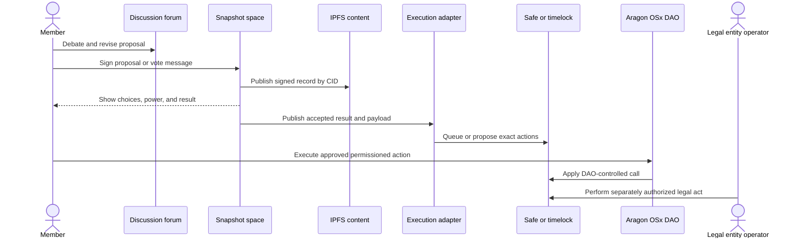

## What it is

DAO tooling supplies the interfaces and protocol modules that connect discussion, voting, membership, permissions, and execution. Snapshot supports signature-based off-chain voting, Aragon OSx supplies composable on-chain organizations and plugins, and a **legal wrapper** gives recognized participants a conventional legal entity for contracts, banking, employment, tax, and liability. None of these tools alone makes a governance system fair, secure, or legally effective.

## How it works

Snapshot stores signed proposals and votes off chain and publishes content through IPFS. Voting power can be derived from an on-chain token strategy at a historical block, while proposal publication and voting avoid an on-chain transaction for every participant. An execution strategy then decides whether a proposal is accepted and what exact transactions run. A Snapshot vote becomes binding authority only when the design connects the signed result to a destination such as a Safe module, a timelock, or a DAO's permission manager.

Aragon OSx treats the organization as an on-chain account with a permission manager. The DAO Factory creates a DAO proxy, registers it, installs configured plugins, sets native permissions, and removes the factory's ownership. Plugins add membership, voting, execution, or other behavior. Each plugin instance requests specific permissions; Aragon's Plugin Setup Processor temporarily receives root permission while applying an approved setup and must revoke it when finished.

The trust boundaries cross forum, content storage, voting, plugin, and legal operations:



An integration review should make the boundaries explicit instead of treating a proposal link as sufficient control:

```json
{
  "record_type": "dao_tooling_review",
  "snapshot": {
    "space": "example.eth",
    "chain_id": 1,
    "voting_type": "quadratic",
    "quorum_percent": 4,
    "strategy": "erc20-balance-of",
    "token_address": "0x1111111111111111111111111111111111111111",
    "historical_block": 21000000,
    "domain_separated_signatures": true,
    "content_pinning_required": true
  },
  "aragon_osx": {
    "dao_address": "0x7777777777777777777777777777777777777777",
    "plugin_repo": "example-voting-plugin.dao.eth",
    "release": 2,
    "build": 1,
    "permissions_granted": ["CREATE_PROPOSALS", "VOTE", "EXECUTE"],
    "root_permission_revocations_verified": true
  },
  "execution": {
    "destination": "0x2222222222222222222222222222222222222222",
    "mode": "timelock",
    "accepted_result_adapter_verified": true,
    "exact_payload_hashed": true
  },
  "legal": {
    "jurisdiction_reviewed": false,
    "mandate_reviewed": false,
    "signatory_authority_reviewed": false,
    "tax_and_accounting_reviewed": false
  }
}
```

Snapshot's content identifiers prove that retrieved bytes match the referenced content, but availability still depends on pinning and gateways. A space administrator can change strategies, quorum, plugins, or settings, so members must monitor configuration changes and anchor important values in signed proposals. A token strategy at a historical block limits later-balance manipulation, but it does not prove that addresses represent independent people. Quadratic and anti-whale configurations also remain vulnerable to address splitting without an enforceable membership rule.

Off-chain voting changes the verification surface. The executor must bind the space, chain ID, proposal ID, epoch, payload, and accepted result into its authorization. It must reject a stale or modified result and compare the execution payload with the text voters approved. Hiding raw calldata in a link, renderer, or hosted transaction service prevents independent review; publish decoded actions and machine-readable payloads as well.

Aragon plugins are composable but not automatically trusted. A plugin's maintainer, upgradeable implementation, plugin repository, setup contract, and requested permissions form part of the DAO's trusted computing base. Aragon's setup process can temporarily grant the processor root permission, so a malicious or unreviewed Plugin Setup can request more access than its advertised function suggests. Review prepared instances, setup IDs, permission conditions, implementation addresses, and revocations on a test network.

A legal wrapper changes accountability; it does not override contract behavior. The entity needs an enforceable constitution or operating agreement that identifies who can propose, sign, execute, and receive assets, plus procedures for disputes, removal, emergency action, records, tax, employment, privacy, sanctions screening, and insolvency. A multisig can sign a legally effective document and a token vote can approve an on-chain call without either action satisfying every legal requirement. Keep the chain address, entity, bank accounts, signatories, and asset register reconciled; document when consensus exists only in chat or an off-chain vote.

## Tradeoffs

| Decision | Gain | Cost |
| --- | --- | --- |
| Snapshot off-chain voting | Low participation cost, flexible strategies, and content-addressed records | Requires signatures, pinning, configuration monitoring, and a trusted result-to-execution bridge |
| On-chain Governor voting | Public state and deterministic enforcement | More on-chain cost and less room for rich discussion in ballot data |
| Aragon OSx plugins | Composable permissions and replaceable capabilities | Plugin setup, upgrades, and requested permissions expand the trusted base |
| Traditional legal entity | Clear contracting parties, banking, records, and remedies | Adds incorporation, governance, tax, and jurisdictional obligations |
| Legal wrapper plus DAO | Can combine conventional accountability with transparent asset control | Creates two authority systems that must remain aligned |
| Hosted DAO interfaces | Faster onboarding and integrated discovery | Adds provider, domain, account, rendering, and availability dependencies |

## When to use

- You need inexpensive voting with historical token weighting and flexible off-chain strategies.
- You need composable on-chain permissions, membership, and plugin upgrades.
- You need a recognized counterparty for grants, employment, services, banking, or regulated assets.
- You can monitor tool configuration, content pinning, execution adapters, and plugin permissions.
- You can reconcile legal authority, chain authority, and treasury records before execution.

## Alternatives

- **Fully on-chain Governor and TimelockController** — minimizes off-chain result dependence, but costs more and provides a simpler, less composable decision interface.
- **Safe multisig with direct proposals** — offers straightforward custody and broad integrations, but provides no native membership or ballot-counting model.
- **Delegate to a legal fiduciary or foundation** — can simplify contracting and recordkeeping, but reduces member control and requires enforceable delegation limits.
- **Off-chain multisig resolution without a wrapper** — can work for low-risk communities, but offers weaker recourse and legal clarity for external counterparties.
- **Custom DAO framework** — fits unusual governance rules, but shifts framework, audit, upgrade, and maintenance responsibility to the organization.

## Related

- [Chapter 19 overview](_index.md)
- [19.1 DAO Architecture: Governance Tokens, Voting Mechanisms (Token-Weighted, Quadratic, Conviction Voting)](01-dao-architecture.md)
- [19.2 Treasury Management & Multi-Sig Custody](02-treasury-multi-sig.md)
- [19.3 On-Chain Proposal/Execution Pipelines (Governor Contracts, Timelocks)](03-proposal-execution-pipelines.md)
