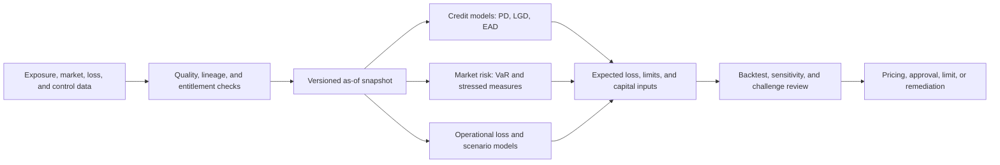

## What it is

A **risk engine** converts observed exposures, market data, loss records, and control signals into calibrated risk measures used for decisions, limits, capital, or remediation. Its output is a conditional estimate under a stated model, horizon, portfolio, and data quality, not a prediction of inevitable loss.

## How it works

Risk engines separate data lineage, calculation, validation, and decision use. A production result is reproducible when the engine can identify its model version, input snapshot, effective time, parameters, and calculation result.



### Credit risk

A common expected-loss decomposition is `PD × LGD × EAD`: probability of default, loss given default, and exposure at default. Each term has a different data requirement. Payment behavior may support default estimation, collateral and recovery processes affect loss severity, and current plus committed exposure affect exposure at default. Through-the-cycle and point-in-time models require different time handling and calibration targets.

A policy artifact makes these assumptions reviewable:

```yaml
model_id: consumer-credit-v3
kind: credit
effective_from: 2026-01-01
data_cutoff_policy: point_in_time
horizon_months: 12
target_population: unsecured_consumer_accounts
exclusions:
  - accounts_closed_for_fraud
  - records_missing_legal_entity
inputs:
  - bureau_features_as_of_decision_time
  - payment_features_as_of_decision_time
  - requested_limit
  - collateral_feature
outputs:
  probability_of_default
  loss_given_default
  exposure_at_default
expected_loss: probability_of_default * loss_given_default * exposure_at_default
calibration:
  method: rolling_out_of_time_validation
  minimum_segments: 8
  approval_owner: model-risk-committee
```

### Market risk

**Value at Risk (VaR)** estimates a loss threshold for a specified holding period and confidence level under stated assumptions. Historical simulation, variance-covariance, and Monte Carlo methods produce different estimates and failure modes. A single VaR number does not capture every severe loss, and a regulatory capital measure may require methods and stress scenarios beyond the reader's internal VaR.

A VaR result must carry at least its portfolio scope, market-data timestamp, valuation model, horizon, confidence level, method, and currency. Liquidity horizons, stale prices, concentration, and nonlinear instruments can make otherwise identical calculations economically different.

### Operational risk

An **operational risk framework** connects inherent risk, control effectiveness, expected loss scenarios, and actual loss data. The framework must define event inclusion, severity thresholds, internal loss data, external loss data, scenario selection, and business-line allocation. A severe control failure should not disappear merely because no accounting loss was recorded.

A practical loss-event schema begins with a stable event identity and preserves uncertainty instead of forcing false precision:

```sql
CREATE TABLE operational_loss_events (
    event_id TEXT PRIMARY KEY,
    occurred_at TIMESTAMP NOT NULL,
    discovered_at TIMESTAMP NOT NULL,
    business_line TEXT NOT NULL,
    event_type TEXT NOT NULL,
    gross_loss_minor_units BIGINT,
    currency CHAR(3) NOT NULL,
    loss_status TEXT NOT NULL,
    source_system TEXT NOT NULL,
    source_record_id TEXT NOT NULL,
    evidence_uri TEXT NOT NULL,
    schema_version INTEGER NOT NULL
);
```

## Tradeoffs

- **Complex model** — captures more interactions and edge cases, but the cost is calibration difficulty, explainability pressure, and model risk.
- **Transparent rules engine** — is easy to challenge and reproduce, but the cost is brittleness when behavior has many interacting variables.
- **Ensemble model** — can improve discrimination and resilience, but the cost is harder validation, monitoring, and regulatory explanation.
- **Real-time scoring** — supports timely intervention, but the cost is dependence on fresh, entitled, and behaviorally correct data.
- **Slow quarterly model governance** — simplifies review, but the cost is stale thresholds and weak evidence during rapid change.

## When to use

- You need a repeatable calculation for credit approval, pricing, limit monitoring, or capital estimation.
- You can capture decision-time features and prevent future information from leaking into model inputs.
- The model must be validated by groups independent of its development.
- You need point-in-time reconstruction for a decision, limit breach, or regulatory calculation.
- You can state the population, horizon, confidence level, stress assumptions, and intended use.

## Alternatives

- **Rules and scorecards** — remain effective when eligibility, policy, or a small stable set of risk factors drives the decision; the cost is limited ability to model complex interactions.
- **Statistical challenger model** — provides an independent view of a production model; the cost is maintaining a credible out-of-sample benchmark.
- **Vendor risk platform** — accelerates data and workflow integration; the cost is opacity, provider concentration, and limited control over calculation details.
- **Manual expert assessment** — provides judgment for uncommon cases; the cost is inconsistency, capacity limits, and weak reproducibility.

## Related

- [20.1 Regulatory Frameworks: PCI-DSS, SOX, GDPR/data residency, MiCA (crypto), Basel III (risk capital)](01-regulatory-frameworks.md)
- [20.3 Audit & Compliance Reporting: Immutable Logging, Regulatory Reporting Pipelines, Explainability for Automated Decisions](03-audit-and-compliance-reporting.md)
- [20.4 Data Governance: PII Handling, Data Retention/Deletion, Consent Management](04-data-governance.md)
- [Chapter 20 References](05-references.md)
