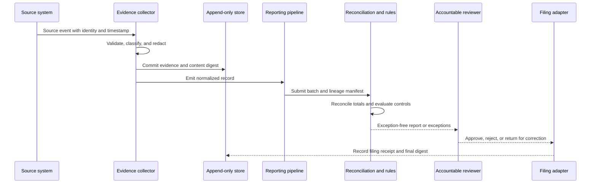

## What it is

**Audit and compliance reporting** is a controlled evidence chain that connects source events, control execution, review decisions, and filed statements. It must answer what happened, when it happened, who or what caused it, which rule or policy applied, and whether the output was complete and approved.

## How it works

A reporting pipeline ingests source records, standardizes them, evaluates reconciliations and rules, preserves evidence, and routes the resulting report for accountable review. Filing and publication occur only after approval, while rejected or amended reports retain their prior state.



**Immutable logging** means the audit record is protected from undetected alteration or deletion. That protection can come from write-once object lock, a separately administered append-only log, or another controlled evidence system. A blockchain is optional and does not by itself make a record correct, complete, private, or available. Hash chaining can detect alteration, but trusted collection time, identity, and root-of-trust design still matter.

A collector configuration should make ingestion behavior explicit:

```yaml
receivers:
  audit_events:
    include_auth_attempts: true
    include_config_changes: true
    include_record_queries: true
processors:
  audit_classification:
    actions:
      - classify_data_classification
      - redact_direct_identifiers
      - attach_legal_hold
  manifest:
    actions:
      - compute_content_digest
      - attach_source_schema_version
exporters:
  evidence_archive:
    endpoint: object-lock-compliance-archive
    mode: create
    retry_on_failure: true
service:
  pipelines:
    evidence:
      receivers: [audit_events]
      processors: [audit_classification, manifest]
      exporters: [evidence_archive]
```

A compliant pipeline should provide the following controls:

- **Source identity and sequence** — preserve stable event IDs, producer identity, source schema, and a producer sequence where available.
- **Trusted time** — record ingestion time separately from source occurrence time and preserve clock uncertainty.
- **Tamper evidence** — use an independently administered archive, signed or chained digests, and periodic digest verification.
- **Completeness reconciliation** — compare record counts, control totals, rejected events, and late arrivals with the source system.
- **Traceable transformations** — version field mappings, validations, classification rules, enrichment, and redactions.
- **Access separation** — separate evidence production, administrator access, and report approval.
- **Reproducible build** — retain the report source, code version, parameter set, run ID, inputs, output, and final filing receipt.

**Explainability for automated decisions** requires an auditable explanation of a specific output, not a generic description of the model. Depending on use and jurisdiction, that explanation may need principal reasons, feature categories, model and input versions, policy or score thresholds, human review, the decision date, and appeal or correction channels. Store business reason codes separately from protected model internals; raw sensitive features are not automatically suitable for disclosure.

For a decision event, a durable record can use this shape:

```json
{
  "decision_id": "dec_01J2Y6M8F3KQ",
  "decision_at": "2026-09-24T14:30:00Z",
  "subject_reference": "customer_7f1c",
  "purpose": "credit_limit_review",
  "model_version": "credit-risk-3.4.1",
  "policy_version": "credit-policy-12",
  "outcome": "manual_review",
  "reason_codes": ["INCOME_VARIABILITY", "RECENT_DELINQUENCY"],
  "principal_reason_categories": ["payment_history", "affordability"],
  "human_review_status": "pending",
  "appeal_channel": "account-appeals"
}
```

Reason codes and human review do not by themselves establish compliance. For example, adverse-action notice duties in the United States depend on the covered product and the ECOA/Regulation B framework, while GDPR automated-decision and information rights depend on the processing context. Confidentiality, security, discrimination, and sector-specific rules can limit what is disclosed.

## Tradeoffs

- **Write once and retain everything** — maximizes evidence availability, but the cost is storage, privacy exposure, and over-collection.
- **Hash-linked internal logs** — makes alteration detectable with modest infrastructure, but the cost is trusting collection and key management.
- **Cloud object lock** — provides managed retention controls, but the cost is provider dependence, lock-period mistakes, and jurisdictional uncertainty.
- **Direct regulatory submission** — reduces manual transcription, but the cost is tighter validation, authentication, and failure recovery.
- **Human-readable reason codes** — supports notices and challenges, but the cost is maintaining a stable mapping to model behavior.

## When to use

- You must reproduce a control result, decision, filing, or exception for a stated period.
- Source systems, processors, and report owners operate in different trust boundaries.
- A report must reconcile to operational systems and preserve rejected records.
- An automated decision can materially affect a person, account, price, or access.
- Regulators or auditors need evidence that a process operated consistently, not only that a policy document exists.

## Alternatives

- **Object storage with versioning and object lock** — fits document and event retention; the cost is designing strict bucket and deletion controls.
- **Central security information and event management platform** — supports access-controlled investigation; the cost is filtering irrelevant data and reconciling business controls.
- **Relational audit tables with restricted update privileges** — is operationally simple; the cost is that application or database owners may still alter the evidence source.
- **Blockchain anchoring** — can add independently observed tamper evidence; the cost is added complexity, availability dependencies, and false confidence about input validity.
- **Manual reporting workbooks** — accommodate exceptions and changing forms; the cost is weak lineage, version confusion, and poor reproducibility.

## Related

- [20.1 Regulatory Frameworks: PCI-DSS, SOX, GDPR/data residency, MiCA (crypto), Basel III (risk capital)](01-regulatory-frameworks.md)
- [20.2 Risk Engines: Credit Risk Scoring, Market Risk (VaR), Operational Risk Frameworks](02-risk-engines.md)
- [20.4 Data Governance: PII Handling, Data Retention/Deletion, Consent Management](04-data-governance.md)
- [Chapter 20 References](05-references.md)
