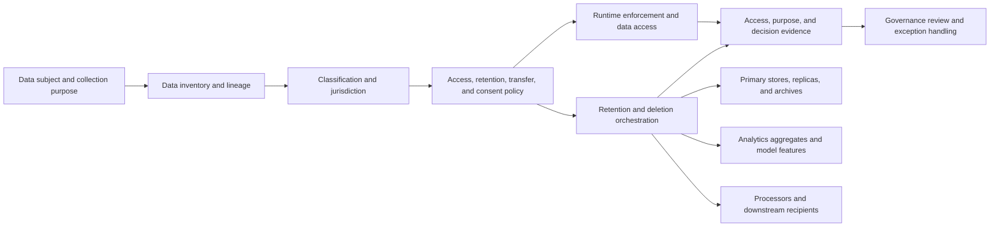

## What it is

**Data governance** is the policy and execution system that controls data throughout its lifecycle, from collection and classification through use, sharing, retention, deletion, and proof of each action. It connects legal purposes to enforceable handling rules and evidence rather than relying on a data inventory alone.

## How it works

A governance control starts with a data purpose, identifies the subject and applicable laws, classifies the data, and assigns rules to every system that stores, transforms, or shares it. A deletion instruction then fans out across replicas, analytics exports, processors, and derived data, with exceptions recorded explicitly.



### PII handling

**Personally identifiable information (PII)** is data linked or linkable to an identified or identifiable person. Legal definitions and regulated categories differ, so a system should preserve a richer classification vocabulary rather than reduce all sensitive data to one boolean.

A useful handling lifecycle has these stages:

1. Record why the data is collected and which notice or contract supports that purpose.
2. Minimize fields, frequencies, and recipients before collection.
3. Classify direct identifiers, sensitive attributes, credentials, and derived identifiers.
4. Enforce least-privilege access, encryption, purpose constraints, and approved transfer paths.
5. Tokenize or pseudonymize where the workflow does not require the direct identifier.
6. Monitor use, sharing, exports, and exceptions.
7. Correct, restrict, export, or delete data when the applicable rights and legal duties require it.

Pseudonymization is risk reduction, not automatic anonymization. The organization may still identify people by using a separate key or by combining the released data with other information.

### Retention and deletion

A retention schedule assigns a trigger, duration, owner, and legal basis to each data class. Deletion is a distributed operation rather than a single database `DELETE`. The orchestrator must know all copies, derived uses, processor contracts, backups, and legal holds.

```yaml
policy_id: customer-data-lifecycle
version: 4
jurisdiction_assumption: EU_and_global_service
retention_rules:
  - dataset: customer_account
    purpose: provide_account
    duration: account_lifetime_plus_approved_period
    trigger: account_closure
    legal_hold_override: true
  - dataset: inactive_authentication_events
    purpose: investigate_abuse
    duration_days: 180
    trigger: event_occurred_at
    legal_hold_override: true
deletion_workflow:
  discover_copies: true
  include_derived_data: true
  include_processors: true
  require_reconciliation: true
  evidence: tombstone_registry
consent_rules:
  marketing_email:
    lawful_basis: consent
    required_purpose: marketing
    withdrawal_channel: privacy_preferences
    essential_for_service: false
```

The resulting deletion evidence should list each discovered copy, action attempted, result, retry or exception, processor confirmation, and reconciliation total. Backups may remain until rotation under the applicable policy, but they must become unavailable for ordinary use and remain covered by retention controls. A legal hold can override ordinary deletion, so the system must record who imposed it, its scope, authority, and release.

### Consent management

A **consent record** identifies the data subject, purpose, notice version, lawful basis, collection timestamp, source, status, and withdrawal history. Granular consent records one decision per purpose; bundled consent is difficult to withdraw selectively and may not be freely given in some contexts.

Consent is not the only lawful basis. GDPR permits several bases, and a control must select and document the correct one for the processing purpose. A consent service should never fabricate agreement, obscure refusal, or make a nonoptional service conditional on unrelated marketing consent.

The lifecycle is:

1. Present a purpose-specific notice before data collection.
2. Record the presented terms and capture an affirmative, attributable action.
3. Store the exact consent event and prevent silent replacement by later policy versions.
4. Enforce withdrawal and objection across downstream processors.
5. Test that new purposes receive their own legal basis and notice.
6. Retain evidence without retaining more identity data than necessary.

Residency is separate from lawful processing. Storage in a particular country can support localization obligations, but it does not replace a GDPR lawful basis, a transfer mechanism where applicable, or data-subject rights. Conversely, an EU data-subject may have rights over data processed outside the EU. The governing jurisdiction can follow the entity, customer, data subject, sector, contract, and data location, so legal teams must record each assumption.

## Tradeoffs

- **Collect once and retain broadly** — simplifies operations, but the cost is privacy exposure, inconsistent deletion, and broader breach impact.
- **Strict purpose-based access** — limits misuse, but the cost is more identity, entitlement, and emergency-access workflow.
- **Tokenize every identifier** — reduces direct identifier exposure, but the cost is token-service availability and operational complexity.
- **Delete all derived data on request** — simplifies a rights workflow, but the cost is difficult lineage, aggregate recreation, and potential loss of legally required records.
- **Store granular consent evidence** — supports proof and withdrawal, but the cost is versioning notices and reconciling downstream consent state.
- **Use regional processing boundaries** — simplifies some transfer assumptions, but the cost is duplicated infrastructure and cross-region access restrictions.

## When to use

- You collect, infer, disclose, or retain data linked to people.
- The same data moves among production, analytics, support, archives, and processors.
- You must honor access, correction, portability, objection, restriction, or deletion rights where applicable.
- Retention rules differ by data purpose, customer relationship, jurisdiction, or legal hold.
- Consent is used as a lawful basis and must be evidenced and withdrawn consistently.
- Business units need one inventory, policy, and evidence trail rather than contradictory local definitions.

## Alternatives

- **Data catalog with stewardship** — provides discovery and ownership; the cost is weaker runtime enforcement unless policies are connected to systems.
- **Policy as code** — evaluates datasets and actions consistently; the cost is translating legal purpose and exception judgment into formal rules.
- **Data-loss prevention platform** — observes and blocks risky flows; the cost is incomplete visibility into semantic purpose and lawful exceptions.
- **Customer data platform** — centralizes identity and preference state; the cost is concentrating sensitive data and processor dependencies.
- **Records-management system** — handles declared retention and disposition; the cost is integrating ephemeral copies, feature stores, and external processors.

## Related

- [20.1 Regulatory Frameworks: PCI-DSS, SOX, GDPR/data residency, MiCA (crypto), Basel III (risk capital)](01-regulatory-frameworks.md)
- [20.2 Risk Engines: Credit Risk Scoring, Market Risk (VaR), Operational Risk Frameworks](02-risk-engines.md)
- [20.3 Audit & Compliance Reporting: Immutable Logging, Regulatory Reporting Pipelines, Explainability for Automated Decisions](03-audit-and-compliance-reporting.md)
- [Chapter 20 References](05-references.md)
