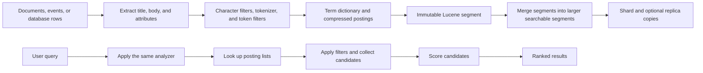

## What it is

An **inverted index** is a data structure that maps each normalized term to the documents containing it, allowing a search engine to find matching documents without scanning every document. Lucene implements this structure, while Elasticsearch and OpenSearch distribute Lucene indexes across shards and add ingestion, storage, querying, and operational services.

## How it works

Indexing and search follow separate paths that meet at a searchable index:



A Lucene posting list links a term to document identifiers, term frequencies, positions, and offsets when those features are indexed. Positions support phrase matching; offsets support highlighting. A term dictionary identifies terms efficiently, while other structures support fast document selection, deletion, and segment merging. Elasticsearch and OpenSearch expose Lucene through JSON APIs and distribute indexes into primary shards with optional replica shards.

The analyzer is part of the contract. The same lowercase and synonym behavior must apply during indexing and querying, or a valid query can miss indexed text. The following mapping makes the searchable fields explicit:

```json
{
  "settings": {
    "number_of_shards": 3,
    "number_of_replicas": 1,
    "analysis": {
      "filter": {
        "product_synonyms": {
          "type": "synonym",
          "synonyms": ["mobile", "smartphone"]
        }
      },
      "analyzer": {
        "product_text": {
          "tokenizer": "standard",
          "filter": ["lowercase", "product_synonyms"]
        }
      }
    }
  },
  "mappings": {
    "properties": {
      "title": { "type": "text", "analyzer": "product_text" },
      "body": { "type": "text", "analyzer": "product_text" },
      "category": { "type": "keyword" },
      "created_at": { "type": "date" }
    }
  }
}
```

Synonym graphs can expand a query into several token sequences, so analyzers must be tested with the exact filters and synonyms used in production. Keep a `keyword` field when exact filtering or stable sorting matters; a `text` field is optimized for analyzed full-text matching and should not be treated as a category identifier.

A typical Elasticsearch or OpenSearch request combines a full-text clause with exact filters:

```http
POST /products/_search
Content-Type: application/json

{
  "query": {
    "bool": {
      "must": [
        {
          "multi_match": {
            "query": "water resistant watch",
            "fields": ["title^3", "body"]
          }
        }
      ],
      "filter": [
        { "term": { "category": "watches" } },
        { "range": { "created_at": { "gte": "now-7d" } } }
      ]
    }
  },
  "highlight": {
    "fields": { "body": {} }
  }
}
```

The engine retrieves posting entries, evaluates the query, applies filters, and returns the configured top results. Boosting `title` expresses editorial intent; it does not guarantee the best semantic match. Elasticsearch and OpenSearch expose related query-dsl and distributed-index concepts, but their plugins, defaults, and release compatibility can differ.

Lucene search is **near real time** because a newly indexed document becomes searchable after refresh. Refresh makes new segments visible to search; merge later combines segments to reduce search overhead and reclaim deleted space. Production designs must distinguish indexing success, refresh visibility, replica durability, and durability in the underlying storage. A client should not assume that a successful write was searchable at the same instant.

For large result sets, use pagination deliberately. `from` plus `size` consumes resources proportional to the requested window on each shard. A **search-after** cursor sorts by a stable tie-breaker and is usually safer for deep result traversal because it does not shift when new documents arrive. Do not expose a result page until the engine has produced a complete shard response unless the product explicitly accepts partial rankings.

## Complexity

| Operation | Cost | Main factors |
| --- | --- | --- |
| Tokenize a document | \(O(n)\) in analyzed text length | Character filters, tokenizers, and token filters |
| Build posting entries | \(O(t)\) postings for \(t\) analyzed terms | Number of positions, offsets, and payload fields |
| Find a term | \(O(1)\) term lookup plus posting traversal | Dictionary lookup and posting-list length |
| Boolean query | \(O(\sum p_i)\) for visited postings \(p_i\) | Wording, filters, stop words, and leading wildcards |
| Filtered full-text search | Query cost plus filter evaluation cost | Candidate terms, filters, cache state, and shard count |
| Merge segments | Proportional to postings in merged segments | Segment count, deletions, compression, and I/O |

Costs are not wall-clock guarantees. Compressed postings, skip lists, block structures, filters, memory layout, and concurrent queries affect observed latency.

## When to use

- You need full-text lookup across changing documents and cannot scan the entire corpus per query.
- You need analyzers, phrase matching, highlighting, relevance scoring, or structured filters.
- You need distributed shards, replicas, near-real-time indexing, and JSON query APIs.
- You can tolerate and monitor indexing latency, refresh delay, merges, and heap usage.
- You need a durable text index alongside operational documents, without designing a search engine from scratch.

## Alternatives

- **Database full-text index** — fits when the existing relational engine already provides the required analyzers, filters, and scale; the cost is tighter coupling to that engine and fewer search-specialized controls.
- **B-tree index** — wins for exact keys, ranges, and sorting; the cost is that it does not efficiently retrieve documents by arbitrary analyzed terms.
- **MapReduce-style batch scans** — works for occasional offline queries over bounded data; the cost is latency proportional to corpus size and storage access.
- **Vector search** — retrieves semantically similar dense representations; the cost is weaker exact-term behavior unless combined with lexical retrieval.
- **Hosted search service** — reduces index operations and scaling work; the cost is provider dependency, data transfer, and less control over scoring and availability.

## Related

- [21.2 Ranking Algorithms: TF-IDF, BM25, Learning-to-Rank](02-ranking-algorithms.md)
- [15.2 Retrieval-Augmented Generation (RAG): Chunking Frameworks, Hybrid Search, Dense/Sparse Embeddings, and Re-ranking](../../06-ml-ai/03-genai/02-rag.md)
- [20.4 Data Governance: PII Handling, Data Retention/Deletion, Consent Management](../05-compliance/04-data-governance.md)
- [Chapter 21 References](05-references.md)
