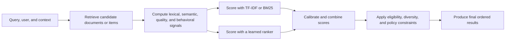

## What it is

A **ranking algorithm** assigns a relevance score to each candidate so a search engine or recommender can return the most useful items first. TF-IDF rewards distinctive terms, BM25 extends that idea with saturation and document-length normalization, and **learning-to-rank** predicts relevance from features learned from judged or observed examples.

## How it works

Ranking is a sequence of decisions, not a single universal score:



**TF-IDF** estimates how informative a term is in a document. Term frequency \(tf(t,d)\) rises when term \(t\) appears in document \(d\); inverse document frequency \(idf(t)\) rises when the term appears in fewer documents. The basic product is easy to interpret, but raw counts can let long documents dominate and common repeated words contribute excessively.

BM25 bounds repeated-term growth and normalizes for document length:

\[
score(D,Q) = \sum_{t \in Q} idf(t) \times \frac{tf(t,D)(k_1+1)}{tf(t,D)+k_1(1-b+b|D|/avgdl)}
\]

In this formula, \(k_1\) controls how quickly repeated terms saturate, \(b\) controls length normalization, and \(avgdl\) is the average document length for the collection. The weights are heuristic defaults, not universal constants. Lucene's default BM25 uses \(k_1=1.2\) and \(b=0.75\); Elasticsearch exposes related `k1` and `b` parameters, while OpenSearch's scoring options depend on the query type and version.

BM25 handles exact lexical evidence well, but it cannot infer that “refund policy” and “return policy” mean the same thing. It also cannot directly learn whether a click or purchase represents satisfaction. Those limits motivate semantic retrieval and learned ranking.

A concrete Elasticsearch request expresses lexical relevance and structured eligibility separately:

```json
{
  "query": {
    "function_score": {
      "query": {
        "multi_match": {
          "query": "cancel annual plan",
          "fields": ["title^3", "body^2"],
          "type": "best_fields"
        }
      },
      "field_value_factor": {
        "field": "quality_score",
        "factor": 0.2,
        "missing": 0
      },
      "boost_mode": "sum"
      }
  }
}
```

The lexical query controls relevance, while `quality_score` contributes a bounded editorial or quality signal. Combining scores without calibration can let one scale dominate. Validate field boosts and score ranges against labeled queries before publishing them.

**Learning-to-rank** trains a model to order items rather than classify one item in isolation. Typical signals include BM25 score, embedding similarity, term proximity, document freshness, item popularity, user-item history, and contextual features. LambdaMART-style gradient-boosted rankers are common in search, while neural rankers can capture richer feature interactions. The training examples must preserve relevance order; treating every unclicked result as negative can mislabel results the user never saw.

A feature log gives offline training and online serving a common contract:

```json
{
  "request_id": "srch_01J7Y8W3A9",
  "query_id": "q_1842",
  "user_cohort": "returning_customer",
  "candidates": [
    {
      "item_id": "doc_301",
      "features": {
        "bm25": 8.42,
        "cosine_similarity": 0.81,
        "term_proximity": 6,
        "freshness_hours": 2.5,
        "historical_ctr": 0.14
      },
      "label": 3
    },
    {
      "item_id": "doc_817",
      "features": {
        "bm25": 7.91,
        "cosine_similarity": 0.68,
        "term_proximity": 4,
        "freshness_hours": 26,
        "historical_ctr": 0.09
      },
      "label": 1
    }
  ]
}
```

The online ranker must reproduce the same feature definitions and values that the training pipeline used. A **training-serving skew** occurs when those paths disagree. Version the feature schema, model, tokenizer, corpus, and query interpretation together. Record enough request and model metadata to reproduce a ranking, while applying the retention limits required for personal data.

Learning-to-rank adds a training-data and maintenance burden. Start with a documented lexical baseline, define a labeled evaluation set, and require a repeatable gain metric such as NDCG or MAP before replacing it. A statistically significant change on a small query set is not automatically a better system for the full corpus.

## Complexity

| Method | Online cost | Training or indexing cost | Main limitation |
| --- | --- | --- | --- |
| TF-IDF | \(O(t)\) term checks for \(t\) query terms after retrieval | \(O(n)\) for \(n\) analyzed documents in a straightforward batch build | Sensitive to token choice and corpus statistics |
| BM25 | \(O(\sum f_i)\) for query-term frequencies in \(k\) candidates | Usually computed from corpus statistics maintained by the engine | No semantic matching and limited contextual learning |
| Learning-to-rank | \(O(kf)\) for \(k\) candidates and \(f\) features per candidate | Depends on examples, model, trees, or network passes | Requires consistent features and representative labels |
| Hybrid score fusion | Cost of each source plus normalization and combination | Cost of maintaining every source model | Uncalibrated scores can dominate the combination |

The table describes per-item work after candidate retrieval. Candidate generation, network calls, index I/O, and result post-processing can dominate end-to-end latency.

## When to use

- You need an interpretable lexical baseline for full-text search.
- Exact terms, rare identifiers, or phrase evidence must influence results.
- You have judged queries or reliable behavioral labels and multiple ranking features.
- You can version the corpus, feature definitions, tokenizer, and model together.
- You need offline metrics and online experiments to verify that a ranker improves the intended outcome.
- You can maintain candidate generation, safety rules, and human relevance review.

## Alternatives

- **Lexical search alone** — remains predictable and inexpensive when exact language and low operational overhead dominate; the cost is weak semantic matching.
- **Dense retrieval** — matches related concepts across wording; the cost is embedding cost, approximate-search tuning, and weaker exact-identifier behavior.
- **Reciprocal rank fusion** — combines rankings without requiring their raw scores to share a scale; the cost is less control over score-level tradeoffs.
- **Rules and editorial boosts** — provides transparent domain control; the cost is rule conflicts, tuning effort, and inconsistent coverage.
- **Reranking model** — improves precision over a small retrieved set; the cost is inference latency and failure when the candidate set omitted a relevant answer.

## Related

- [21.1 Inverted Indices & Search Engines (Lucene/Elasticsearch/OpenSearch)](01-inverted-indices-search-engines.md)
- [21.3 Recommendation Architectures: Collaborative Filtering, Content-Based, Hybrid, Two-Tower Retrieval + Ranking](03-recommendation-architectures.md)
- [14.1 End-to-End ML System Design: Training, Validation, Feature Engineering, and Inference Pipelines](../../06-ml-ai/02-mlops/01-ml-system-design.md)
- [Chapter 21 References](05-references.md)
