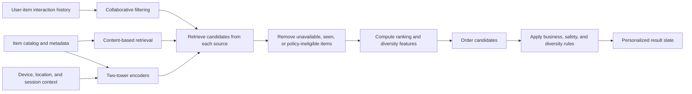

## What it is

A **recommendation system** predicts which items a user is most likely to find useful by combining item content, user behavior, and current context. Its architecture separates broad candidate generation from precise ranking so it can search a large catalog within a request budget.

## How it works

Collaborative, content-based, and learned retrievers contribute different evidence. A production pipeline usually combines them, removes ineligible items, and applies a final ranker:



**Collaborative filtering** learns from behavior among similar users or items. User-based methods find people with related histories, while item-based methods find items with related interaction patterns. Matrix factorization, factorization machines, and graph methods compress sparse interactions into user and item representations. Collaborative signals can reveal relationships absent from metadata, but they have a **cold-start problem** when a new user or item has little history.

**Content-based filtering** compares item attributes with a user's profile. It can recommend a new item immediately because it does not require prior interactions, and it tends to preserve attribute-level discoverability. However, repeated recommendations can become homogeneous when many items share the same features. A profile also needs explicit updates when interests change.

A **two-tower model** encodes the user context and each item into a shared vector space. The user tower and item tower can be trained independently, precomputed item embeddings stored in an approximate nearest-neighbor index, and queried by vector similarity. This is the **retrieve-and-rank** pattern: recall many plausible items cheaply, then spend more computation ranking a smaller set.

A concrete retrieval API separates candidates from final ordering:

```json
POST /v1/recommendations
Content-Type: application/json

{
  "user_id": "usr_4821",
  "context": {
    "country": "US",
    "locale": "en-US",
    "surface": "home"
  },
  "retrievers": [
    {"name": "item_item_cf", "limit": 200},
    {"name": "content_similarity", "limit": 200},
    {"name": "two_tower", "limit": 400}
  ],
  "filters": {
    "available": true,
    "excluded_categories": ["adult"]
  }
}
```

A corresponding result contract keeps retrieval metadata available for debugging and ranking:

```json
{
  "request_id": "rec_01J7Z1H6M4",
  "model_version": "candidate-2026-09-18",
  "candidates": [
    {
      "item_id": "item_882",
      "retrievers": ["item_item_cf", "two_tower"],
      "candidate_features": {
        "cf_score": 0.73,
        "content_score": 0.61,
        "vector_score": 0.84
      }
    },
    {
      "item_id": "item_104",
      "retrievers": ["content_similarity", "two_tower"],
      "candidate_features": {
        "cf_score": 0.58,
        "content_score": 0.86,
        "vector_score": 0.79
      }
    }
  ],
  "expires_at": "2026-09-24T21:48:00Z"
}
```

Merge candidates by item identity, preserve the retrievers that found each item, and deduplicate before expensive ranking. When an item is absent from the configured filter or safety policy, remove it before response generation. Do not assume unioning lists creates enough diversity; the final slate can still contain many near-duplicate items from one brand, artist, topic, or price band.

**Hybrid recommendation** combines collaborative and content evidence. Score fusion, weighted features, or a learned reranker can combine the sources. Reciprocal rank fusion is useful when source scores use incompatible scales, but it discards some score-magnitude information. A learned reranker can use source rank, source score, item quality, context, and interaction features, but it needs enough positive and negative examples to avoid reinforcing the retriever's blind spots.

Offline metrics should match the product goal. Precision and recall evaluate candidate sets; NDCG evaluates ordered relevance; catalog coverage reveals whether recommendations collapse onto popular items; diversity measures item variety. Online measures such as click-through, conversion, save rate, hide rate, and long-term retention can disagree, so define the primary metric and guardrails before training or experimentation.

## Complexity

| Stage | Cost | Main factors |
| --- | --- | --- |
| Collaborative scoring | Usually \(O(u+i)\) per user-item pair for neighborhood methods | Interaction sparsity and neighborhood size |
| Content similarity | \(O(f)\) after item features are prepared for \(f\) attributes | Feature extraction, storage, and comparison method |
| Two-tower retrieval | \(O(fe)\) to encode one item, then index-dependent nearest-neighbor search | Embedding dimension, index type, and recall target |
| Candidate merge | \(O(c\log c)\) for \(c\) candidates with a sort, or near-linear with bounded hash sets | Duplicate resolution and ordering |
| Reranking | \(O(cf)\) for \(c\) candidates and \(f\) features | Model depth, batch size, and feature access |

Online encoding is avoided by precomputing item vectors when items change less often than users. The index must then refresh at an acceptable freshness boundary, and deleted or newly restricted items must be removed promptly.

## When to use

- You need to recommend from a catalog too large to score exhaustively for every request.
- Users and items have enough behavior to support collaborative signals.
- New items need useful recommendations before they accumulate interactions.
- You can combine semantic, collaborative, popularity, quality, and business signals.
- You can enforce inventory, consent, safety, diversity, and regional eligibility rules after retrieval.
- You need an offline benchmark and online experiment tied to user outcomes.

## Alternatives

- **Popularity ranking** — is inexpensive and robust for cold start; the cost is low diversity and reinforcing the system's existing bias.
- **Content-based recommendation** — handles new items and explains matches through attributes; the cost is similarity loops and narrow recommendations.
- **Collaborative filtering alone** — captures behavior-driven affinity; the cost is cold start, sparse data, and feedback loops around exposure.
- **Knowledge graph recommendation** — represents entities and their typed relationships explicitly; the cost is graph construction, update complexity, and domain coverage.
- **Generative recommendation** — produces flexible candidates or explanations; the cost is constrained output, attribution, evaluation, and additional inference latency.
- **Editorial curation** — provides trustworthy, diverse choices; the cost is publishing effort and reduced automatic adaptation.

## Related

- [21.2 Ranking Algorithms: TF-IDF, BM25, Learning-to-Rank](02-ranking-algorithms.md)
- [21.4 Real-Time Personalization: Feature Freshness, Online Learning, A/B Test Infrastructure](04-real-time-personalization.md)
- [15.1 Vector Databases & Billion-Scale Retrieval: Pinecone, Qdrant, Milvus, Similarity Metrics, Approximate Nearest Neighbors](../../06-ml-ai/03-genai/01-vector-databases.md)
- [Chapter 21 References](05-references.md)
