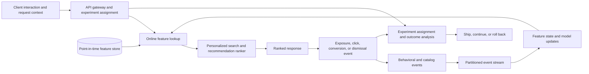

## What it is

**Real-time personalization** updates a user's experience as recent events, inventory, and context change, while controlled infrastructure measures whether each update improves a defined outcome. It combines event-time features, online model updates, deterministic experiment assignment, and reliable rollout controls.

## How it works

The system must distinguish an observed event from a feature that is available now, cached for later, or reconstructed offline. The same definition and point-in-time value must be available to online serving and training:



A feature's **freshness** is the age of the newest valid value used for a request. A cache hit does not prove a feature is fresh, and a recent request time does not make old event data recent. Store both event time and ingestion or availability time. Point-in-time training must join on the value that existed when the label or prediction was produced, not the latest corrected value.

A stream definition shows how a behavioral event becomes updateable state:

```yaml
schema_version: 1
topic: personalization.user-events.v1
partitions: 96
key: user_id
delivery:
  ordering_scope: user_id
  duplicate_policy: deduplicate_by_event_id
  retention_hours: 168
event_time: occurred_at
allowed_lateness_seconds: 300
features:
  - name: recent_category_affinity
    source: category_viewed
    window: PT24H
  - name: session_item_cooccurrence
    source: item_impression
    window: PT2H
  - name: inventory_now
    source: inventory_updated
    window: PT5M
```

**Online learning** updates a model from observations as they arrive, without waiting for a full retraining cycle. FTRL, AdaGrad, and online gradient-boosting methods are common choices because they support incremental updates. An online objective does not guarantee an unbiased product outcome: the learner only sees logged data generated by earlier policies, and repeated exposure can cause a feedback loop. Keep a stable exploration or deliberate policy-improvement source when fresh discovery matters.

A FTRL-oriented configuration makes state, loss, and rollback explicit:

```json
{
  "model_name": "personalized_linear_ranker",
  "algorithm": "ftrl",
  "loss": "logistic",
  "learning_rate": 0.05,
  "l1_regularization": 0.1,
  "l2_regularization": 1.0,
  "feature_schema_version": 14,
  "update_policy": {
    "max_events_per_second": 10000,
    "reject_stale_events_after_seconds": 600,
    "rebuild_from_snapshot_before_update": true
  },
  "rollback": {
    "strategy": "last_verified_snapshot",
    "minimum_snapshot_interval_seconds": 900
  }
}
```

Persist model parameters, optimizer state, feature schema, and data version together. A process restart must not reset learning silently. Validate updates offline before promoting them, cap extreme feature values, and define what happens when an event arrives after a feature window has closed. Periodic retraining from a durable event history remains a recovery path even when online updates are enabled.

An **A/B test** assigns comparable users or sessions to variants and compares outcomes under a defined allocation. Randomization produces a unit, while **stable bucketing** keeps that unit in the same variant across requests. If assignment depends on mutable user attributes, a user's experience can change unexpectedly. A typical assignment uses a namespace, unit identifier, experiment identifier, and salt:

```proto
syntax = "proto3";

message ExperimentAssignment {
  string experiment_id = 1;
  string assignment_unit_id = 2;
  string variant_id = 3;
  uint32 allocation_bucket = 4;
  string assignment_version = 5;
  google.protobuf.Timestamp assigned_at = 6;
}
```

The treatment service should record the assignment before exposure, use a durable experiment definition, and preserve idempotency across retries. The analysis pipeline then joins assignment and outcome events by the same unit and respects the assignment date. Do not count an outcome after an experiment ends merely because the event arrived later unless that delayed effect was part of the predefined analysis plan.

A minimal warehouse model separates assignment from observed outcomes:

```sql
CREATE TABLE experiment_assignments (
  experiment_id STRING NOT NULL,
  unit_id STRING NOT NULL,
  variant_id STRING NOT NULL,
  assignment_bucket INTEGER NOT NULL,
  assigned_at TIMESTAMP NOT NULL,
  definition_version STRING NOT NULL,
  PRIMARY KEY (experiment_id, unit_id)
);

CREATE TABLE experiment_outcomes (
  event_id STRING NOT NULL,
  experiment_id STRING NOT NULL,
  unit_id STRING NOT NULL,
  variant_id STRING NOT NULL,
  metric_name STRING NOT NULL,
  metric_value DOUBLE NOT NULL,
  occurred_at TIMESTAMP NOT NULL,
  PRIMARY KEY (event_id)
);
```

The analysis query must prevent one user from appearing in both control and treatment, remove duplicate outcome events, and report randomization balance. Statistical significance does not make a biased assignment valid. Guardrails should include latency, error rate, crashes, policy violations, and longer-term outcomes that could reveal harm hidden by a short conversion window.

Operational telemetry must expose the whole path:

```prometheus
personalization_feature_age_seconds{surface="home",feature="recent_category_affinity"}
personalization_feature_miss_total{surface="home",feature="recent_category_affinity"}
personalization_model_update_events_total{model="personalized_linear_ranker",result="accepted"}
personalization_model_update_rejected_total{model="personalized_linear_ranker",reason="stale_event"}
personalization_assignment_total{experiment="home_ranker_2026_09",variant="treatment"}
personalization_result_latency_seconds{surface="home",stage="ranking"}
```

Alert on the user-visible objective, not only on infrastructure health. A fresh service can still serve stale features, a model can learn from the wrong event-time window, and an experiment platform can be correctly implemented while the treatment harms a guardrail. Preserve request IDs from assignment through model version, feature versions, retrieval sources, final item order, and outcome events so a specific result can be explained without collecting unnecessary personal data.

## Tradeoffs

- **Update each model on every event** — adapts quickly, but the cost is feedback loops, noisy updates, and harder reproducibility.
- **Batch features and models** — simplifies state and training, but the cost is longer staleness and less response to current intent.
- **Cache online features** — lowers request latency, but the cost is stale values, invalidation complexity, and version skew.
- **Recompute historical features from current data** — simplifies storage, but introduces training-serving skew and leaks information that was unavailable when the outcome occurred.
- **Assign users permanently** — keeps experience stable, but the cost is persistent history and slower adaptation to major changes.
- **Randomize every request** — increases exploration, but the cost is inconsistent experiences, confounding, and possible overexposure.
- **Serve the winning model globally** — simplifies operations, but removes a rollback path and prevents continued learning until the next controlled rollout.

## When to use

- A session's result should reflect clicks, purchases, inventory, location, or other recent context.
- Candidate or model updates must be visible within a defined freshness objective.
- You can define event time, availability time, feature age, and acceptable staleness.
- You need to compare model, ranking, or experience changes safely.
- Outcomes, assignments, feature versions, and model versions can be joined without violating privacy and retention rules.
- The team can operate feature state, model rollback, experiment analysis, and guardrail alerts.

## Alternatives

- **Scheduled batch retraining** — provides reproducible models and simpler operations; the cost is delayed adaptation.
- **Rule-based personalization** — is explainable and easy to change; the cost is limited combinations and manual tuning.
- **Remote stateless inference** — isolates model code; the cost is network latency and dependence on a model service.
- **Client-side assignment and counters** — reduces assignment traffic; the cost is tamper risk, delayed counters, and weak central auditability.
- **Post hoc cohort analysis** — enables retrospective analysis; the cost is that it cannot correct a poor assignment, loss of logging, or unsafe rollout.

## Related

- [21.3 Recommendation Architectures: Collaborative Filtering, Content-Based, Hybrid, Two-Tower Retrieval + Ranking](03-recommendation-architectures.md)
- [14.5 Self-Improving Machine Learning Systems: Feedback Loops, Active Learning, Online Recalibration, Continuous Drift Detection, and Auto-Tuning Pipelines](../../06-ml-ai/02-mlops/05-self-improving-machine-learning-systems.md)
- [25.2 Feature Flags & Experimentation Infrastructure (A/B Test Deployment)](../../08-web3-embedded-finance/04-resilience-testing-sre/02-feature-flags-experimentation-infrastructure.md)
- [Chapter 21 References](05-references.md)
