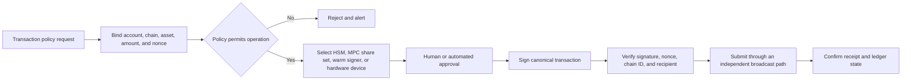

## What it is

Web3 key management is the system that creates, stores, uses, recovers, and retires the credentials that authorize custody and transactions. A **hardware security module (HSM)** protects keys inside tamper-resistant hardware, **multi-party computation (MPC)** distributes signing authority across parties, and a **hierarchical deterministic (HD) wallet** derives many keys from one seed so operators can isolate accounts without storing every private key independently.

## How it works

A production custody design classifies every signing context, gives it an independent trust boundary, and limits the operations that the context can authorize. The account, chain, asset, amount, and policy context must be verified by a trusted display or policy engine before a signature is released.



An HD seed is a high-value secret, not a convenience backup format. Deterministic derivation applies a path such as `m/44'/60'/0'/0/0` to produce one account key. Public derivation can produce an **extended public key (xpub)** for watch-only monitoring, but the seed and chain code must remain private. Derivation does not provide a second approval; possession of the seed can recreate every derived key and therefore defeats independent signer separation.

A useful policy artifact records the custody boundary without putting key material in configuration:

```yaml
custody_policy:
  account: treasury-usd
  environment: production
  binding:
    chain_ids:
      - 1
    contract_allowlist:
      - "0x1111111111111111111111111111111111111111"
    max_amount_atomic: 2500000000000000000
  signing_contexts:
    warm:
      max_amount_atomic: 1000000000000000000
      approval_policy: two-person
    cold:
      max_amount_atomic: 0
      approval_policy: offline-multisig
    mpc:
      threshold: 3
      participants: 5
    hsm:
      signing_usage: payment-submit-only
      exportable: false
  verification:
    require_chain_id: true
    require_contract_id: true
    require_human_address_display: true
    require_recipient_allowlist: true
  monitoring:
    detect_ownership_changes: true
    detect_nonce_reuse: true
    alert_on_new_deployment: true
```

Hot wallets serve latency-sensitive operations, warm wallets hold bounded authority for routine operations, and cold storage holds long-term authority with stronger isolation. The labels do not create security. Security comes from the number of independent control domains, recovery path, key extractability, and the damage a compromised component can cause.

MPC splits signing across parties so no complete key exists in one process. Its threshold rules tolerate unavailable participants but not collusion above the threshold. Participant independence must survive cloud accounts, administrators, software releases, and recovery operators. A three-of-five scheme with all shares recoverable by one platform administrator is not a three-party trust boundary.

Hardware wallets and HSMs bind signing to a trusted display or protected policy context. A compromised host can still present deceptive transaction data, request a malicious signature, or wait until a user approves an attack. Verify firmware provenance, protect device pairing, set allowlists on the device where possible, and broadcast through a separate service after policy evaluation. Never use a seed phrase typed into a website as a substitute for device-backed signing.

Recovery and rotation are core key-management functions. Test threshold recovery, protect backup shares as production credentials, record key version and retirement events, and prevent a restored old key from signing after rotation. A hardware wallet that cannot display the destination, chain, token contract, and calldata is not a sufficient control for high-value contract calls.

## Tradeoffs

| Decision | Gain | Cost |
| --- | --- | --- |
| HSM-backed centralized signer | Fast policy enforcement and centralized audit | A privileged service is a concentrated compromise target |
| MPC threshold signing | No complete key and configurable availability | More protocol, network, recovery, and collusion assumptions |
| HD wallet | Deterministic addresses and simple account rotation | Seed compromise recreates the entire hierarchy |
| Hot wallet | Low signing latency | Internet exposure and continuous abuse risk |
| Warm wallet | Routine authority with bounded value | Misconfiguration expands the operational attack surface |
| Cold or air-gapped custody | Smaller remote exposure | Slower recovery, rotation, and transaction approval |
| Hardware-wallet approval | User-controlled confirmation and offline key storage | Physical loss, supply-chain risk, and deceptive host interfaces |

## When to use

- You custody customer or organizational assets and need an explicit recovery and rotation procedure.
- You can separate transaction policy, signing, broadcast, and reconciliation into independent trust domains.
- You need both automated payment latency and a slower authority for high-value or contract-upgrade operations.
- You operate a multi-tenant platform and must prevent one tenant's keys, policies, or broadcasts from crossing another tenant's boundary.
- You integrate hardware devices and need to verify the complete context rather than accept a signature as proof of user intent.

## Alternatives

- **Qualified custody** — provides operational controls and regulated oversight, but adds provider, jurisdiction, and concentration risk.
- **On-chain multisig** — enforces a threshold on-chain, but owner recovery, signer diversity, and module configuration remain off-chain responsibilities.
- **Account abstraction with session keys** — limits long-term authority for applications, but bundlers, paymasters, and policy modules expand the trusted computing base.
- **Social or passkey recovery** — can reduce single-device loss, but recovery policy and identity proofing become security-critical.
- **Cloud KMS plus transaction policy** — simplifies centralized control, but does not by itself provide independent custody or safe key isolation.

## Related

- [Chapter 22 overview](_index.md)
- [22.2 Zero-Knowledge Proofs & Privacy Computation: zk-SNARKs/STARKs, ZK-Rollups, Privacy-Preserving KYC, Private Set Intersection (PSI), and Garbled Circuits](02-zero-knowledge-proofs-privacy-computation.md)
- [19.2 Treasury Management & Multi-Sig Custody](../../07-part-vii/04-dao-governance/02-treasury-multi-sig.md)
- [17.1 KYC, KYB & Customer Onboarding Pipelines](../../07-part-vii/02-identity-kyc/01-kyc-kyb-pipelines.md)
