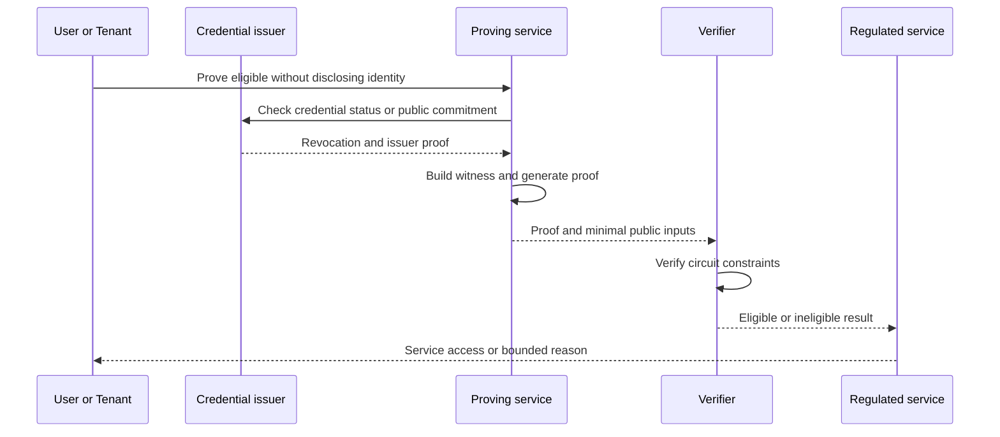

## What it is

Privacy cryptography computes over hidden data while revealing only a constrained result or its correctness. A **zero-knowledge proof (ZKP)** lets a prover convince a verifier that a statement is true without exposing the witness; **private set intersection (PSI)** finds shared records without disclosing the rest of either set; and **garbled circuits** let two parties evaluate a function over private inputs without learning the other party's input.

## How it works

A ZKP turns an application statement into constraints. The prover computes a witness satisfying those constraints and generates a proof. The verifier checks the proof against a small public input. A **zk-SNARK** commonly uses a trusted or operational setup and succinct verification, while a **zk-STARK** uses a transparent setup and can provide post-quantum security assumptions, but its proofs and proving costs differ. Neither property means a proof is safe if the circuit computes the wrong predicate.



The circuit boundary is the real application design:

```text
Public input
  account_group_hash
  jurisdiction
  credential_schema
  minimum_age
  credential_status_root
  policy_version

Private witness
  customer_identity_commitment
  date_of_birth
  document_attributes
  sanctioned_status
  issuer_signature
  credential_revocation_proof

Prover output
  eligibility_proof

Verifier rule
  accept only if the witness belongs to a valid issuer
  and every credential is current for the stated jurisdiction
  and the hidden attributes satisfy the published policy
```

Privacy-preserving KYC normally proves a bounded property such as current accreditation status, age range, allowed jurisdiction, or successful screening. It does not anonymously guarantee that a person is eligible. The credential issuer, circuit logic, predicate freshness, nullifier design, and verifier policy still determine what the result means. Without a stable anonymous nullifier, a user could present the same eligible proof repeatedly; with an over-linking nullifier, use can be correlated across services.

A ZK-rollup executes transactions off-chain, batches them, and publishes compressed state plus a proof that the batch followed the rollup rules. The proof can establish valid execution and state transition, while the data-availability and fork-choice rules determine when the result becomes final and recoverable. A valid execution does not by itself prove that the application applied the intended business policy.

PSI has a separate trust model. A protocol compares commitments or encrypted records and outputs only the selected intersection. The parties still need agreement on the universe, duplicate handling, and equality semantics. Stable hashes can collide with weak identifiers, while unmatched formatting can create false negatives. A compromised or dishonest party may infer values from protocol metadata, so the protocol's leakage must be reviewed separately from its correctness.

Garbled circuits evaluate arbitrary Boolean functions. One party generates randomized wire labels and encrypted gates; the other evaluates them using oblivious-transfer input labels. Output decoding reveals the function's result, not either party's raw input. The approach can support confidential auctions, credit decisions, and private analytics, but circuit generation, garbling, oblivious transfer, output handling, and peer discovery are separate security stages.

## Tradeoffs

| Decision | Gain | Cost |
| --- | --- | --- |
| zk-SNARK | Small proofs and mature verification patterns | Setup ceremony, proving-system constraints, or coordinator trust can be material |
| zk-STARK | Transparent setup and post-quantum-oriented assumptions | Larger proofs or more expensive proving in some constructions |
| ZK-rollup | Private or low-cost execution with cryptographic validity | Prover centralization, data availability, and circuit complexity remain |
| Privacy-preserving KYC | Reveals a bounded eligibility fact instead of raw identity data | Issuer, revocation, predicate, and nullifier governance |
| PSI | Neither party sends its complete set to the other | Protocol leakage, equality errors, and coordination overhead |
| Garbled circuits | General private two-party computation | Substantial circuit cost and sensitive output-label handling |

## When to use

- You need to prove account eligibility, provenance, or policy compliance without exposing the underlying identity record.
- A batched execution environment can prove state transitions while keeping transaction data off-chain.
- Two regulated institutions must compare a bounded customer or compliance set without exchanging the full set.
- Two parties need to evaluate a function over confidential inputs and neither can reveal its raw records.
- You can publish, review, and version the circuit, proving pipeline, and verifier policy used for a security decision.

## Alternatives

- **Trusted execution environments** — simplify private computation, but the trust model depends on vendor, firmware, attestation, and side-channel resistance.
- **Secure multi-party computation** — supports general confidential computation, but communication and coordination costs remain.
- **Fully homomorphic encryption** — permits computation on ciphertext with a public or private key, but it usually carries high performance and circuit costs.
- **Confidential computing with attribute-based access** — can hide data fields from infrastructure operators, but it does not provide the same public verifiability as a ZKP.
- **Conventional encryption and access control** — fits ordinary infrastructure boundaries, but participating services must coordinate and can observe plaintext during processing.

## Related

- [Chapter 22 overview](_index.md)
- [22.1 Key Management: HSMs, MPC Wallets, HD Wallet Derivation, Hot/Cold/Warm Architecture, Hardware Wallet Integration](01-key-management.md)
- [22.3 Smart Contract Security: Reentrancy, Formal Verification, Audits, Proxy/Upgrade Patterns](03-smart-contract-security.md)
- [17.1 KYC, KYB & Customer Onboarding Pipelines](../../07-part-vii/02-identity-kyc/01-kyc-kyb-pipelines.md)
